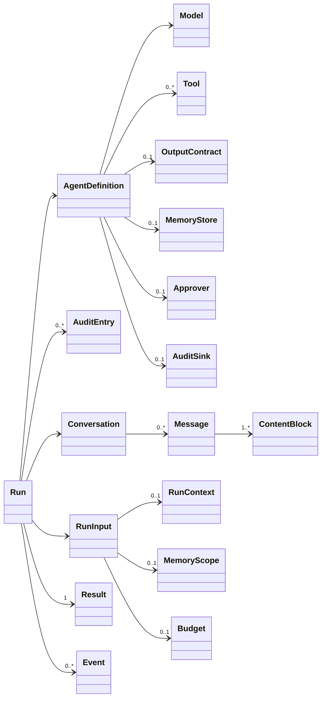
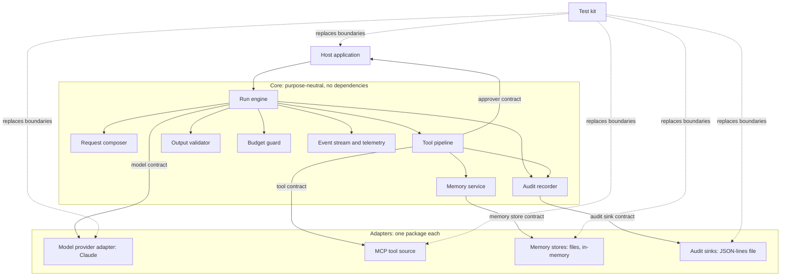
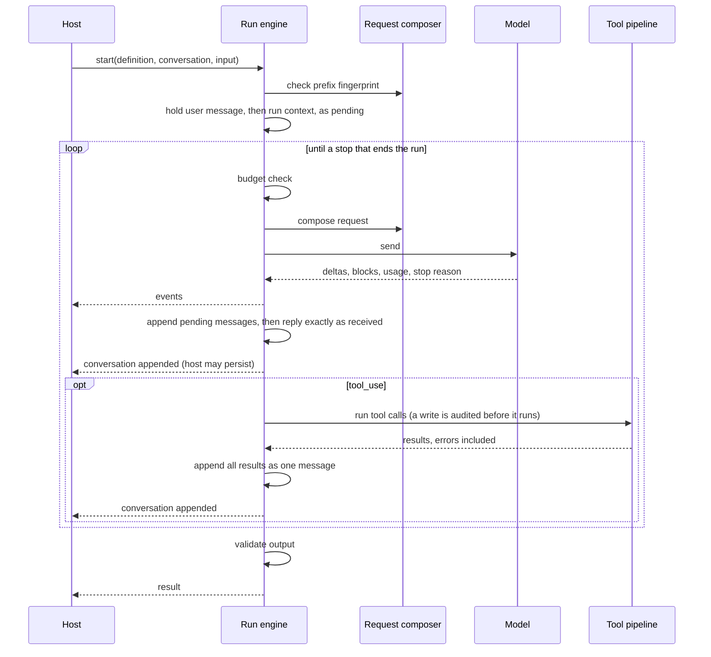
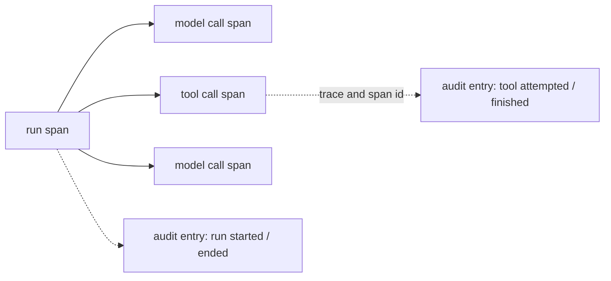
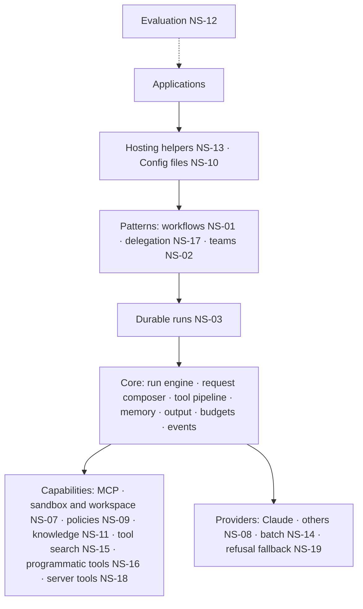
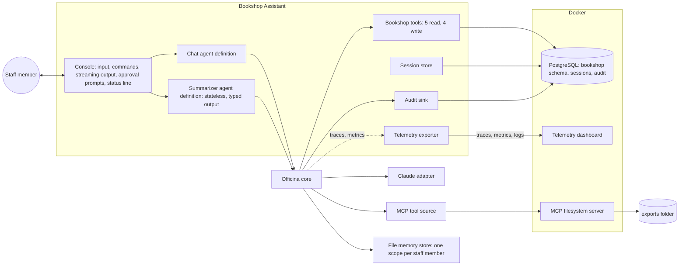

# Officina — Architecture

Status: draft 5 · 2026-10-05. Packages are named under `Sleepyshark.Officina`. Implements [`REQUIREMENTS.md`](REQUIREMENTS.md). It describes concepts, components,
contracts and flows only; how they are coded is left to the implementation.

## 1. Design goals

| Goal | What it means for the design | Requirements |
|---|---|---|
| **Purpose-neutral** | One small core serves single calls, chat, assistants, workflows, background jobs and, later, teams. Purposes differ only in what the host plugs in. | GEN |
| **One primitive** | Everything is built from one run of one agent. Later patterns compose runs; they never bypass them. | AGT-02 |
| **Cache-stable** | The request's prefix never changes within a conversation, and history is append-only. | CTX, HIST |
| **Structured control** | Stop reasons, tool calls and validated output decide what happens next, never free text. | AGT-03 |
| **Host owns state and policy** | The core persists nothing and decides no policy on its own; the host supplies storage, approval and limits. | AGT-06, GEN-01 |
| **Accountable** | Every important action leaves a durable audit entry; a write never happens unrecorded. | AUD |
| **Observable** | Every run is a trace, every model and tool call a span, with tokens, cache use, cost and outcome; audit entries point to their trace. | EVT, AUD-03 |
| **Opt-in parts** | Tools, memory, MCP, typed output, approval and budgets are each optional and cost nothing when absent. | GEN-02 |

## 2. Concepts



| Concept | Meaning |
|---|---|
| **Agent definition** | What an agent is: model, instructions, tools, output contract, memory, approver. Immutable; shared by any number of runs. |
| **Run** | One unit of work: a definition applied to a conversation and an input, looping until the model stops. Ends in exactly one result. |
| **Conversation** | The append-only sequence of messages between the agent and the model. Owned and stored by the host; empty and discarded for stateless runs. |
| **Message, content block** | A message holds blocks: text, reasoning, tool request, tool result, server-tool result, compaction summary. Blocks are kept exactly as the model produced them. |
| **Run input** | The user's message, plus optional **run context** (date, user profile, retrieved passages) **memory scope** (whose memory this run sees) and **budget** (limits on this run). |
| **Model** | A provider's model behind the model contract (§4.1), with its settings fixed for the conversation. |
| **Tool** | An action the model may request: name, description, input schema, read or write, whether it needs approval. From the application or an MCP server. |
| **Output contract** | Optional: the schema the final answer must satisfy. |
| **Memory** | Optional: files the model reads and writes across conversations, in a scope the host names. |
| **Approver** | Optional: the human or policy that answers approval requests. Absent means unattended. |
| **Budget** | Optional limits on cost, tokens, model calls and time. |
| **Result** | `Completed` (text or typed output), `Stopped` (with a reason) or `Failed` (with an error), always with usage. |
| **Event** | Something that happened during a run, streamed to the host as it happens. |
| **Audit entry** | A durable record of an important event (AUD-01), written through the audit sink the host chooses. Events are for watching; audit is for review. |

## 3. Components



| Component | Responsibility | Never does |
|---|---|---|
| **Run engine** | Runs the loop (§5): appends input, calls the model, routes stop reasons, hands tool calls to the pipeline, produces the result | Interpret text; know the application |
| **Request composer** | Builds each request in the fixed layout (§6) from the definition and the conversation; checks the prefix fingerprint | Edit or drop earlier messages |
| **Tool pipeline** | For each tool call: validate input → ask approval if needed → invoke → truncate → result. Reads in parallel, writes in order | Throw into the loop; let a tool see other agents, budgets or configuration |
| **Memory service** | Exposes memory to the model as a tool with view, create, edit, delete and rename commands, confined to the run's scope | Put memory into the instructions |
| **Output validator** | Validates the final answer against the output contract; a failure ends the run as `Failed` | Accept unvalidated output |
| **Budget guard** | Tracks usage and cost; checked before every model call | Stop a call already in flight |
| **Event stream, telemetry** | Streams events to the host; emits traces and metrics (§7) through the platform's own primitives, including the cache hit ratio | Carry secrets or, unless the host opts in, message text; export telemetry itself |
| **Audit recorder** | Turns important events into audit entries with run, conversation, agent, scope, sequence and the current trace and span; records a write tool's attempt before it runs and blocks the tool if that fails | Change or remove an entry; record secrets |
| **Model provider adapter** | Maps the model contract to one provider; uses the provider's native caching, compaction, memory tool and retries | Leak provider types into the core |
| **MCP tool source** | Connects to an MCP server, pins and filters its tool list, presents each tool through the tool contract | Run tools outside the pipeline |
| **Memory stores** | Persist memory files for a scope | Decide what is remembered |
| **Audit sinks** | Persist audit entries durably, in order | Drop an entry silently |
| **Test kit** | Scripted model, scripted approver, fake MCP server, in-memory store, prefix stability check | Replace anything inside the core |

**Dependency rule:** the core depends on nothing outside the platform's base library (its tracing and metrics primitives included). Adapters depend on the core; the
core never depends on an adapter. Only the Claude adapter uses the provider's SDK.

## 4. Contracts at the boundaries

Each contract is the only way the core reaches what is behind it; the test kit replaces each one (TEST-01).

### 4.1 Model

| | |
|---|---|
| **Input** | Tools, instructions, conversation, output schema, run context, and the cache and context-management settings |
| **Output** | A stream of: text deltas, complete content blocks, usage, compaction notices, a retry notice on every retry (text the failed attempt streamed is discarded; its usage stays counted), and finally a stop reason |
| **Capabilities** | What the provider supports: server-side compaction, context editing, native memory tool, structured output, operator messages mid-conversation |
| **Stop reasons** | `end` · `tool_use` · `max_tokens` · `refusal` (with a category) · `context_full` · unknown |
| **Errors** | Transient failures are retried inside the adapter, each retry reported (for telemetry); what remains is reported as a classified failure |

### 4.2 Tool

| | |
|---|---|
| **Describes** | Name, description, input schema, read or write, needs approval |
| **Receives** | Validated input and the run's identity (memory scope, cancellation) |
| **Returns** | A result or an error result; size-limited by the pipeline |

A tool may come from a source that holds a connection, such as an MCP server. The run connects each source of its
tools before its first model call, and fails if one cannot connect; connection changes are audited.

### 4.3 Approver

| | |
|---|---|
| **Receives** | The tool, its input and the reason it needs approval |
| **Returns** | Approved, or denied with a reason the model is told |
| **Absent** | The run is unattended: approval-requiring calls are denied (GEN-04) |

### 4.4 Memory store

| | |
|---|---|
| **Operations** | List, read, write, delete, rename files, within one scope |
| **Guarantees** | Paths are confined to the scope; a run never sees another scope's files |

### 4.5 Audit sink

| | |
|---|---|
| **Receives** | Audit entries, in sequence order |
| **Guarantees** | An entry acknowledged is durable; a failure is reported, never swallowed |
| **Absent** | No audit trail; nothing else changes (GEN-02) |

### 4.6 Host

The host constructs definitions, starts and cancels runs, consumes events, persists conversations between runs (if
stateful), and supplies run context. Nothing else crosses into the host.

## 5. One run



| Stop reason | Engine does |
|---|---|
| `tool_use` | Run the tools, append the results, continue |
| `end` | Validate output if a contract exists, then `Completed` (or `Failed` if it does not validate) |
| `max_tokens`, `refusal`, `context_full` | `Stopped` with that reason |
| Budget exceeded before a call | `Stopped(Budget)` |
| `max_tokens` under an output limit the budget lowered, with the budget now used up | `Stopped(Budget)` rather than stopped for the output limit: the budget cut the reply short |
| Host cancels | `Stopped(Cancelled)`. A reply cut off mid-stream is not appended, nor are the user message and run context it answers. Once a reply with tool calls is appended, finished calls keep their results and calls not yet started get a "cancelled" error result; no further model call |
| Unknown, or failure after retries | `Failed`; with no reply, the pending user message and run context are not appended |

Audit entries are written at each step that AUD-01 names; the run's start and end bracket them.

After every step the conversation is valid to resume: the user message and run context enter it only together with
the reply that answers them, and a reply is followed by the results of all its tool calls before
the next request, even when cancelled. Each append is an event, so the host can persist after every step and a crash
loses at most the step in flight. The audit trail still holds a write that ran in that step (AUD-02).

One step leaves the conversation incomplete: a crash while tools run, after the reply that asked for them was saved
and before their results were. When the next run starts on such a conversation, it first appends an error result for
each of those calls, saying the call was interrupted and may or may not have taken effect, and audits each one. The
history stays append-only, every call still gets exactly one result, and the model learns to check before it repeats a
write.

Before each model call the budget guard lowers the call's output limit to what the remaining cost and tokens allow. A
reply that this lowered limit cuts short, once the budget is used up, ends the run as stopped for the budget rather
than for the output limit, as the budget is what cut it.

## 6. Context and caching

```
 ┌──────────── stable prefix: fixed for the conversation ─────────────┐ ┌───────────── grows, append-only ──────────────┐
 │ tools (deterministic order, memory tool included) │ instructions ◆1 │ │ … compaction · user · operator(context) ·      │
 │                                                    │   (frozen)     │ │ assistant · tool results · …               ◆2 │
 └────────────────────────────────────────────────────┴────────────────┘ └────────────────────────────────────────────────┘
 ◆1 cache point at the end of the stable prefix; lifetime chosen per agent (short for fast loops, long for slow replies)
 ◆2 cache point that moves with the end of the conversation
```

| Rule | Why |
|---|---|
| Content is ordered by stability: tools, instructions, conversation | Caching matches the prefix; anything changed invalidates everything after it |
| Instructions hold nothing per user, per run or per date | Otherwise no two requests share a prefix |
| Run context is appended as an operator message after the user message, and kept | It carries operator authority, cannot be forged by user or tool text, and leaves the prefix intact |
| Tools, instructions, model and its settings are fixed per conversation, enforced by a fingerprint | A change silently loses the cache and invalidates reasoning blocks; failing fast makes it visible |
| History is append-only; the core never edits, reorders or drops a message | Edits break the cache and the provider's binding of reasoning to its prefix |
| Cache hits are measured on every call and the prefix is checked byte for byte in tests, across a save, restart and resume too | Caching failures are silent: only cost shows them. Re-deriving tools or instructions on resume is the most common cause |

## 7. Long conversations, memory, MCP and observability

**Long conversations.** The provider shortens history on its side: it clears old tool results past a threshold, and
compacts the conversation into a summary block when it nears the window. The summary block is appended like any block,
and the provider uses it in place of what came before. A provider without this capability declares it, and its runs
stop with `context_full`.

**Memory.** Memory is a tool, not part of the instructions: the model views it when it needs it, and writes to it as
work progresses. The memory service confines each run to the scope the host names (a user, a tenant, a project).
Writes are write-tool calls, so they are logged and can need approval. Where the provider has a native memory tool the
model is trained on, the adapter presents memory as that tool.

**MCP.** An MCP tool source connects to a server, reads its tool list once, filters it by the host's allow-list, names
each tool by server and tool, and marks it read or write. MCP tools then go through the same pipeline as any tool. A
server that fails mid-run returns error results; one that is down at the start fails the run.

**Observability.** Two views of the same run, for two purposes, joined by the trace:

| | Events and telemetry | Audit trail |
|---|---|---|
| For | Watching and operating: live display, latency, cost, cache, errors | Review after the fact: who did what, approved by whom |
| Holds | Spans, metrics; no message text unless the host opts in | Entries with inputs and outcomes (truncated), never secrets |
| Kept | As long as the host's telemetry back end keeps it | Durably, by the audit sink; never changed by the core |
| Leaves the core through | The platform's tracing and metrics primitives; the host picks the exporter | The audit sink contract |



| Span | Carries |
|---|---|
| Run | Agent, conversation, memory scope, result kind and stop reason, total usage and cost |
| Model call | Model, tokens by kind (input, output, cache read, cache write), cost, stop reason, time to first token, retries, compaction or clearing |
| Tool call | Tool, source (application, MCP server, memory), read or write, approval asked and the wait, outcome, duration, truncation |

Metrics, by agent and model: tokens, cost, cache hit ratio, model and tool call duration, tool outcomes, approvals by
answer, results by kind, compactions, retries, audit sink failures. Names follow the OpenTelemetry semantic
conventions for generative AI where one exists.

## 8. Serving different purposes

The same core serves each purpose; only what the host plugs in differs.

| Purpose | Conversation | Tools | Output | Approver | Memory | Typical stop | Phase |
|---|---|---|---|---|---|---|---|
| **Extraction, classification** | Stateless | None | Typed | None | None | `end` after one call | 1 |
| **Chat assistant** | Stateful | Optional | Text | Optional | Per user | `end` each turn | 1 |
| **Interactive assistant over business data** (the reference application, §12) | Stateful, resumable | App tools (read and write) + MCP | Text | Human | Per user | `end` | 1 |
| **Session summarizer** (inside the reference application) | Stateless | None | Typed | None | None | `end` after one call | 1 |
| **Background agent** (triggered by an event, a schedule or a queue; the GEN-06 sample uses MCP over HTTP and the JSON-lines audit sink) | Stateless or per job | App + MCP | Typed or side effects | None (unattended) or a policy | Per job or tenant | `end` or budget | 1 |
| **Workflow** (sequence, routing, fan-out, evaluate-and-retry) | One per step | Per step | Typed between steps | Per step | Shared scope | Pattern decides | NS-01 |
| **Delegating agent** | Parent plus fresh child | Child exposed as a tool | Typed from child | Inherited | Inherited | `end` | NS-17 |
| **Team** (lead plans, members work, checks decide) | One per member | Per role | Typed tasks | Human sign-off | Per project | Task board decides | NS-02 |
| **Long-running job** (hours or days) | Stateful, checkpointed | Any | Any | Any | Per job | Resumes after crash | NS-03 |

**Variation points.** Every row above is one of these choices, and none needs a change to the core:

| Varies | Plugged in through |
|---|---|
| What the agent knows and does | Instructions, tools, MCP sources |
| What it returns | Output contract, or none |
| Whether it remembers within a session | Stateless or host-kept conversation |
| Whether it remembers across sessions | Memory store and scope |
| Who decides on risky actions | Approver, or none |
| Where the record of its actions goes | Audit sink, or none |
| How much it may spend | Budget |
| What changes per request | Run context |
| How it is started and where its result goes | The host: a request, a message, a schedule, a queue |

**What the core never knows:** the application's domain, its users' identities beyond an opaque scope, its interface,
its storage technology, its triggers or its transport.

## 9. Practices this design follows

From Anthropic's guidance on building agents with the Claude API, as of 2026-10.

| Practice | Where |
|---|---|
| Order the request by stability; keep instructions frozen; deterministic tool order | §6 |
| Put dynamic context after the prefix as an operator message | §6 |
| Never change tools or model mid-conversation | §6 fingerprint; NS-15 and NS-17 when change is needed |
| One cache point on the static prefix and one moving with the tail; lifetime by reply gap | §6 |
| Measure cache hits continuously; diff consecutive requests | §6, TEST-02 |
| Append-only history; no client-side edits | §5, §6 |
| Provider-side compaction and clearing of old tool results; keep the summary block | §7 |
| Memory through a memory tool, read on demand, scoped per user | §7 |
| Return all parallel tool results together; failures as error results, never dropped | §5 |
| Validate streamed tool input before running a tool; check `max_tokens` and `refusal` first | §3 tool pipeline, §5 |
| Dedicated tools where actions need gating; reads in parallel, writes in order | §3 tool pipeline |
| Check `refusal` before reading content (fallback deferred: NS-19) | §5, §10 |
| Adaptive reasoning with an explicit effort, fixed per conversation | §6, §10 |
| Stream every request | §10 |
| Dedicated, parameterized data tools instead of a raw query tool | §12 |

## 10. The first provider: Claude

How the Claude adapter realizes the model contract. These are design choices, not code.

| Contract element | Claude realization |
|---|---|
| Cache points | An explicit breakpoint on the last instructions block; automatic caching for the tail |
| Run context | A mid-conversation `system` message |
| Compaction, clearing | Server-side context management: threshold compaction (D12) and tool-result clearing. Usage and cost include the compaction step, which the provider reports apart from the main call |
| Native memory | The memory tool, mapped to the core's memory service |
| Structured output | The output format setting; forced tool choice is never used |
| Reasoning | Adaptive thinking; effort set explicitly; blocks replayed unchanged, their text possibly empty. Progress shown to users is the text between tool calls, not reasoning |
| Refusal | `refusal` stop reason with its category; no fallback in phase 1 (D10) |
| Transport | Streamed requests; eager tool-input streaming, validated by the pipeline; retries including mid-stream errors; output token limit lowered to the remaining budget |
| SDK | The official Anthropic SDK, used only inside this adapter, through its beta surface |

## 11. North star



Each box is its own package; an application uses only what it needs. Patterns compose runs and never reach past the
run engine.

| Item | Attaches to | Phase 1 seam that makes room | Rule it must keep |
|---|---|---|---|
| NS-01 Workflows | Composes runs; a step is a run | Runs are the only primitive; results are typed | Fan-out sends one request first and the rest after its first token, so they read its cache |
| NS-02 Teams | A pattern over workflows plus a task board; checks decide done | Structured results and tool calls drive control | Each member keeps its own stable prefix |
| NS-03 Durable runs | An event log per run; replay rebuilds conversation and budget | Every state change is an event; conversations are portable | Replay sends the same bytes |
| NS-07 Sandbox, workspace | Tools backed by a sandbox | Tools are uniform, wherever they come from | — |
| NS-08 Providers | Another adapter; a gateway for fallback and shared rate limits | The model contract is neutral and declares capabilities | Caches are per model: switch per conversation, not per call |
| NS-09 Policies, gates | Stages of the tool pipeline before approval | The pipeline is ordered stages | — |
| NS-10 Configuration | A loader that produces agent definitions | Definitions are plain immutable values | — |
| NS-11 Knowledge | A source that fills the run context | Run context is already appended after the prefix | Never into the instructions |
| NS-12 Evaluation | Runs agents over datasets, scripted or live | Results carry typed output and usage | — |
| NS-13 Hosting | Registration and streaming endpoints for common hosts | Definitions are shareable; runs are independent | — |
| NS-14 Batch | A run mode of a provider adapter | Runs are independent | — |
| NS-15 Tool search | Deferred tools, added or removed by appended messages | Tools are declared once per conversation | Tools are appended, never swapped |
| NS-16 Programmatic tools | Code execution calling chosen tools | The pipeline still runs each call | — |
| NS-17 Delegation | A tool that runs another agent in a fresh conversation | Runs compose; budgets nest | A child that shares the parent's cache copies its tools, instructions and model exactly |
| NS-18 Server tools | Provider tools declared on the agent; `pause` continues the loop | Unknown stop reasons fail cleanly; usage counts server tool use | Results kept exactly as received |
| NS-19 Refusal fallback | A provider adapter option | Refusal is already a structured stop | The model switch is recorded in the conversation, and any block the provider asks to leave out is a documented exception to append-only |

**Rule for growth.** An application needs a capability: build it inside that application. A second application needs
it: move it into a package, shaped by both. Then add its requirements and update this table.

## 12. The reference application: Bookshop Assistant

A console chatbot for bookshop staff over a real PostgreSQL database (REQUIREMENTS §2). It is a host like any other: it
uses only the contracts of §4.

### 12.1 Shape



| Part | Role | Core contract used |
|---|---|---|
| Console | Reads input and commands; renders streamed text, tool activity and the status line from events; asks approval; cancels on Ctrl+C | Host (events, cancel), approver |
| Chat agent | Instructions for the shop, the bookshop tools, the MCP export tool, memory; the console gives each reply its budget | Agent definition, run input |
| Bookshop tools | Fixed, parameterized queries; order placement and cancellation in one transaction each; business rule failures as error results | Tool |
| Summarizer agent | On leaving a session: title, summary and changes made, as typed output | Agent definition, output contract (stateless run) |
| Session store | Saves the conversation after every reply; lists and resumes sessions | Host persistence |
| Audit sink | Writes audit entries to a database table; `/audit` reads a session's entries, grouped by run, each with a link to its trace | Audit sink |
| Telemetry exporter | Exports the core's traces and metrics and the application's logs to the dashboard | Host (telemetry) |
| Telemetry dashboard | One container in the compose file; shows traces, metrics and logs | None: outside the application |
| File memory store | One scope per staff member | Memory store |
| MCP filesystem server | Exports reports to a mounted folder; its write tool needs approval | MCP tool source |

### 12.2 What each part demonstrates

| Capability | How the demo shows it | Requirements |
|---|---|---|
| Agentic loop over several turns | One request becomes: find customer → search books (parallel reads) → place order (approval) → answer | APP-09, AGT-02, TOOL-03 |
| Data retrieval and storing | Read and write tools over the real database | APP-05, APP-06 |
| Human in the loop | Approval prompt with the exact input; a denial the model works around | APP-06, TOOL-04 |
| Recovery from tool errors | Ordering more than the stock; stopping the database mid-session | APP-07, APP-18, TOOL-05 |
| Streaming and cancellation | Text streams; Ctrl+C stops a reply, the session goes on | APP-01, APP-03, AGT-05 |
| Caching | Status line shows the cache read share rising from the second message | APP-14, CTX |
| Budgets and cost | Status line and `/cost`; a small budget stops a reply | APP-14, BUD |
| Persistent sessions | Quit, restart, `/resume`: the conversation continues | APP-10, AGT-06 |
| Memory across sessions | A preference stated in one session is applied in a new one; `/memory` shows it | APP-11, MEM |
| Long conversations | Demo mode reaches compaction with large catalogue searches, clears old tool results above 12 tool calls, and reports both | APP-17, HIST |
| MCP | Export an order history as CSV into `exports` | APP-12, MCP |
| Run context | The assistant knows today's date and who it is talking to | APP-13, CTX-02 |
| Typed output, stateless runs | Session titles and summaries in `/sessions` | APP-15, OUT, GEN-03 |
| Audit | `/audit` lists tool calls, approvals, writes and the session's runs; each entry opens as its trace | APP-16, AUD |
| Observability | A multi-step reply viewed as one trace with its model and tool spans; cost, cache hit ratio and latency charts over the session | APP-20, EVT-02 |

### 12.3 Data

| Table | Holds |
|---|---|
| Books, authors, genres | The catalogue, with price and stock |
| Customers | Name, email |
| Orders, order lines | Who ordered what, status, total |
| Sessions | Conversation, staff member, title, summary, updated time |
| Audit | Audit entries, in sequence, with their trace and span |

The schema and seed data are created by the compose file when the database container first starts.

## 13. Reused from agentic-core

| From agentic-core | Becomes | When |
|---|---|---|
| Claude provider and its SDK spike findings | The Claude adapter (§10) | Phase 1 |
| Own MCP client | The MCP tool source | Phase 1 |
| Scripted model and human | The test kit | Phase 1 |
| Model event shape, stop-reason mapping, price table | The model contract | Phase 1 |
| Dependency check | TEST-05 | Phase 1 |
| Sandbox and its spike findings | NS-07 | When it enters |
| Workspace, task board, team pattern | NS-02, NS-07 | When they enter |
| Checkpoint and resume design | NS-03 | When it enters |
| Benchmark harness | NS-12 | When it enters |

Not carried over: the configuration-first model and presets, the run record, masking, admission, client-side history
shortening, and the coding team CLI.
