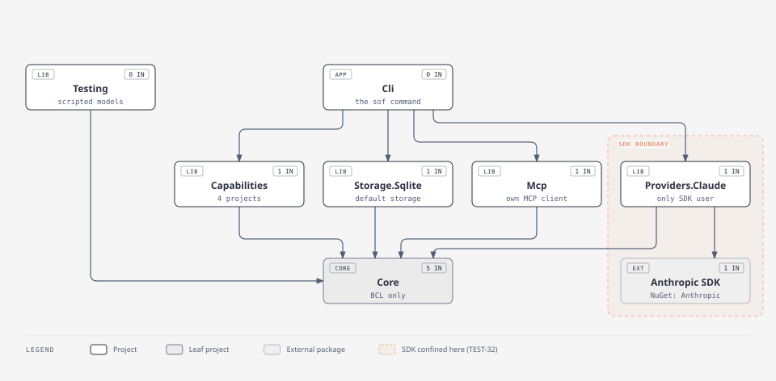
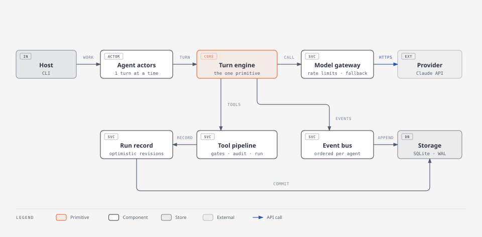
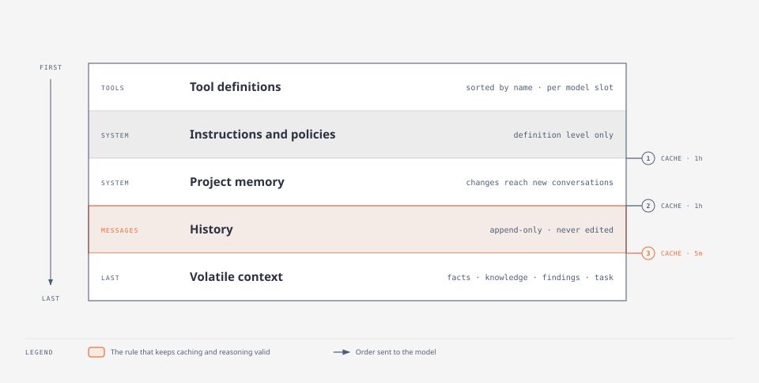
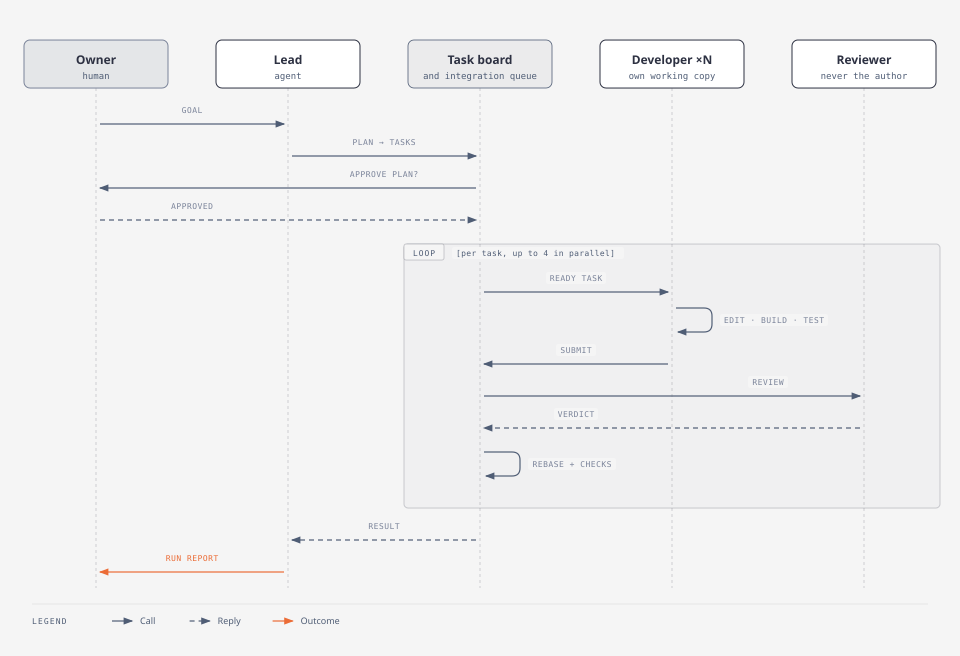
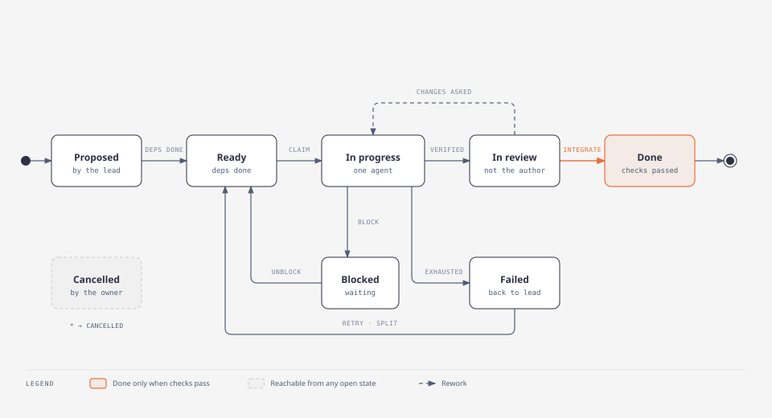
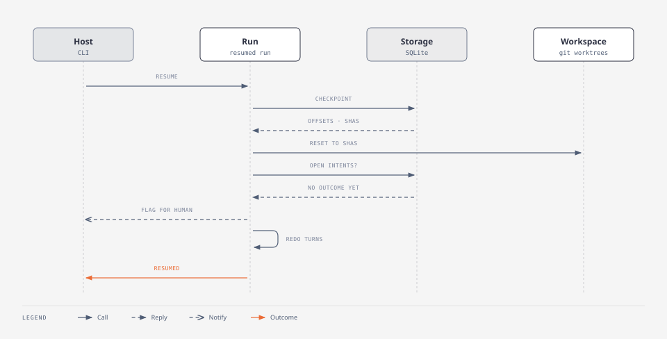

# Officina — Design

Status: draft for M0 design review · 2026-09-30 · implements `REQUIREMENTS.md` (revision 2),
configured by `CONFIGURATION.md`. The diagrams are in `docs/diagrams/`: an SVG for embedding, and an HTML page for
viewing. They are generated with the diagram-design skill (default style).

## 1. Solution layout



<sub>[Open the HTML version](docs/diagrams/solution-layout.html)</sub>

Officina is the product, and Sleepyshark is the organization: all projects live under the
`Sleepyshark.Officina.*` namespace. The CLI command is `sof`. Each project is one assembly, and its root
namespace is its name.

| Project | Box in the diagram | What it contains | Depends on | Loaded when |
|---|---|---|---|---|
| `Sleepyshark.Officina.Core` | Core | Options classes and validation; admission; turn engine; built-in loop patterns; context builder; conversation history and its shortening, kept through `IStorage.Conversations`; tool pipeline; run record; budgets; events; audit; extension interfaces (§4); built-in `record.*`, `control.*` and `artifact.*` tools; knowledge retrieval and its tools; the task board and its `tasks.*` tools, kept through `IStorage.Tasks`; the team pattern, which runs on the board, and the `team.*` tools; the `workspace.*` tools, over `IWorkingCopy` | .NET base library and a JSON Schema validator only | Always |
| `Sleepyshark.Officina.Team` | Capabilities | Empty for now: the team runs on the task board, so it lives in Core beside it (S20) | Core | `team` is on |
| `Sleepyshark.Officina.Workspace` | Capabilities | Git-backed workspace: baseline, working copies, integration queue, edit safety; `sof` registers Core's `workspace.*` tools over its working copies, as `extension:` ids | Core; the git CLI at run time | `workspace` is on |
| `Sleepyshark.Officina.Sandbox` | Capabilities | Linux sandbox (bubblewrap, cgroups v2) and Windows sandbox (AppContainer, Job Objects); filtering network proxy; `sandbox.*` tools and the command rules gate, which `sof` registers as `extension:` ids | Core | `sandbox` is on |
| `Sleepyshark.Officina.Capabilities` | Capabilities | Human interaction, project memory, checkpoints; `human.*` and `memory.*` tools | Core | Each part when its capability is on |
| `Sleepyshark.Officina.Storage.Sqlite` | Storage.Sqlite | Default storage, conversations, the run record and artifacts included: one SQLite file in WAL mode; artifacts are text rows in it | Core, `Microsoft.Data.Sqlite` | Configured as storage (the CLI's default) |
| `Sleepyshark.Officina.Mcp` | Mcp | Own MCP client for stdio and Streamable HTTP. Turns each server tool into a core tool. | Core | `toolServers` are configured |
| `Sleepyshark.Officina.Providers.Claude` | Providers.Claude | The Claude provider: maps requests (§9), places cache markers, streams, classifies errors. The price table ships as the `claude` provider's default prices in Core's options | Core, Anthropic C# SDK | A `claude` provider is configured (the default) |
| `Sleepyshark.Officina.Testing` | Testing | Test kit: scripted models, controllable clock, fake tools, in-memory workspace, sandbox and storage, record and replay (TEST-01, TEST-02) | Core | In tests, and by `sof config dry-run` (CFG-12) |
| `Sleepyshark.Officina.Cli` | Cli | The coding team CLI: `init`, `run`, `resume`, `rollback`, `report`, `config`; loads configuration: merges the files and what they `extend` (the presets are embedded in Core), resolves agents' `extends`, then binds with Microsoft.Extensions.Configuration; approvals, questions, task board and cost views; the CLI human-interaction channel | Every project, Microsoft.Extensions.Configuration and System.CommandLine (Testing only for the scripted model of `config dry-run`); it receives the Anthropic SDK only transitively, through the Claude provider | — |
| `Anthropic` (NuGet) | Anthropic SDK | The official Claude SDK | `Microsoft.Extensions.AI.Abstractions` (transitive) | With the Claude provider only |

Dependency rules, enforced by the dependency check, which runs as a test in CI (TEST-32):

- Every project depends on `Sleepyshark.Officina.Core`. Core depends on no other project and on no AI or
  agent framework.
- Only `Sleepyshark.Officina.Providers.Claude` references the Anthropic SDK directly. Projects that
  reference the provider, such as the CLI, receive the SDK and its transitive
  `Microsoft.Extensions.AI.Abstractions` through it, but no project code outside the provider uses
  either.
- Capability projects never reference each other. Where one needs another, for example the sandbox
  needing the workspace, it uses that capability's interface in Core, and validation checks that
  both are on (CAP-03).
- A capability that is off is not loaded, so it adds no tools, storage or settings (CAP-02).

## 2. Runtime



<sub>[Open the HTML version](docs/diagrams/runtime.html)</sub>

- **Agent actor.** Each agent has a mailbox (`Channel<T>`) and processes one turn at a time
  (LOOP-02). Messages that arrive during a turn are appended at the next iteration (CTX-08).
- **Turn engine.** This is the only primitive (principle 4). Patterns, including the team, call
  `PatternContext.RunStepAsync(id, step, input)` and nothing else. A step is a turn of an agent, that
  agent's own pattern, or a nested pattern, so every leaf is a turn, and budgets (each drawn from its
  parent's), cancellation, events and handoffs behave the same everywhere.
- **Optimistic revisions.** Shared state is written without a coordinator or lock. A record
  proposal is validated against the record as read, then appended with the next revision; the
  store's key (run, revision) refuses a revision already taken, and the core then reads, validates
  and tries again. No write overwrites another, across threads and processes (REC-02, REC-04,
  CONC-01). Task and memory changes follow the same pattern.
- **Model gateway.** Every model call goes through it (`ModelGateway`). Per provider, one line serves all agents: at most
  `maxConcurrentCalls` calls in flight, the rest waiting in turn, the team lead's first (MDL-08, CLD-10). A failure that
  is transient or rate-limited is retried after a wait that doubles each time, or the provider's `Retry-After` if longer,
  and that wait holds back every agent; after `maxAttempts` the profile's fallbacks are tried in order (REL-01, MDL-04,
  MDL-05). It tells the turn about a fallback (`FallbackUsed`) and a reply it starts over (`ReplyRestarted`), so the
  turn records the switch, prices the call by the fallback's model, and drops the part of the reply that was void.
- **Event bus.** Each event takes the runner's next sequence number, so every agent's events are in
  order, and is appended to the stored log. A reader (`EventBus.ReadAsync`, an `IAsyncEnumerable`)
  gets the stored events after a sequence number, then live ones from its own bounded queue. A
  reader that falls behind is detached and catches up from the log, so it never blocks an agent
  (EVT-03, EVT-04).
- **Telemetry.** Traces and metrics use the base library's `ActivitySource` and `Meter`, named
  `Sleepyshark.Officina`, with the OpenTelemetry GenAI names (OBS-01, OBS-02). Logs are an
  `EventSource`, `Sleepyshark-Officina` (OBS-03). The host chooses the exporters; Core has none.

## 3. Model request and caching



<sub>[Open the HTML version](docs/diagrams/model-request.html)</sub>

Every model call is built from five parts, always in this order (CTX-01). Parts 1–3 are the stable
prefix. They are built once, when a conversation starts, and never change for that conversation.

| # | Part | What it contains | Built from | Changes when | Sent to Claude as |
|---|---|---|---|---|---|
| 1 | Tool definitions | Name, description and input schema of each tool the model slot offers, sorted by name | The slot's tool sets and the enabled capabilities (TOOL-03); MCP tool lists read at startup | Only for new conversations, after a configuration change or a tool server's list changes | `tools` |
| 2 | Instructions and policies | The agent's instructions, with placeholders filled from project and agent values only; output format rules; how content from tools, documents and other agents is labelled as data (INV-08) | The agent definition | Only for new conversations, after a configuration change | First `system` block, then boundary ① |
| 3 | Project memory | Conventions, how to build and test, architecture summary, project-wide decisions (MEM-01, MEM-02) | The memory store, as of the revision the conversation started with | Only for new conversations. Running conversations receive approved changes as appended operator messages instead (MEM-03). | Second `system` block, then boundary ② |
| 4 | History | Everything said so far: each turn's work, labelled with its sender; the model's replies, including reasoning blocks exactly as received (MSG-02); tool calls and their trimmed results; messages received during a turn (CTX-08); operator messages; shortening summaries | The conversation store | Grows by appending only. Earlier content is changed only by history shortening (HIST). | `messages`, then boundary ③ on the last cacheable block |
| 5 | Volatile context | Facts with source and as-of time, in a stable order (CTX-07); passages retrieved before the turn, with citation ids; findings and decisions; the current task's status and acceptance criteria; operating facts such as the caller and the date (CTX-09) | Run record, task board, knowledge sources and host, rebuilt for every call (LOOP-10) | Every call | A turn-scoped mid-conversation `system` message; where unsupported, a text block after the tool results (CTX-10) |

The three cache boundaries (CTX-11):

| Boundary | Covers | Shared by | Lifetime | Why there |
|---|---|---|---|---|
| ① | Parts 1–2 | Every agent with the same definition and model slot, in every project | 1 hour | Agents of one role start throughout a run, often minutes apart |
| ② | Parts 1–3 | Every agent with the same definition, model slot and memory scope | 1 hour | Memory differs per project, so it gets its own boundary after the shared part |
| ③ | Parts 1–4 | One conversation | 5 minutes, configurable | Calls within a turn come seconds apart. Agents that often wait for approvals can use 1 hour. |

Claude allows at most four boundaries and requires longer lifetimes before shorter ones; this
layout uses three. A prefix shorter than the model's minimum cacheable size simply isn't cached.
Cache reads and writes are measured on every call, and a low hit rate raises a warning (COST-01).

**Project memory (MEM).** Memory is a log of proposals and of the decisions on them, kept per scope
(project, owner or tenant) with optimistic revisions like the run record (CONC-01). Only approved
entries are memory; a decision that replaces another says so, and a replaced entry leaves memory but
stays in the log. The lead (through `memory.review`) or the owner (asked at the proposal) approves,
as configured. A conversation records the memory revision of its prefix and the revision it has been
told of. Before each call, changes approved since are appended as one operator message, so the
prefix never changes; after shortening, which may drop that message, they are told again, as are the operator's other messages. When a
change would take memory past its size limit it stays proposed, and agents propose a condensed
version that replaces several entries with one. Only the owner approves that, and the replaced
entries stay in the log, so nothing is dropped silently (MEM-05).

How each call is assembled:

1. Take the conversation's stable prefix (parts 1–3) unchanged.
2. Take its history (part 4) and append what is new since the last call: the model's last reply,
   the results of the tools it asked for, and any messages that arrived.
3. Build the volatile context (part 5) and add it at the end. In the fallback form, after the first
   call of a turn only what changed since it was last sent is appended.
4. Place boundary ③ on the last cacheable block of history.
5. Check that the request starts with exactly the content of the previous request (the append-only
   check). It runs before every call, and a request that fails it is not sent.
6. Send the request through the model gateway.

## 4. Extension interfaces

An application adds behaviour only through these interfaces (§4.3 of the requirements). They are
in `Sleepyshark.Officina.Core.Extensibility`.

```csharp
public interface IModelProvider    { ProviderCapabilities Capabilities { get; }
                                     IAsyncEnumerable<ModelEvent> StreamAsync(ModelRequest request, CancellationToken ct); }
public interface ITool             { ToolDescriptor Descriptor { get; }
                                     ValueTask<ToolResult> InvokeAsync(ToolCall toolCall, CancellationToken ct); }
public interface IGate             { ValueTask<GateDecision> EvaluateAsync(GateContext context, CancellationToken ct); }
public interface ICheck            { ValueTask<CheckResult> RunAsync(CheckContext context, CancellationToken ct); }
public interface IKnowledgeSource  { ValueTask<Retrieval> RetrieveAsync(RetrievalQuery query, CancellationToken ct); }
public interface ILoopPattern      { ValueTask<StepResult> RunAsync(PatternContext context, CancellationToken ct); }
public interface IHumanChannel     { ValueTask<HumanAnswer> AskAsync(HumanRequest request, CancellationToken ct); }
public interface IStorage          { IRunStore Runs { get; }  IConversationStore Conversations { get; }  IRecordStore Records { get; }
                                     ITaskStore Tasks { get; }  IMemoryStore Memory { get; }  ICheckpointStore Checkpoints { get; }
                                     IEventLog Events { get; }  IAuditLog Audit { get; }  IArtifactStore Artifacts { get; }
                                     ValueTask<OwnerData> ExportAsync(string? tenant, string owner, CancellationToken ct);
                                     ValueTask DeleteAsync(string? tenant, string owner, CancellationToken ct);
                                     ValueTask DeleteExpiredAsync(RetentionOptions retention, DateTimeOffset now, CancellationToken ct); }
public interface IHistoryShortener { ValueTask<ImmutableArray<Message>> ShortenAsync(ModelRequest request, CancellationToken ct); }
public interface IWorkspace        { ValueTask<IWorkingCopy> OpenWorkingCopyAsync(TaskId task, AgentId agent, CancellationToken ct);
                                     ValueTask<IntegrationResult> IntegrateAsync(IWorkingCopy copy, CancellationToken ct);
                                     ValueTask<WorkspaceSnapshot> SnapshotAsync(CancellationToken ct);
                                     ValueTask RestoreAsync(WorkspaceSnapshot snapshot, CancellationToken ct); }
public interface ISandbox          { string? Probe();
                                     ValueTask<ISandboxProcess> StartAsync(SandboxCommand command, CancellationToken ct); }
public interface ISecretSource     { ValueTask<SecretValue> GetAsync(string name, CancellationToken ct); }
```

| Interface | Implement it to | Called by the core when | Receives | Returns | Rules the core enforces |
|---|---|---|---|---|---|
| `IModelProvider` | Add a model provider | The model gateway sends a model call | `ModelRequest`: profile settings; the prefix (tools, instructions); history ending with the volatile context, as a turn-scoped system message where the provider supports one; cache boundaries | A stream of `ModelEvent`: text, reasoning, tool requests, usage, stop reason | `CapabilitiesOf(model)` is checked at validation, for each profile and each of its fallbacks (MDL-04, MDL-06). Failures are thrown as a `ModelCallException` with their category and, if the provider asked for one, the wait (MDL-05, REL-01). It receives no secrets except its own credential. |
| `ITool` | Add an application tool | The model asks for the tool and the tool pipeline lets the call through (§5) | `ToolCall`: validated arguments, caller identity, the calling agent, the task board to read, idempotency key, secret source, the run record to read, and a callback that publishes its output as it is produced | `ToolResult`: content, artifacts, or an error category (TOOL-08) | `Descriptor` declares the name, input schema, kind (read or write) and defaults. A write tool needs a gate (INV-04). No access to configuration, budgets or other agents (INV-10). |
| `IGate` | Add a rule that needs code | Before each call of a tool it is attached to (TOOL-05) | `GateContext`: tool, arguments, caller, run record, task board when on, and whether the agent has read untrusted content | `GateDecision`: allow, deny with a reason, ask a human, or route | Deterministic: no model calls and no side effects. |
| `ICheck` | Add an output or verification check | Output is produced (OUT-03), a task is submitted (TASK-05), or a change is integrated (WS-02) | `CheckContext`: output, artifacts, read-only working copy, task | `CheckResult`: passed or failed, with findings | Only the result decides; nothing the agent says can override it (INV-09). Commands run in the sandbox. |
| `IKnowledgeSource` | Search the application's own data | Before a turn, or when the agent calls a `knowledge:` tool (CTX-04) | `RetrievalQuery`: question, caller, maximum passages | `Retrieval`: passages, citations, and covered, partly covered or not covered (CTX-05) | Results are labelled as data (INV-08). It sees only the caller's tenant (SEC-02). |
| `ILoopPattern` | Add a loop pattern | A step selects the pattern by name (PAT-07) | `PatternContext`: its input and settings; `RunStepAsync` for a step, which draws on the pattern's budget; `HandOff` | `StepResult`: the outcome (completed, handed off, failed or cancelled), output and handoff | It can only call the core's primitives, so budgets, cancellation, events and handoffs apply (PAT-06). |
| `IHumanChannel` | Change how humans are reached | An approval, question, sign-off or owner message is needed (HITL) | `HumanRequest`: kind, agent, summary, pending action, deadline | `HumanAnswer`: approve, approve a changed version, deny, or text | The core applies timeouts (HITL-02). A changed version goes through the checks again. |
| `IStorage` | Store state elsewhere | Whenever state is read or written | One store per kind of data: runs, conversations, records, tasks, memory, checkpoints, events, audit, artifacts | — | Conversations and the audit log are append-only. Every row carries its tenant, and every read and write names one (SEC-02). Stored data carries its format version, and data in an unknown version is refused (REL-04). Deleting an owner's data on request leaves audit entries to their retention (PRIV-02). |
| `IHistoryShortener` | Replace history shortening | The provider reports the input is too long (HIST-04) | The request it reported | Shortened history; it may clear old tool results, keeping a note (HIST-05) | The result is checked (HIST-02). A model provider with its own mechanism implements it, or says its model `Summarizes`, and the core asks the model through the gateway (HIST-01). It cannot change the run record, tasks or memory (HIST-03). |
| `IWorkspace` | Replace the git workspace | File tools run, a task starts or ends, a change is integrated, or a checkpoint is taken | Task, agent, working copy, snapshot | `IWorkingCopy` (read, read range, search, edit with the expected content hash, write, delete, move), integration result, snapshot | Edits fail if the file changed since it was read (WS-07). Integration is queued (WS-09). Protected paths are enforced (WS-05). |
| `ISandbox` | Replace OS isolation | A command tool or a check runs a command | `SandboxCommand`: command, working copy and its protected paths, limits, network allow list, permitted secrets | `ISandboxProcess`: streamed output and exit code; disposing it stops the command | `Probe` must report whether isolation is available, and the core refuses to run commands without it (SBX-07). |
| `ISecretSource` | Read secrets from elsewhere | A secret is needed, at the moment of use | The secret's name | The value | Values are never logged or placed in model input (INV-06). |

Masking (ING-02, ING-06) lives in Core and is configured by its patterns; it is not replaceable in v1.

## 5. Tool call path (TOOL-05, TOOL-07)

Every tool call goes through these steps in order. The first step that does not allow the call
decides the outcome.

| Step | Possible results | If the call doesn't continue |
|---|---|---|
| Validate arguments | pass, or invalid | Error sent to the model ("invalid arguments") |
| Permission rules | allow, deny, ask, route | Deny → "not authorised"; ask → human; route → another agent |
| Gates for all tools, then the tool's own gates | allow, deny, ask, route | Same as above |
| Human approval (if required) | approve, approve a changed version, deny, time out | A changed version goes back to "validate arguments"; deny or time out → "approval denied" |
| Idempotency lookup (irreversible tools only) | new, or already recorded | Never re-run; goes to a human (TOOL-10, RUN-07) |
| Audit "intent" (durable) | — | — |
| Run as the caller | done, failed, timed out | Retried per configuration, then the error goes to the model (TOOL-08) |
| Trim result, audit "outcome", publish events | — | — |

- **Every write-tool attempt is audited**, whichever step it stops at: allowed, denied, asked,
  failed or completed (TOOL-11).
- **If every call in an iteration is denied**, the turn ends in a handoff for a policy gap (LOOP-11).
- **Provider server-side tools** skip the per-call steps. They are audited when they appear in the
  response (TOOL-13).

## 6. Team



<sub>[Open the HTML version](docs/diagrams/team-run.html)</sub>



<sub>[Open the HTML version](docs/diagrams/task-states.html)</sub>

- **The board** is a run's, in Core, because gates and tools read it (TOOL-06). It is kept as changes keyed by
  (run, revision), written with optimistic revisions like the record (§2). Each change holds the tasks it changed,
  who changed them, what changed and why (TASK-07). Its rules are checked on the board after every change: the
  transitions in the diagram, which are fixed in code (TASK-02), dependencies that exist and form no cycle (TASK-03),
  and done only for a task whose checks passed and, if it requires one, whose review approved it (TASK-05, TASK-06).
- **The team** is an agent's own pattern (`TeamRun`), built from turns like every other. Each agent of it is an instance,
  `role[n]` or the lead, with its own turns, budget, inbox and status; it sees only its task as data, the board when it is the
  lead, and messages sent to it (TEAM-04). The team works from the board as it is, so a resumed run goes on from its last
  checkpoint's board: the lead plans only while the board is empty, each ready task goes to a free agent of its role, a task
  that needs a review to another agent whose tools can review, and work that ends unfinished fails its task back to the lead
  with the reason. The lead's authority (assign, retry, cancel, decide on memory) is a flag the team sets, never a name.
- **Done means integrated.** Submitting runs the task's checks, and only if they pass is the task in review. The host
  integrates a task in review that is verified and approved, then marks it done; a conflict or a failed baseline check
  returns it to its author as a failed attempt (WS-03). The last failed attempt, or a used-up task budget, sends it to
  the lead as failed (TASK-09). A change that adds conflict-marker lines (`<<<<<<< `, `>>>>>>> `) is a conflict, even in a
  file that really holds them, such as documentation about git.
- **The plan sign-off** (TEAM-10, HITL-04): with `planApproval` on, no task is dispatched until the owner approves the
  lead's plan; a denial goes back to the lead to re-plan (it carries no reason: the owner explains with `tell lead …`), and no
  answer hands the run off. The approval is a `planApproved`
  event, so a resumed run does not ask again.
- **Helpers** (TEAM-07) are nested turns: `team.start_helper` runs one of the agents the definition lists in `helpers`, as
  `helper[parent.n]` with `n` numbered in the run, inside the parent's turn. Its spending counts against the parent's turn
  budget, its permissions are within the parent's, it has no tool the parent does not, and it keeps the parent's task (so the
  workspace write tools refuse it in that task's copy, TASK-06); depth and count are limited by
  `capabilities.team.helperDepth` and `helperCount`.
- **A human handoff** (EGR-04) is only explicit: `human.request_handoff` ends the turn in a handoff to a human with the
  model's reason.

## 7. Workspace and sandbox

| Concern | Design |
|---|---|
| Baseline and working copies | The workspace is the git repository's top folder, where `sof.json` is; a subfolder is refused, as protected paths and diffs are relative to the top. The baseline is a git branch. Each working copy is a `git worktree` on `agent/<task>`. The core uses the git CLI, because libgit2's worktree support is limited. A run that dies leaves its worktrees behind; the next run to hold the workspace removes them, and the branches of runs that cannot resume. |
| Integration (WS-09) | A single queue per workspace. Each change is squashed into one commit, rebased onto the current baseline in a scratch worktree, then the baseline checks (`capabilities.workspace.baselineChecks`) run there, then the baseline fast-forwards. A failed check goes back to the task's author, and so does a change that adds, changes or removes a protected path (INV-10: a command can create a file such as `sof.<environment>.json` that did not exist when it started, which the sandbox therefore did not protect). A conflict does too, with the baseline merged into the task's working copy and the conflicts marked and committed there, so the author resolves them and the next integration squashes from the merged baseline (WS-03). Each task has its own working copy, `<run>-task.<id>`, which its author and its reviewer share, its verification checks run in, and which goes when the task is done or cancelled. |
| Edit safety (WS-07) | The core keeps a content hash for each agent and file at read time. An edit whose hash no longer matches fails. |
| Linux sandbox | bubblewrap (user namespaces). Only the working copy and toolchains are mounted, and the network namespace is empty. Allowed traffic goes through a host-side filtering proxy reached over a Unix socket in `$XDG_RUNTIME_DIR` (socket paths are limited to 108 bytes), bind-mounted into the sandbox and forwarded by socat. Limits use cgroups v2 through `systemd-run --user`. Stopping a command kills bubblewrap, which ends its PID namespace and everything in it. |
| Linux host setup | Done once by the installer, as root: an AppArmor profile that lets bubblewrap create user namespaces (Ubuntu 23.10 and later restrict them); `loginctl enable-linger` for service accounts, so they get a systemd user manager; socat installed. Everything else runs unprivileged (S00a). |
| Windows sandbox | An AppContainer per working copy, with ACLs granting the working copy, a home folder of its own and the toolchains, and a Job Object per command for CPU, memory, process count and kill-on-close. The network capability is removed. Protected paths stop inheriting the working copy's grant: an AppContainer opens only what is granted to it, and an entry denying it does not stop it. Allowed traffic goes through the filtering proxy over a named pipe whose access list admits only the container, with a small PowerShell forwarder inside the sandbox. No admin rights are needed. A loopback exemption also works, but it would expose every local service on the host, so it is not used (S00a). |
| No isolation available | Startup refuses to run with a clear reason. Commands never run unsandboxed (SBX-07). |

## 8. State and durability

- **Storage.** SQLite in WAL mode. Tables: runs (with the resolved configuration, CFG-07),
  conversations (append-only, a row per turn), record entries (keyed by run and revision),
  artifacts (text rows, such as the full text of a trimmed tool result), task board changes (keyed by run and revision),
  memory, checkpoints, events, audit.
- **Checkpoints are cheap because history is append-only.** A checkpoint stores:
  - the number of stored turns of each conversation;
  - the revisions of the record and the task board, and the position in memory's log;
  - the commit of each working copy (uncommitted changes are committed as a checkpoint commit on its branch first);
  - the number of audit entries, so a rollback can list the effects made since.

  A run takes one when it starts, then where `capabilities.checkpoints.at` says (after each turn by default), and on demand.
- **Rollback (RUN-08)** truncates each store to those positions and resets the worktrees, opening again any that are gone, from
  their branch or from the commit alone, and removing any that did not exist then. The restored history is byte-identical to
  what was sent earlier, so it is still valid for the provider. A conversation is shared by every run of the agent and caller,
  so a rollback or resume is refused when another run has written to it since the checkpoint. Project memory is shared too
  (S17) and is left as it is: the checkpoint records its log position, and the rollback lists the changes made since as not
  undone. Events and the audit log are history and are never truncated; the rollback is an event, and it lists the write-tool
  attempts made since that are outside the core's state (everything but the built-in tools and the `workspace.*` tools).
  Integration squashes the checkpoint commits into the change's one commit, so older checkpoints' commits are then kept only by
  the reflog, and `git gc` can make restoring them fail.
- **Resume (RUN-04)** is a rollback to the run's last checkpoint, then the run's work starts again on the restored state, with the
  event numbering continued from the stored log. A run whose process died is still `running` in the store, which is how resume
  finds it. Write-tool intents without an outcome are flagged in a `runResumed` event (RUN-07), and an irreversible call is not
  repeated, because its intent is already in the audit log (TOOL-10): it goes to a human. Patterns do not resume part-way: the
  steps run again from the first, on the state the checkpoint holds. The budgets hold across the restart (INV-07): the resumed
  run's budget starts with the cost, tokens and tool calls summed from the stored events, and the time spent inside its work
  items, so downtime between processes does not count. Event retention shorter than a run's life would under-count it. `sof` holds a lock file for a run while it works on it, so a live run is not resumed from another process.
- **Budgets and the report (RUN-05, RUN-10, RUN-11).** Each level draws on the one above: turn, pattern, agent, run; a task's cost
  is checked beside them. Exhausting any ends the turn in a handoff that names the level, and the run level asks the owner. The agent level exists only when configured. A level
  announces a `budgetWarning` once at 80% of a limit. The report is built from the stored events, record and board, so it can be
  made for a run of another process; cost is summed from `modelCallEnded` events by their agent, task, step and model.



<sub>[Open the HTML version](docs/diagrams/resume.html)</sub>

## 9. Claude provider mapping

| Core | Claude API |
|---|---|
| Stable prefix and cache boundaries ①② | `tools` (sorted), then `system` blocks with `cache_control`. `ttl: "1h"` before 5-minute boundaries. |
| History and cache boundary ③ | `messages`, with `cache_control` on the last cacheable block |
| Volatile context | Turn-scoped mid-conversation `system` message where supported; otherwise a text block after the `tool_result` blocks |
| Operator messages, memory changes | Mid-conversation `system` messages; a model without them (all but the allow list) gets a user message that starts `Message from the operator:` |
| Model profile | `model`, `output_config.effort`, `max_tokens` (64,000 by default), `tool_choice: auto` or `none`. Forced tool choice is not used, because current models reject it. Every other profile setting, such as `thinking`, is sent as a top-level field, as JSON where it parses. |
| Provider tools (TOOL-13) | `web_search`, `web_fetch` and `code_execution`, at their current versions, with `max_uses` and `allowed_domains` from the tool's `limits`. Their calls and results stay in the history as Claude's own content, and each result is reported as a call the provider ran. |
| Structured output | With `features.structuredOutput`, the agent's `output.schema` as `output_config.format`; the core checks the output against it either way. `strict: true` on tools is not sent: the core checks every call against its tool's schema before it runs, and strict mode limits the schemas Claude accepts, so an MCP tool's schema could fail every call |
| History shortening (HIST-01) | The provider's own: compaction on demand (`compaction: {type: summarize}`, beta `compact-2026-09-04`) over the earlier turns, with the same model, instructions and tools. The core asks for it with a request to summarize, through the model gateway, when the model `Summarizes`. The streamed `compaction` block (its summary and opaque content in `compaction_delta` pieces, then its signature) takes their place, first, as an assistant message of its own, and every later request that carries it sends the beta. The operator's messages it summarized are told again after it. The summary call is paid like any other call, also when it fails |
| Feature switches (CLD-06) | `providers.claude.features`: `clearToolResults` (`context_management` with `clear_tool_uses_20250919`, beta `context-management-2025-06-27`), `taskBudget` (`output_config.task_budget`, beta `task-budgets-2026-03-13`), `refusalFallback` (`fallbacks: "default"`, beta `server-side-fallback-2026-07-01`). After a fallback, the `fallback` block stays where it came, and the declining model's reasoning before it is not sent back; each attempt in `usage.iterations` is priced by its own model, the switch reported as a fallback (`modelFallback`, failure `Refused`) |
| Batches (MDL-10) | Not used in v1 (CLD-11): batch work runs as ordinary calls |
| Stop reasons | `end_turn` → finished, `tool_use` → wants tools, `max_tokens` → output limit, `stop_sequence`, `pause_turn` → paused, `refusal` → refused, `model_context_window_exceeded` → input too long, anything else → unknown |
| Errors (MDL-05) | Classified by the SDK's exception type, then its error type. 429 → rate-limited; 500, 529 and connection errors → transient; an error that arrives mid-stream (no status code, for example `overloaded_error`) → transient; 401 and 403 → authentication; a 400 whose message says the prompt is too long → input too long, reported as the stop reason so the history is shortened (the SDK has no distinct type, so the provider matches the API's error message, not model output); other 400s → invalid request |
| SDK use (S00b) | The provider uses only the beta API (`client.Beta.Messages`), because turn-scoped system messages, fallbacks, task budgets and context management are typed only there. JSON the core already holds (tool and output schemas, stored reasoning blocks) is deserialized into the SDK's own types (`JsonSerializer.Deserialize<BetaToolUnion>`, `<BetaContentBlockParam>`). The SDK's own retries are off (`MaxRetries = 0`), so the model gateway is the only retry policy, including for mid-stream errors (REL-01, CLD-10). The SDK's exceptions do not carry headers, so a handler on the HTTP transport notes `Retry-After` of failed responses. Only the Opus 5 and 4.8, Fable 5, Mythos 5 and Sonnet 5.5 models take a system message mid-conversation, so `CapabilitiesOf` leaves out turn-scoped messages for every other model. A call silent for longer than the provider's `timeout`, a dropped connection and the SDK's own timeout are transient failures. |
| Usage | `input_tokens`, `output_tokens`, `cache_read_input_tokens`, `cache_creation_input_tokens`, with the one-hour part priced at `cacheWrite1h` and the rest at `cacheWrite5m` |
| Streaming | Always on. Tool inputs use eager streaming and are validated against the schema before any tool runs. |

## 10. Risks to settle early

| Risk | Plan |
|---|---|
| Sandbox gaps the spike did not cover: isolation between two sandboxes (SBX-06), output size caps, background processes, and Windows files readable by all apps (Program Files, Windows) | Prove them in S15; fallbacks for hosts that cannot isolate are rootless Podman (Linux) and Windows Sandbox or WSL2 (Windows) |
| Claude beta features (turn-scoped system messages, compaction) change or are not on the chosen model | Each one is behind a provider feature flag, with the append-only fallback always available |
| Integration queue throughput with slow test suites | Measure in M6. The option is to batch compatible changes into one baseline check run. |
| The 90% benchmark target depends on the model | The goal set's difficulty is agreed before M6 (TEST-31) |

## 11. Testing

Tests replace only what sits at a **system boundary**: something outside the process or outside our
control. Everything inside Officina is tested with the real objects, never mocks.

| Boundary | Test double | From |
|---|---|---|
| Model provider | Scripted model; recorded exchanges replayed offline (TEST-02) | `Sleepyshark.Officina.Testing` |
| External tool servers and network | A reference MCP test server, over stdio and HTTP | `tests/Sleepyshark.Officina.Mcp.TestServer` |
| OS processes and sandbox | Fake sandbox that records commands and returns scripted output | Testing |
| Clock | `FakeTimeProvider` (the core takes `TimeProvider`, never `DateTime.Now`) | Testing |
| Environment variables and secret source | An in-memory secret source; variables set per test | Testing |
| The human | A scripted human channel that answers approvals and questions | Testing |

Inside the boundary, use the real thing:
- **Configuration, validation, the tool pipeline, gates, context building, the run record, patterns:**
  real objects wired as in production.
- **Files:** real files in a temporary directory, not a mocked file system.
- **Git and the workspace:** a real git repository in a temporary directory.
- **Storage:** the in-memory store or SQLite in a temporary file, both real implementations that
  pass the same contract tests.

A test that needs a mock of an internal type is a sign that the design needs a seam at a real
boundary instead.

The load and latency tests (TEST-30, `tests/Sleepyshark.Officina.Load.Tests`) run the real runner against the scripted model and
time it at the boundaries: a wrapper around the model provider takes out the time spent inside the model, and one around storage
times the durable writes, which LAT-01 leaves out and the tests report on their own. They run apart from the other tests, one
at a time, and print what they measured.
