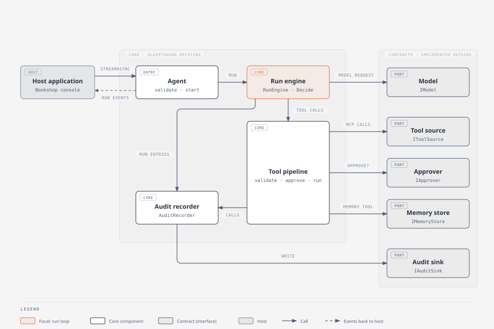
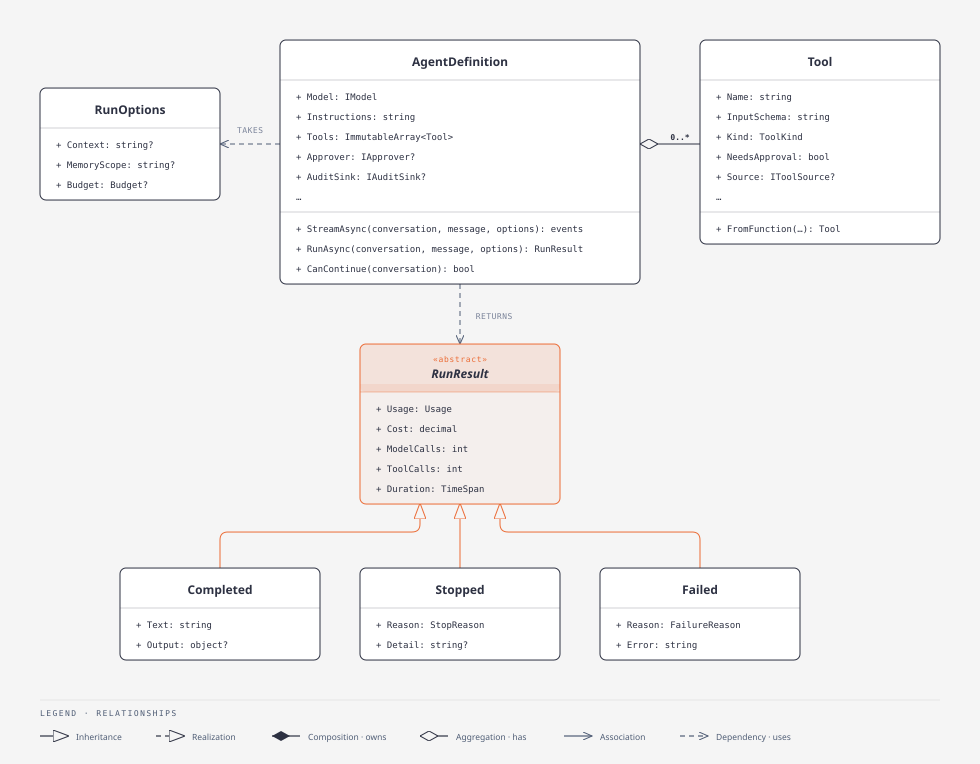
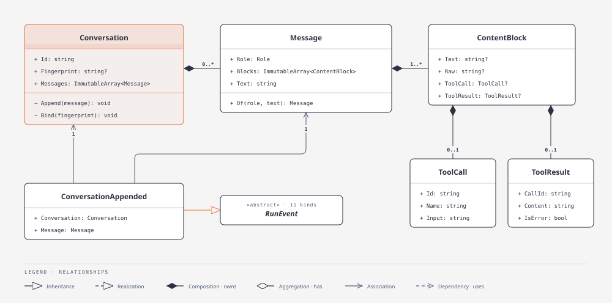
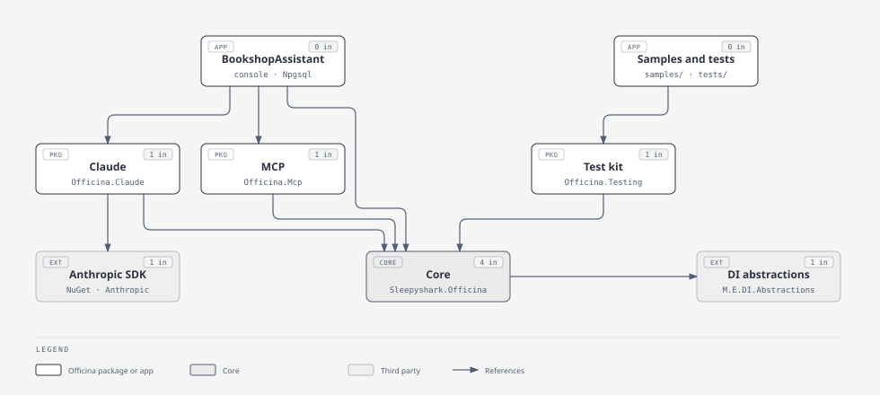
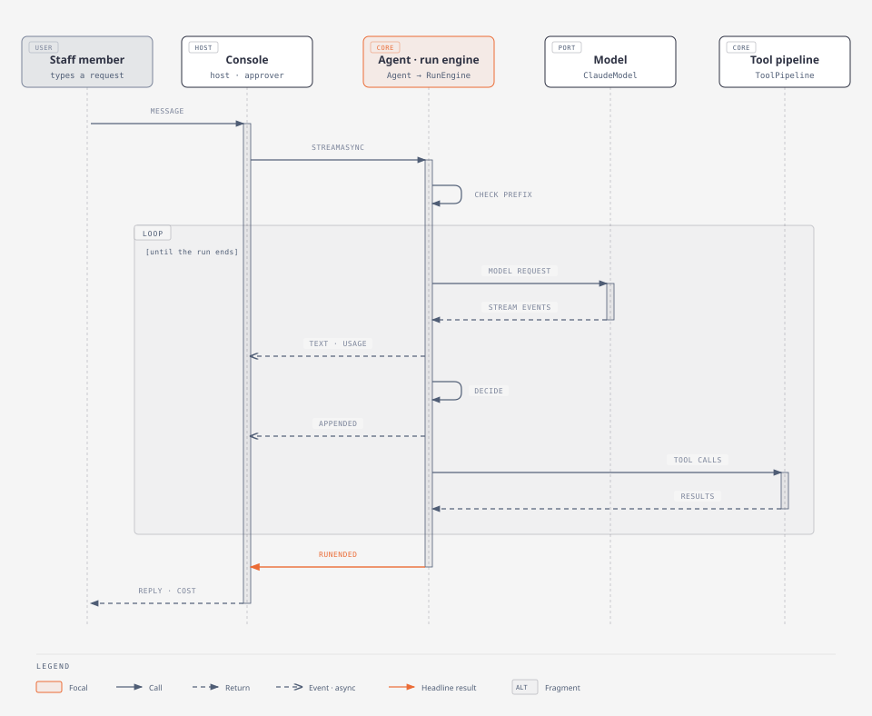
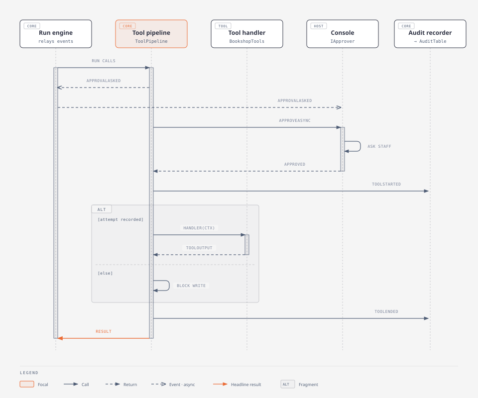
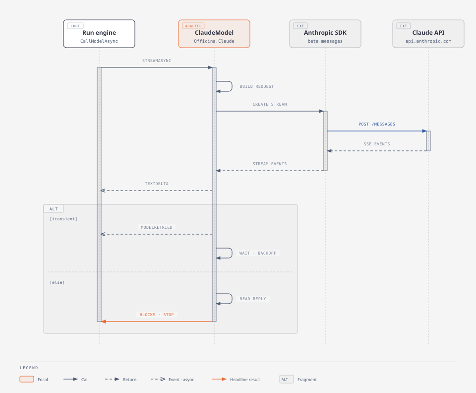

# Officina core design

How the core (`Sleepyshark.Officina`) is built, how the other projects implement it, what happens during one chat turn,
and which design principles the code follows. This is the type-level view of the code as of 2026-10-06.
[ARCHITECTURE.md](../../ARCHITECTURE.md) stays the authority for concepts and contracts, and holds no type names.
If the two disagree, the code is right and this page needs updating.

| Diagram | Type |
|---|---|
| [Core architecture](#core-architecture) | Architecture |
| [Agent, run and result](#agent-run-and-result) · [Conversation, messages and events](#conversation-messages-and-events) | UML class |
| [Package dependencies](#package-dependencies) | Dependency graph |
| [One chat turn](#one-chat-turn) · [A write call that needs approval](#a-write-call-that-needs-approval) · [One model call](#one-model-call) | Sequence |

The diagrams follow the diagram-design skill's default style. Each `.html` file in [diagrams/](diagrams/) is the
source; the `.svg` beside it is exported from it for this page.

## Core architecture

The host calls one entry point, a run of an agent. The run engine sequences each run. Everything outside the core is
reached through a contract the core owns and an adapter or the host implements.

| Block | Responsibility | In the code |
|---|---|---|
| Agent | What an agent is: model, frozen instructions, sorted tools, optional output contract, context management, and host policy (approver, audit sink, secrets, clock). It validates a run's options and starts the run. | `Agent`, `RunOptions` |
| Run engine | Sequences one run: lock the conversation, check the prefix fingerprint, connect tool sources, call the model, append, run tools, loop, and end in exactly one result. | `RunEngine`, `RunScope` |
| Reply decision | A pure mapping from a model reply (error, stop reason, blocks, tool calls) to "append or not" and "end with this result or continue". | `RunEngine.Decide` |
| Request composer | Builds every request in the same layout (sorted tools, instructions, history, pending messages). A hash of that prefix stops a conversation from continuing under other tools, instructions or settings. | `ModelRequest`, `Agent.Fingerprint` |
| Tool pipeline | For each call: find, validate input, ask approval, audit the attempt, invoke, redact and truncate. Reads run together and writes run one at a time; every call gets exactly one result. | `ToolPipeline`, `ToolSources` |
| Audit recorder | Turns important steps into numbered, redacted, truncated entries. With an audit sink, a write tool runs only once its attempt is recorded. | `AuditRecorder`, `AuditEntry` |
| Schema validator | Validates JSON against the JSON Schema subset the core uses, and refuses schemas outside it when a tool or output contract is defined. | `SchemaValidator` |
| Memory tool | Memory as an ordinary write tool with Claude's memory commands, confined to the run's memory scope and never part of the instructions. | `MemoryTool`, `MemoryPath` |
| Output contract | Exports a JSON schema from an application type, then validates and deserializes the final reply; a mismatch fails the run. | `OutputContract`, `TypedJson` |
| Budget guard | Adds up usage and cost. It is checked before every model call and lowers the call's output limit to what the budget allows. | `Spending`, `Budget` |
| Telemetry | Traces and metrics through .NET's `ActivitySource` and `Meter`, named after the OpenTelemetry generative-AI conventions. Message text appears only on opt-in. | `Telemetry` |
| Run events | Stream text, tool activity, approvals, appended messages, usage and the result to the host as they happen. | `RunEvent` and subtypes |

## Core classes

### Agent, run and result

### Conversation, messages and events

`RunEvent` has 11 kinds: `TextStreamed`, `ReplyRestarted`, `UsageReported`, `ToolCallStarted`, `ApprovalAsked`,
`ApprovalAnswered`, `ToolCallFinished`, `ConversationAppended`, `ConversationCompacted`, `ToolResultsCleared` and
`RunEnded`, which always comes last.

| Class | Description |
|---|---|
| **Built by the host** | |
| `Agent` | Immutable, stateless record describing an agent, and the only entry point for runs. It keeps tools sorted and refuses duplicates. |
| `RunOptions` | One run's context (sent as an operator message), memory scope and budget. Each value is validated when set. |
| `Tool` | A tool the model may call: name, description, input schema, read or write, approval need, handler. `FromFunction` builds one from a typed delegate. |
| `ToolContext` | What a handler learns about the run calling it: its memory scope. |
| `OutputContract` | Typed output: a schema exported from an application type, and how to read the reply into it. |
| `Budget` | Optional limits on one run's cost, tokens, model calls and time. |
| `ContextManagement` | Provider-side compaction and tool-result clearing; part of the prefix. |
| `MemoryTool`, `MemoryPath` | The memory tool over a store, and the scopes and paths that are valid on every system. |
| **Owned by the host, appended by the core** | |
| `Conversation` | Append-only messages and the bound fingerprint, serializable to JSON; one run at a time. |
| `Message`, `ContentBlock` | A role and its blocks. A block the model produced keeps the provider's raw JSON and is replayed byte for byte; the core reads only its text and tool-call views. |
| `ToolCall`, `ToolResult` | Neutral views of a requested call and the result that answers it. |
| **Returned to the host** | |
| `RunEvent` | Everything that happens during a run, in order. |
| `RunResult` | Exactly one of `Completed` (text, typed output), `Stopped` (reason) or `Failed` (reason, error), with usage, cost, counts and duration. |
| **Contracts** | |
| `IModel` | A provider's model with fixed settings. It streams model events for one request and retries transient failures itself. |
| `IToolSource` | A source of tools that holds a connection, such as an MCP server: connect before a run, report connection changes. |
| `IApprover` | A person or policy that approves or denies a call. Without one the run is unattended, and calls that need approval are denied. |
| `IMemoryStore` | The files of one scope: list, read, write, delete, rename. |
| `IAuditSink` | Durable, ordered storage of audit entries; a failed write throws. |
| **Internal** | |
| `RunScope` | What one run's steps share: agent, conversation, span, audit recorder, spending, tool context. |
| `ToolPipeline` | Runs one reply's calls with validation, approval, audit, invocation, redaction and truncation. |
| `AuditRecorder` | Numbers, redacts and truncates entries, and writes them to the sink one at a time. |
| `Spending` | Usage, cost, call counts and elapsed time against the run's budget. |
| `ModelReply` | What one model call returned, shared by the engine and telemetry. |
| `SchemaValidator`, `TypedJson`, `Strings` | Schema subset validation; JSON settings for application types; text cutting that keeps surrogate pairs whole. |

## How other projects implement the core

### Package dependencies

Every package references the core, and the core references nothing outside the .NET base library. A dependency test
(TEST-05) fails if the core gains a package or project reference, or if any package but Claude references the
Anthropic SDK. Package names in the diagram drop the `Sleepyshark.` prefix. The samples and tests also reference the
core, Claude, MCP and memory-files packages, and `BookshopAssistant.Tests` references the app; the graph draws only
their edges to the two packages the app doesn't use.

| Contract | Production | Test double | Notes |
|---|---|---|---|
| `IModel` | `ClaudeModel` (Claude) | `ScriptedModel` | Beta messages API, streaming, adaptive thinking, cache points, the native memory tool, and its own retries that honour `Retry-After`. The scripted model rejects role sequences the real API rejects. |
| `IToolSource` | `McpToolSource` (MCP) | `FakeMcpServer` | Stdio or Streamable HTTP. It pins and filters the server's tool list once, so the prefix stays stable, and names tools `server__tool`. |
| `IMemoryStore` | `FileMemoryStore` (Memory.Files) | `InMemoryMemoryStore` | One hex-named directory per scope; refuses links and paths that leave the scope. |
| `IAuditSink` | `JsonLinesAuditSink` (Audit.JsonLines), `AuditTable` (app) | recording sink in tests | Each write is flushed before it returns. The app keeps entries in PostgreSQL for its `/audit` view. |
| `IApprover` | `BookshopConsole` (app) | `ScriptedApprover` | The console answers from its own event loop: it prompts on `ApprovalAsked` and completes the approval it is waiting on. |
| `Tool` | `BookshopTools`, the MCP export tools, the memory tool | plain delegates | Parameterized PostgreSQL queries; placing or cancelling an order is one transaction. |

## Chat flow

A staff turn in the Bookshop Assistant, such as "Order two copies of The Winter Archive for Alice Martin": the model
looks things up, asks to place the order (which needs approval), then answers.

### One chat turn

1. The console builds `RunOptions`: the date and staff member as context (sent at the start of a session and again only
   when it changes), the staff member as memory scope, and the lower of the reply budget and what is left of the
   session budget.
2. `StreamAsync` checks the options. The engine locks the conversation, starts the run span, records `RunStarted`,
   checks the prefix fingerprint (a mismatch fails the run), connects MCP sources and answers calls an interrupted run
   left without results.
3. Each pass of the loop checks the budget, sends the request and relays text and usage while the reply streams.
   `Decide` then says whether to append the reply and whether the run ends. The console saves the session on every
   `ConversationAppended`.
4. A `tool_use` stop runs the reply's calls (next diagram) and appends their results as one message. The loop ends at
   the first other stop: end of turn, refusal, output limit, context full, error, cancellation, budget, or 25 model
   calls.
5. The engine records `RunEnded`, ends the span and releases the conversation. The console saves the session with its
   new usage and cost, and prints the status line.

### A write call that needs approval

The pipeline runs on its own task and writes events to a channel the engine relays, so `ApprovalAsked` follows
everything that happened before it in the event stream. It may reach the console before or after `ApproveAsync` is
called, as the pipeline calls the approver straight after writing the event. The console prompts from its event loop
and completes a per-call answer that `ApproveAsync` waits on, so the two meet in either order. A host whose approver
answers from the event stream must do the same. The pipeline also records `ApprovalAsked` and `ApprovalAnswered` in
the audit trail (left out of the diagram), and before all this it has parsed the input and validated it against the
tool's schema. Read calls in the same reply run together; a write waits for the reads before it and runs alone. A
denied or unattended approval, invalid input, an unknown tool, a thrown handler and a cancelled call each become an
error result for the model, never an exception.

### One model call

The request lists the tools sorted by name (the memory tool as Claude's `memory_20250818`). The instructions are one
cached system block, the tail gets an automatic cache point, an operator message becomes a mid-conversation system
message, and stored blocks are sent as their raw JSON. A transient failure (rate limit, overload, 5xx, network) is
retried up to 5 attempts, waiting for `Retry-After` (at most 30 s) or a backoff with jitter. The engine discards the
text already streamed. "Prompt is too long" stops the run as `ContextFull`. An authentication or invalid-request error,
or a transient failure on the last attempt, throws `ClaudeException`, and the run fails.

## Principles and trade-offs

| Principle | In the code | Trade-off |
|---|---|---|
| **Architecture** | | |
| Ports and adapters | The core references the .NET base library only. Model, tool source, approver, memory store and audit sink are interfaces, and each adapter is its own package. A dependency test (TEST-05) fails if the core gains a reference or a package other than Claude references the Anthropic SDK. | The core carries its own JSON Schema subset validator (about 200 lines) instead of a library. |
| One primitive | A run of one agent is the only thing the core executes. The session summarizer is a second agent the host runs. | No built-in multi-agent orchestration; hosts compose runs. |
| Purpose-neutral core | No domain, UI, storage or transport types in the core; bookshop concepts live only in the app. | Hosts write more wiring (telemetry, stores, MCP servers). |
| **SOLID** | | |
| Single responsibility | `RunEngine` sequences, `Decide` decides, `ToolPipeline` runs calls; `AuditRecorder`, `Spending` and `Telemetry` each own one concern. `Agent` describes an agent and `RunOptions` carries per-run input. | Audit and telemetry calls sit inside the engine and pipeline rather than observing events, because a write must wait until its attempt is recorded. |
| Open/closed | Tools, providers and stores plug in through contracts. The memory tool is an ordinary `Tool` using `ToolContext`; the pipeline has no special case for it. | A provider recognizes the memory tool through the `IsMemory` marker to map it to its native tool. |
| Liskov substitution | Test doubles behave like the real thing: `ScriptedModel` rejects role sequences the Claude API rejects, and `InMemoryMemoryStore` enforces the same path rules. | The test kit is a shipped package that must track the real adapters. |
| Interface segregation | `IApprover` and `IAuditSink` have one method each, `IToolSource` three members, `IMemoryStore` five related file operations. | None found. |
| Dependency inversion | The core owns every contract. The clock is an injected `TimeProvider`; telemetry uses platform primitives the host exports. | The host must configure an exporter to see telemetry. |
| **Agent rules** | | |
| Append-only conversation | `Conversation.Append` is internal and only appends. Blocks keep the provider's raw JSON. The user message and context enter only with the reply that answers them. Compaction and clearing happen on the provider's side. | History can't be pruned on the client, so long sessions rely on provider features. Each append copies an immutable array. |
| Stable prefix | Tools sorted, instructions frozen, model settings fixed. A SHA-256 fingerprint is bound on the first append and checked on every run. Per-run context goes after the prefix as an operator message. | Changing tools or instructions means a new conversation. |
| Structured signals decide | Stop reasons are enums and results are three sealed records; `Decide` is a pure switch. The one place that reads error text is "prompt is too long" in `ClaudeErrors`, which has no error type of its own. | Hosts switch on result types; exceptions are kept for host mistakes. |
| Every run ends in a result | Model, tool and approval failures become values. Every tool call gets exactly one result, even when the run is cancelled. | A host that stops reading events abandons the run and gets no `RunEnded`. |
| **Safety** | | |
| Secure by default | Secrets are redacted from tool results, audit and telemetry. Unattended runs deny calls that need approval. With an audit sink, a write runs only after its attempt is recorded. Memory paths can't leave their scope or follow links. | Streamed text deltas and appended messages are not redacted (D13): redacting them would break byte-exact history or delay streaming. Without an audit sink, writes run with no trail (GEN-02). |
| Observability | One trace per run, with model and tool spans. Metrics cover tokens, cache hit ratio, cost, retries, approvals and audit failures. Message text appears only on opt-in. | Telemetry is static per process, the usual .NET pattern for `ActivitySource`. |
| **Practice** | | |
| Simplest thing that works | Limits are constants until a case needs a setting (25 model calls, 64,000-character results). A test caps the core at 3,500 lines. Features without a current user wait. | Some limits can't be configured. A shared MCP source's connection changes are credited to whichever run notices them first. |
| Concurrency | Reads run in parallel and writes in order. One run per conversation, enforced by an interlocked flag. Tool events cross a channel. Cancellation still gives every call a result. | The event channel is unbounded, so a slow host buffers events in memory. |
| Tests at the boundaries only | Scripted model, approver, fake MCP server and in-memory store replace the system boundaries; everything inside runs for real. Property tests cover the invariants (append-only history, secrets, memory paths, budget overshoot). | Live provider behaviour is covered only by the smoke tests, which are skipped by default. |
