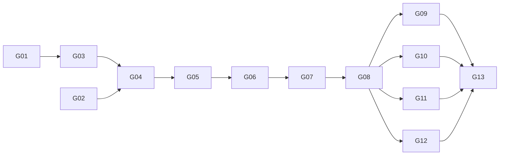

# Go port plan

Builds the Go implementation in [`go/`](../../go/): [`REQUIREMENTS.md`](../../REQUIREMENTS.md) phase 1, again, in 13
slices that mirror [`phase-1.md`](phase-1.md). Each slice `Gnn` has the acceptance criteria of `Snn` there, plus the Go
ones below. One slice = one branch (`slice/gnn-<slug>`) = one PR, stacked on the previous one until it is merged.

**Done means, for every slice:** the Go gates green (G12 in [`go.md`](../implementations/go.md): `gofmt`, `go vet`,
`golangci-lint`, `go mod tidy`, `govulncheck`, `go test -race -shuffle=on`), offline, fast and deterministic; the .NET
checks still green; every rule in [`go/CLAUDE.md`](../../go/CLAUDE.md) kept; an Opus review approved; then merged by
the lead. Requirement IDs map to Go tests in `go/docs/traceability.md`.

**The source is the requirements, not the C#.** Read the .NET code to learn what a requirement meant in edge cases;
never port its shape. The reviewer rejects C#-shaped Go (see `go/CLAUDE.md`).

## Decisions before G01

| # | Question | Recommendation |
|---|---|---|
| P1 | Confirm the proposed decisions G1…G14 in `go.md`, above all G5 (no container) and G6 (the core depends on the OpenTelemetry API) | Confirm: both follow Go's own conventions and keep D15's intent |
| P2 | Required checks: branch protection requires `ubuntu-latest`, `windows-latest`, `quality` and `mutation`, so a Go-only PR whose .NET workflow is skipped by a path filter would never merge | Run the .NET workflow on every PR, and add Go jobs (`go-ubuntu`, `go-windows`, `go-quality`, `go-mutation`) to a `go.yml` that also runs on every PR and exits early when nothing under `go/` changed; require all eight |
| P3 | Shared test data: .NET's golden request layouts (`tests/Sleepyshark.Officina.Claude.Tests/Fixtures/`) and conversation JSON | Move them to a top-level `testdata/` both implementations read, in G04; a request or conversation that differs between the two is a bug in one of them |

## Slices

| # | Mirrors | Go-specific work and acceptance (on top of the `Snn` criteria) |
|---|---|---|
| G01 | S01 Skeleton | `go.mod` (G1, G2), `doc.go` per package, `.golangci.yml`, CI per P2. Hooks: `git-gate.py` runs the Go checks when staged or pushed files are under `go/`, and the .NET ones only when .NET files change; a `go-rules.py` edit hook flags a package without `doc.go` and requirement IDs in comments. The dependency test (G4, G6) fails on a fixture that imports the SDK outside `claude`, or anything but the standard library and the OpenTelemetry API in the core |
| G02 | S02 Live check | Rerun S02's checks on the Anthropic Go SDK's beta surface: compaction, tool-result clearing, the memory tool, thinking display, a mid-conversation system message, structured output. Results in `go/docs/spikes/claude-features.md`; a feature the SDK lacks gets a decision (raw request fields, or wait) before G04. Under $1 |
| G03 | S03 Run loop | The run as `iter.Seq[RunEvent]` plus result (G10); `context` cancellation; conversation JSON byte-exact with `json.RawMessage` (G9); scripted model in `officinatest`. Plus: `goleak` clean after every test; a consumer that `break`s mid-run leaves no goroutine; 100 concurrent runs pass under `-race`. Sets the core line budget (G13) |
| G04 | S04 Claude adapter | Golden tests read the shared `testdata/` (P3) and match .NET byte for byte; retries honour `Retry-After` on recorded HTTP (`httptest.Server`); `examples/hello` chats live |
| G05 | S05 Tools and audit | Reads run in an `errgroup`, writes in order; the reply's event channel is sized from the call count; a panicking tool becomes an error result; fuzz test for the schema validator; TEST-08 against the reference validator (G8); `rapid` properties for TEST-07; first `gremlins` run sets the mutation threshold |
| G06 | S06 Bookshop console | `cmd/bookshop` on `pgx` (G7) against the same compose file and SQL schema as .NET; console with streaming and Ctrl+C through `signal.NotifyContext`; end-to-end tests with `testcontainers-go` |
| G07 | S07 Telemetry and audit view | Spans and metrics through the OpenTelemetry API (G6), checked with the SDK's in-memory exporter in tests only; same span names and attributes as .NET, so one dashboard reads both |
| G08 | S08 Sessions and budgets | Plus: a session saved by the .NET Bookshop resumes in the Go one with the same prefix (shared conversation format, G9) |
| G09 | S09 Memory | Fuzz test of path scoping, as well as the `rapid` property |
| G10 | S10 Long conversations | As S10 |
| G11 | S11 MCP | Own client over stdio (`os/exec`) and Streamable HTTP (`net/http`); fuzz test of message parsing; the child process is stopped and waited for when the context ends |
| G12 | S12 Typed output and summarizer | Output contract from a Go struct to the validator's schema subset, without `reflect` in non-test code unless the reviewer agrees it is the simplest way |
| G13 | S13 Samples, demo, smoke test | `examples/` as runnable `Example` tests and programs; the live smoke test behind a build tag; every requirement mapped in `go/docs/traceability.md` |

## Order

As in phase 1: G02 runs alongside G01 and G03, and G09 to G12 are independent once G08 is merged.

## Team

As in [`phase-1.md`](phase-1.md), with one addition: the reviewer checks every rule in `go/CLAUDE.md` for changes
under `go/`, and a breach of Go convention is a must-fix, not a suggestion.
