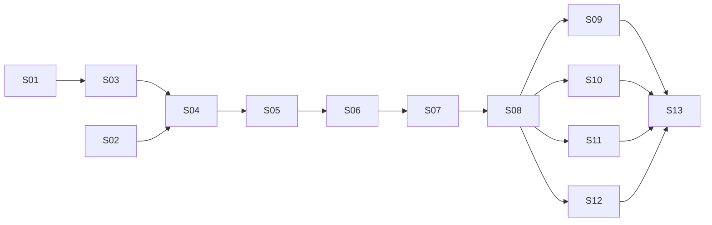

# Phase 1 plan

Implements [`REQUIREMENTS.md`](../../REQUIREMENTS.md) phase 1 in 13 slices, the same for every implementation. A slice
is cited with its implementation, such as `Go S03`; G1…G16 are Go's decisions in `go.md`, never slices. One slice = one
branch (`slice/<id>-<slug>`: `slice/s03-run-loop` in .NET, `slice/g03-run-loop` in Go) = one PR. Every slice ends in something that runs, with offline tests. A slice's PR is stacked on
the previous one until that one is merged.

**Done means, for every slice:** the implementation's gates green (its build, format, lint and test checks, listed
in [`docs/implementations/`](../implementations/)), the tests offline, fast and deterministic; every required CI check
green, the other implementation's included; the core within its line budget (principle 11); an Opus review approved
against [`docs/conventions.md`](../conventions.md) and the implementation's language rules; then merged by the lead.
From S06 on, each APP requirement with a console flow that a slice delivers has its offline end-to-end test (TEST-09).
Each implementation maps requirement IDs to its tests in its own traceability page.

**The source is the requirements and the architecture**, not another implementation's code. Read it to learn what a
requirement meant in an edge case; never port its shape.

## Slices

| # | Slice | Delivers (requirements) | Acceptance criteria |
|---|---|---|---|
| S01 | **Skeleton** | Project layout, packages (core, Claude, MCP, test kit, Bookshop app), pinned dependency versions, CI, the hooks' checks (TEST-03, TEST-05) | Builds and tests on every supported OS in CI · the dependency test fails on a fixture where the core or a non-Claude package uses the Anthropic SDK, and when the core uses anything beyond what D15 allows |
| S02 | **Live check** | A spike, run once on the implementation's Anthropic SDK, of the provider features phase 1 relies on, on the beta types with Opus 5.5: server-side compaction, tool-result clearing, the memory tool, thinking display `updates`, a mid-conversation system message, structured output, byte-exact replay of stored blocks | The implementation's spike doc records each feature as works / works with a caveat / fails with evidence · total API cost under $1 · the spike is not part of the build |
| S03 | **Run loop** | Agent definition, conversation (JSON, byte-exact), run engine, results, events, cancellation, prefix fingerprint; scripted model in the test kit (AGT-01…06, AGT-08, GEN-02, GEN-03, CTX-01, CTX-04, EVT-01, TEST-01 part, TEST-02) | A scripted multi-turn run completes with text · every stop reason maps to its result · cancelling mid-stream appends nothing · a changed tool or instruction fails the run with a prefix mismatch · TEST-02 passes within a run and across save → new process → resume · 100 concurrent runs of one definition pass |
| S04 | **Claude adapter** | Streaming requests on the beta types, cache points, run context as a mid-conversation system message, retries with `Retry-After` and mid-stream, error classes, refusal, usage (MDL-01…06, CTX-02, CTX-03, CTX-05 usage part) | Golden tests of the request layout (tools sorted, instructions frozen, cache points, operator message after the user message) · retry tests on recorded HTTP · a hello sample that chats live with Opus 5.5 and shows cache reads from the second message |
| S05 | **Tools and audit** | Tools from typed functions, the schema validator (Q2), read tools in parallel and writes in order, approval, truncation, error results, the audit recorder, JSON-lines sink; scripted approver (TOOL-01…06, GEN-04, AUD-01…05, TEST-07 part, TEST-08) | Invalid input, a failing handler and a denial each come back as error results and the run continues · reads overlap, writes don't · an unattended run denies approval-requiring calls · a write whose attempt cannot be audited never runs · results of one reply return in one message, in call order · property tests (TEST-07) over generated sequences of runs, cancels, failures and tool calls keep the conversation valid and every tool call answered once, and no write runs before its audit entry · the validator agrees with a reference validator on generated cases (TEST-08) |
| S06 | **Bookshop console** | Compose file with PostgreSQL, schema and seed; the 9 tools on the plain driver (Q1); console with streaming, tool activity, progress notes, approvals, Ctrl+C, `/help`, `/quit`; run context (APP-01, APP-03…09, APP-13, APP-18) | `docker compose up` then the app runs APP-09's request end to end live · tool tests run against the real database (Linux) · not enough stock comes back as an error result · stopping the database mid-session gives an error answer, and the session works again once it is back · no tool takes SQL text |
| S07 | **Telemetry and audit view** | Traces and metrics in the core, the Aspire dashboard in the compose file, the app's exporter and logs, the audit table sink with trace ids, `/audit` (EVT-02…04, AUD-03, AUD-06, CTX-05, APP-16, APP-20, TEST-06, TEST-07 part) | In-memory collection proves the span tree, attributes and metrics, and that no message text or secret appears by default; a property test (TEST-07) generates secrets and checks events, telemetry and audit never contain them · a live reply shows in the dashboard as one trace with model and tool spans · an `/audit` entry's link opens its trace |
| S08 | **Sessions and budgets** | Session store, `/new`, `/sessions`, `/resume`, refusal of a changed definition; price table, budgets, status line, `/cost` (APP-02 part, APP-10, APP-14, BUD-01…03, TEST-07 part) | Quit, restart, `/resume` continues with cache reads on the first call · a crash mid-reply loses at most the step in flight · a small budget stops a reply with its reason · the output limit is lowered to the remaining budget · status line numbers match the usage · property tests (TEST-07) bound the budget overshoot and keep the prefix byte-identical across generated save/resume sequences |
| S09 | **Memory** | Memory service as Claude's memory tool, scoped; file and in-memory stores; staff member chosen at start, `/memory` (MEM-01…05, APP-11, TEST-07 part) | A path outside the scope is refused, including generated traversal paths (TEST-07) · memory writes are audited and go through the pipeline · a preference saved in one session is applied in a new one (live) · the instructions never change with memory |
| S10 | **Long conversations** | Server-side compaction and tool-result clearing, their events and audit, demo mode (HIST-01…04, APP-17) | Scripted: the compaction block is kept and replayed as received · a provider without compaction ends with `Stopped(ContextFull)` · live, demo mode compacts and clears in a short session and reports both |
| S11 | **MCP** | MCP client over stdio and Streamable HTTP, pinned and filtered tools, `<server>__<tool>` names; fake MCP server in the test kit; filesystem server in the compose file (MCP-01…04, APP-12) | A server down at start fails the run clearly; one failing mid-run gives error results · the tool list is pinned for the conversation · only allow-listed tools appear · live, an order history is exported as CSV after approval |
| S12 | **Typed output and summarizer** | Output contract on structured output, the session summarizer (OUT-01, OUT-02, APP-15) | Invalid output ends as `Failed` with the errors · `/sessions` shows titles and summaries · a crashed session is summarized when listed |
| S13 | **Samples, demo, smoke test** | GEN-06 samples (extraction, chat assistant, background agent with HTTP MCP and the JSON-lines sink), the demo script, the live smoke test (GEN-06, APP-19, TEST-04) | Each sample runs offline and passes TEST-02 · the smoke test drives APP-09, asserts cache reads from the second call and forces a compaction · the demo script runs as written · every requirement maps to a test · no core code without a user |

## Order

S02 runs alongside S01 and S03. S09 to S12 are independent of each other once S08 is merged.

## Across implementations

Every implementation after the first also meets these, so the implementations stay one product:

| Slice | Check |
|---|---|
| S02 | The spike doc also records, per feature, what the SDK exposes typed and what only as raw JSON |
| S04 | Golden request data lives in a top-level `testdata/` that every implementation reads and none rewrites: .NET's request layouts (`tests/Sleepyshark.Officina.Claude.Tests/Fixtures/`) and conversation JSON move there in Go S04. Stored blocks and messages compare byte for byte in the canonical form (compact, `<` `>` `&` escaped): a stored block from either implementation is replayed byte for byte. The typed parts of a request compare as parsed JSON, as each SDK writes its own key order and escapes |
| S07 | The same span names, attributes and metrics, so one dashboard reads every implementation |
| S06, S08 | The same compose file, SQL schema and seed; a session saved by one implementation resumes in another with the same prefix and cache reads |

## Per implementation

How each implementation realizes a slice, where it differs from the shared criteria. .NET decisions:
[`dotnet.md`](../implementations/dotnet.md); Go decisions: [`go.md`](../implementations/go.md).

| Slice | .NET (done) | Go |
|---|---|---|
| S01 | Solution and central package versions. From `~/sources/agentic-core` (ARCHITECTURE §13; spike notes in its `docs/spikes/`), ported, not copied wholesale: the dependency check and build props here, the scripted model and human in S03 and S05, the Claude provider in S04, the MCP client in S11 | `go.mod` (G1, G2), `doc.go` per package, `.golangci.yml`, `go.yml` with its own required checks (G15); hooks run the Go checks for files under `go/` and the .NET ones for the rest; a `go-rules.py` edit hook that flags a package without `doc.go` and requirement IDs in comments; the dependency test checks direct imports (G4, G6); checks `gremlins` runs on Go 1.27 (G12) |
| S02 | [`docs/spikes/claude-features.md`](../spikes/claude-features.md) | [`go/docs/spikes/claude-features.md`](../../go/docs/spikes/claude-features.md): all seven features typed in the SDK; blocks stored in the canonical form and replayed through `param.Override` |
| S03 | Events as `IAsyncEnumerable`; tool events through an unbounded channel | The run as `iter.Seq[RunEvent]` plus result (G10); `jsontext.Value` blocks in the canonical form (G9), pinned by a test that marshals, unmarshals and marshals again a conversation holding `<`, `&`, non-ASCII and `\u` escapes; `goleak` clean; a consumer that `break`s mid-run leaves no goroutine; 100 concurrent runs under `-race`; sets the core line budget (G13) |
| S04 | `samples/hello` | Blocks stored canonical as they arrive; the model settings string the fingerprint uses agreed with .NET's (for Go S08); a reply's `tool_use` blocks never left in the conversation without results, as the real API rejects the next request; retries tested on `httptest.Server`; `examples/hello`. Conversation JSON compares across implementations as parsed JSON; only each block's raw JSON, and the request messages built from it, compare byte for byte |
| S05 | CsCheck properties; Stryker.NET | Every `tool_use` block gets its result (until now a tool-use stop is Failed and its reply has none); Schema derived with `reflect` (the one place `go/CLAUDE.md` allows it); reads under a `sync.WaitGroup`; the event channel sized from the call count; a panicking tool becomes an error result; fuzz test of the validator; `rapid` properties; the first `gremlins` run sets the mutation threshold |
| S06 | Npgsql | `cmd/bookshop` on `pgx` (G7); Ctrl+C through `signal.NotifyContext`; end-to-end tests with `testcontainers-go` |
| S07 | `ActivitySource` and `Meter` | The OpenTelemetry API with host-passed providers (G6); the SDK's in-memory exporter in tests only |
| S08 | | The .NET-saved session resumes in Go (above); the fingerprint matches .NET's byte for byte (its JSON escaping, the tool schemas as given rather than re-encoded, and the model settings string agreed in Go S04) |
| S09 | | Fuzz test of path scoping, besides the `rapid` property |
| S10 | | Checks on-demand compaction and `clear_at` live before relying on them (Go S02 left them unproven) |
| S11 | | Stdio through `os/exec`, Streamable HTTP through `net/http`; fuzz test of message parsing; the child process is stopped and waited for when the context ends |
| S12 | | The output schema through S05's schema derivation |
| S13 | `docs/demo.md` | `examples/` as runnable `Example` tests and programs; the live smoke test behind a build tag; `go/docs/traceability.md` complete |

## Progress

| Slice | .NET | Go |
|---|---|---|
| S01 | Merged | Merged (#56) |
| S02 | Merged | Merged (#55) |
| S03 | Merged | Merged (#58) |
| S04 | Merged | Merged (#59) |
| S05 | Merged | Merged (#61) |
| S06 | Merged | Merged (#63) |
| S07 | Merged | In review (#PRNUM) |
| S08–S13 | Merged | Not started |

## Team

| Role | Who | Does |
|---|---|---|
| Lead | Main session | Plans, dispatches, checks CI, merges approved PRs, reports to the owner |
| Implementer | Opus subagent per slice, in its own worktree | Builds the slice, opens the PR |
| Reviewer | A separate Opus subagent | Reviews each PR against `docs/conventions.md`, the implementation's language rules and this slice's criteria; at most 3 rounds. For Go, a breach of Go convention is a must-fix |
| Fixes | Sonnet subagent | Small, well-bounded review fixes only |
| Owner | You | Sets direction; has delegated merges to the lead once the reviewer approves |
