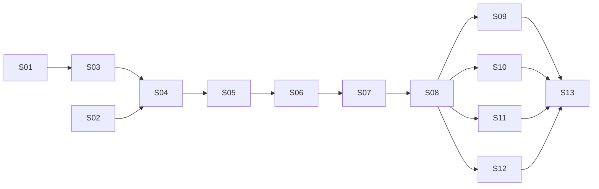

# Phase 1 plan

Implements [`REQUIREMENTS.md`](../../REQUIREMENTS.md) phase 1 in 13 slices. One slice = one branch
(`slice/<id>-<slug>`) = one PR. Every slice ends in something that runs, with offline tests. A slice's PR is stacked on
the previous one until that one is merged.

**Done means, for every slice:** `dotnet build` with warnings as errors, `dotnet test` green offline, fast and
deterministic, CI green (`ubuntu-latest`, `windows-latest`, `quality`), the core within its line budget (principle 11),
an Opus review approved, then merged by the lead. From S06 on, each APP requirement a slice delivers has its offline
end-to-end test (TEST-09).

**Reuse** (ARCHITECTURE §13): port, don't copy wholesale, from `~/sources/agentic-core`: the Claude provider (S04), MCP
client (S11), scripted model and human (S03, S05), dependency check (S01), build props. Spike notes: `docs/spikes/` there.

## Slices

| # | Slice | Delivers (requirements) | Acceptance criteria |
|---|---|---|---|
| S01 | **Skeleton** | Solution, packages (core, Claude, MCP, test kit, Bookshop app), central package versions, CI (TEST-03, TEST-05) | Builds and tests on Linux and Windows in CI · the dependency test fails on a fixture where the core or a non-Claude package references the Anthropic SDK, and when the core references any package |
| S02 | **Live check** | A spike, run once, of what S00b did not prove, on the beta types with Opus 5.5: server-side compaction, tool-result clearing, the memory tool, thinking display `updates`, a mid-conversation system message, structured output | `docs/spikes/claude-features.md` records each feature as works / works with a caveat / fails, with evidence · total API cost under $1 · the spike is not part of the solution |
| S03 | **Run loop** | Agent definition, conversation (JSON, byte-exact), run engine, results, events, cancellation, prefix fingerprint; scripted model in the test kit (AGT-01…06, AGT-08, GEN-02, GEN-03, CTX-01, CTX-04, EVT-01, TEST-01 part, TEST-02) | A scripted multi-turn run completes with text · every stop reason maps to its result · cancelling mid-stream appends nothing · a changed tool or instruction fails the run with a prefix mismatch · TEST-02 passes within a run and across save → new process → resume · 100 concurrent runs of one definition pass |
| S04 | **Claude adapter** | Streaming requests on the beta types, cache points, run context as a mid-conversation system message, retries with `Retry-After` and mid-stream, error classes, refusal, usage (MDL-01…06, CTX-02, CTX-03, CTX-05 usage part) | Golden-JSON tests of the request layout (tools sorted, instructions frozen, cache points, operator message after the user message) · retry tests on recorded HTTP · a `samples/hello` console that chats live with Opus 5.5 and shows cache reads from the second message |
| S05 | **Tools and audit** | Tools from typed functions, the schema validator (Q2), read tools in parallel and writes in order, approval, truncation, error results, the audit recorder, JSON-lines sink; scripted approver (TOOL-01…06, GEN-04, AUD-01…05) | Invalid input, a thrown handler and a denial each come back as error results and the run continues · reads overlap, writes don't · an unattended run denies approval-requiring calls · a write whose attempt cannot be audited never runs · results of one reply return in one message, in call order · property tests (TEST-07) over random sequences of runs, cancels, failures and tool calls keep the conversation valid and every tool call answered once · the validator agrees with a reference validator on generated cases (TEST-08) |
| S06 | **Bookshop console** | Compose file with PostgreSQL, schema and seed; the 9 tools on Npgsql; console with streaming, tool activity, progress notes, approvals, Ctrl+C, `/help`, `/quit`; run context (APP-01, APP-03…09, APP-13, APP-18) | `docker compose up` then the app runs APP-09's request end to end live · tool tests run against the real database (Linux) · not enough stock comes back as an error result · stopping the database mid-session gives an error answer, and the session works again once it is back · no tool takes SQL text |
| S07 | **Telemetry and audit view** | Traces and metrics in the core, the Aspire dashboard in the compose file, the app's exporter and logs, the audit table sink with trace ids, `/audit` (EVT-02…04, AUD-03, AUD-06, CTX-05, APP-16, APP-20, TEST-06) | In-memory collection proves the span tree, attributes and metrics, and that no message text or secret appears by default · a live reply shows in the dashboard as one trace with model and tool spans · an `/audit` entry's link opens its trace |
| S08 | **Sessions and budgets** | Session store, `/new`, `/sessions`, `/resume`, refusal of a changed definition; price table, budgets, status line, `/cost` (APP-02 part, APP-10, APP-14, BUD-01…03) | Quit, restart, `/resume` continues with cache reads on the first call · a crash mid-reply loses at most the step in flight · a small budget stops a reply with its reason · the output limit is lowered to the remaining budget · status line numbers match the usage · a property test bounds the budget overshoot |
| S09 | **Memory** | Memory service as Claude's memory tool, scoped; file and in-memory stores; staff member chosen at start, `/memory` (MEM-01…05, APP-11) | A path outside the scope is refused, including generated traversal paths (TEST-07) · memory writes are audited and go through the pipeline · a preference saved in one session is applied in a new one (live) · the instructions never change with memory |
| S10 | **Long conversations** | Server-side compaction and tool-result clearing, their events and audit, demo mode (HIST-01…04, APP-17) | Scripted: the compaction block is kept and replayed as received · a provider without compaction ends with `Stopped(ContextFull)` · live, demo mode compacts and clears in a short session and reports both |
| S11 | **MCP** | MCP client over stdio and Streamable HTTP, pinned and filtered tools, `<server>__<tool>` names; fake MCP server in the test kit; filesystem server in the compose file (MCP-01…04, APP-12) | A server down at start fails the run clearly; one failing mid-run gives error results · the tool list is pinned for the conversation · only allow-listed tools appear · live, an order history is exported as CSV after approval |
| S12 | **Typed output and summarizer** | Output contract on structured output, the session summarizer (OUT-01, OUT-02, APP-15) | Invalid output ends as `Failed` with the errors · `/sessions` shows titles and summaries · a crashed session is summarized when listed |
| S13 | **Samples, demo, smoke test** | GEN-06 samples (extraction, chat assistant, background agent with HTTP MCP and the JSON-lines sink), `docs/demo.md`, the live smoke test (GEN-06, APP-19, TEST-04) | Each sample runs offline and passes TEST-02 · the smoke test drives APP-09, asserts cache reads from the second call and forces a compaction · the demo script runs as written · every requirement maps to a test · no core code without a user |

## Order

S02 runs alongside S01 and S03. S09 to S12 are independent of each other once S08 is merged.

## Team

| Role | Who | Does |
|---|---|---|
| Lead | Main session | Plans, dispatches, checks CI, merges approved PRs, reports to the owner |
| Implementer | Opus subagent per slice, in its own worktree | Builds the slice, opens the PR |
| Reviewer | A separate Opus subagent | Reviews each PR against CLAUDE.md's rules and this slice's criteria; at most 3 rounds |
| Fixes | Sonnet subagent | Small, well-bounded review fixes only |
| Owner | You | Sets direction; has delegated merges to the lead once the reviewer approves |
