# Officina in Ruby: a guide for .NET developers

The Ruby implementation of Officina and its Bookshop Assistant, explained for a reader who knows the .NET one and C#
well and Ruby not at all. It describes the code on `main` as of 2026-10-11. How to run it and its tests is in
[`running-and-testing.md`](running-and-testing.md); this guide does not repeat it.

The sources this guide sits on, in order of authority: [`REQUIREMENTS.md`](../../REQUIREMENTS.md) (what),
[`ARCHITECTURE.md`](../../ARCHITECTURE.md) (concepts, contracts, runtime model), the decisions R1–R20 in
[`docs/implementations/ruby.md`](../../docs/implementations/ruby.md), the choice-by-choice notes in
[`design.md`](design.md), and the working rules in [`ruby/CLAUDE.md`](../CLAUDE.md). Where this guide and the code
disagree, the code wins.

**How to read the citations.** Links are `path:line`, relative to `ruby/`, with the long gem prefixes shortened:

| Written as | Stands for |
|---|---|
| `officina/…/x.rb` | `officina/lib/sleepyshark/officina/x.rb` (the core gem) |
| `officina-claude/…/x.rb` | `officina-claude/lib/sleepyshark/officina/claude/x.rb` |
| `officina-mcp/…/x.rb` | `officina-mcp/lib/sleepyshark/officina/mcp/x.rb` |
| `officina-testing/…/x.rb` | `officina-testing/lib/sleepyshark/officina/testing/x.rb` |
| `apps/bookshop/…/x.rb` | `apps/bookshop/lib/bookshop/x.rb` |

## Contents

1. [The big picture](#1-the-big-picture)
2. [Flows, step by step](#2-flows-step-by-step)
   1. [The run loop and streaming](#21-the-run-loop-and-streaming)
   2. [The tool pipeline](#22-the-tool-pipeline)
   3. [Memory](#23-memory)
   4. [MCP over stdio and Streamable HTTP](#24-mcp-over-stdio-and-streamable-http)
   5. [Sessions, the prefix fingerprint and resume](#25-sessions-the-prefix-fingerprint-and-resume)
   6. [Budgets and cost with BigDecimal](#26-budgets-and-cost-with-bigdecimal)
   7. [Typed output](#27-typed-output)
   8. [The summarizer](#28-the-summarizer)
   9. [Demo mode and context management](#29-demo-mode-and-context-management)
   10. [Telemetry and logs](#210-telemetry-and-logs)
   11. [Cancellation and concurrency](#211-cancellation-ctrlc-and-concurrency)
3. [Design principles as applied](#3-design-principles-as-applied)
4. [Notable decisions and tricky cases](#4-notable-decisions-and-tricky-cases)
5. [Ruby for a .NET developer](#5-ruby-for-a-net-developer)
6. [The quality machinery](#6-the-quality-machinery)
7. [Ruby next to .NET's design diagrams](#7-ruby-next-to-nets-design-diagrams)

---

## 1. The big picture

### 1.1 Four gems and an application

A Ruby *gem* is a NuGet package; a *gemspec* is its `.csproj` package metadata; the `Gemfile` plus `Gemfile.lock` is
the solution-wide package reference list plus a lock file. Ruby has one Bundler workspace in `ruby/`
([`Gemfile`](../Gemfile)), with each gem as a `path:` entry, so every gem is built and tested against one
`Gemfile.lock` (R2).

| Ruby gem (folder) | Module | .NET project | Holds |
|---|---|---|---|
| `sleepyshark-officina` ([`officina/`](../officina/)) | `Sleepyshark::Officina` | `Sleepyshark.Officina` | The core: agent, run engine, conversation, tool pipeline, memory, audit, budgets, telemetry, schema DSL, built-in stores |
| `sleepyshark-officina-claude` ([`officina-claude/`](../officina-claude/)) | `…::Claude` | `Sleepyshark.Officina.Claude` | The Claude adapter, the only user of the `anthropic` gem |
| `sleepyshark-officina-mcp` ([`officina-mcp/`](../officina-mcp/)) | `…::Mcp` | `Sleepyshark.Officina.Mcp` | The MCP client (stdio, Streamable HTTP) and the MCP tool source |
| `sleepyshark-officina-testing` ([`officina-testing/`](../officina-testing/)) | `…::Testing` | `Sleepyshark.Officina.Testing` | Scripted model and approver, fake MCP server, prefix check, thread-leak check |
| `bookshop` ([`apps/bookshop/`](../apps/bookshop/)) | `Bookshop` | `apps/BookshopAssistant` | The reference application, run by `exe/bookshop` |
| [`examples/`](../examples/) | — | `samples/` | `hello`, a live chat; each sample runs as a test |

The gem name has dashes where the module has `::`, the RubyGems convention (R2); `officina` alone is a global gem name
the project does not own.

### 1.2 Layers and the dependency rule

The layers are ARCHITECTURE §3's, the same in every implementation. What each Ruby gem may require is a table in a
test, [`test/dependencies_test.rb:13`](../test/dependencies_test.rb#L13), which reads every gemspec and finds every
`require` in each gem's `lib/` with Prism, Ruby's own parser, without running the code (R4, design.md "The dependency
test reads the code without running it"). A `require` it cannot read, a computed path, fails it.

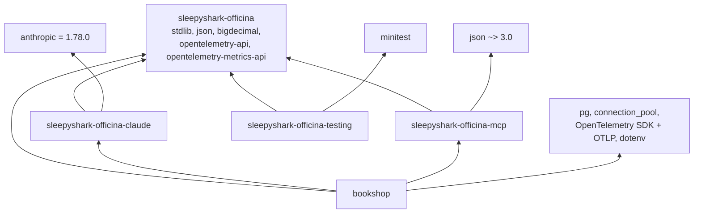

| Gem | May require (R6) | Where it is declared |
|---|---|---|
| Core | Standard library, `json`, `bigdecimal`, `opentelemetry-api`, `opentelemetry-metrics-api` (pinned `= 0.9.0`, pre-1.0) | [`officina/sleepyshark-officina.gemspec:15`](../officina/sleepyshark-officina.gemspec#L15) |
| Claude | The core and `anthropic` | [`officina-claude/sleepyshark-officina-claude.gemspec:15`](../officina-claude/sleepyshark-officina-claude.gemspec#L15) |
| MCP | The core, the standard library, `json ~> 3.0` | [`officina-mcp/sleepyshark-officina-mcp.gemspec:16`](../officina-mcp/sleepyshark-officina-mcp.gemspec#L16) |
| Test kit | The core, the standard library, Minitest | its gemspec |
| Application | Anything but `anthropic` | [`apps/bookshop/bookshop.gemspec`](../apps/bookshop/bookshop.gemspec) |

The core never requires an OpenTelemetry SDK or exporter, and never reads a global provider: the host passes its
providers in, and without them the API's no-op ones emit nothing
([`officina/…/telemetry.rb:60`](../officina/lib/sleepyshark/officina/telemetry.rb#L60)).

### 1.3 Composition: no container

.NET composes through `IServiceCollection`: each package has `Add…` methods (`AddClaudeModel`, `AddFileMemoryStore`…)
and Bookshop resolves everything from one container. Ruby has **no container** (R5): every class takes its
dependencies as keyword arguments, and the application builds the object graph in one method,
[`Bookshop.build`](../apps/bookshop/lib/bookshop.rb#L97), called by
[`exe/bookshop:17`](../apps/bookshop/exe/bookshop#L17) and by the end-to-end tests with fakes for the boundaries.

| .NET | Ruby |
|---|---|
| `services.AddClaudeModel(…)`, resolved by the container | `Claude::Model.new(name:, effort:, …)` called by the root ([`apps/bookshop/…/chat_agent.rb:52`](../apps/bookshop/lib/bookshop/chat_agent.rb#L52)) |
| The composition root registers, then resolves | [`bookshop.rb:97-121`](../apps/bookshop/lib/bookshop.rb#L97) builds in order and returns an `Application` |
| A test replaces a registration | A test passes `model:`, `summarizer:`, `memory:`, `clock:`, `telemetry:`, `input:`, `output:` to the same `build` |
| Constructor injection | Keyword arguments; optional ones default to `nil` or a frozen constant ([`ruby/CLAUDE.md`](../CLAUDE.md), *Gems and API*) |

```ruby
# apps/bookshop/lib/bookshop.rb:110-115
tools = [*Tools.all(Shop.new(database:)), Sleepyshark::Officina::MemoryTool.new(memory), *exports&.tools]
agent = Sleepyshark::Officina::Agent.new(
  name: 'bookshop', model:, instructions: ChatAgent::INSTRUCTIONS, tools:,
  approver: approvals, audit_sink: audit, secrets: [Database.password(url)].compact, clock:,
  telemetry: telemetry.officina, context_management: mode.context_management
)
```

`model:` alone is Ruby 3.1's shorthand for `model: model`. The method carries the only `rubocop:disable` of a `Metrics` cop,
with its reason: "the composition root names every part in one place"
([`bookshop.rb:96`](../apps/bookshop/lib/bookshop.rb#L96)).

### 1.4 Files and loading

One public class or module per file, named after it in snake case (R3), as .NET's one type per file. There is **no
autoloading** (no Zeitwerk): each gem's entry file lists its files with `require_relative` in load order, so the
order is visible ([`officina.rb:3-72`](../officina/lib/sleepyshark/officina.rb#L3)). Internals are hidden with
`private_constant` ([`run_engine.rb:113`](../officina/lib/sleepyshark/officina/run_engine.rb#L113)), Ruby's nearest
thing to `internal`, but it hides a constant only from outside its enclosing module, so every class in
`Sleepyshark::Officina` sees every other (§5.14).

---

## 2. Flows, step by step

### 2.1 The run loop and streaming

The host calls `Agent#run(conversation, input, context:, cancel:, budget:, memory_scope:) { |event| … }`. Each event
is yielded to the block as it happens; the result is the method's **return value**. That is the Ruby shape of .NET's
`Agent.StreamAsync` returning `IAsyncEnumerable<RunEvent>` with a final `RunEnded` (R10).

| Class | Role | Where |
|---|---|---|
| `Agent` | Frozen definition; checks the call, holds the conversation, starts the engine | [`agent.rb:96-104`](../officina/lib/sleepyshark/officina/agent.rb#L96) |
| `Conversation#hold` | One run per conversation, with `Mutex#try_lock`; yields the only way to append | [`conversation.rb:69-77`](../officina/lib/sleepyshark/officina/conversation.rb#L69) |
| `RunEngine` | The loop alone, and the result | [`run_engine.rb:29-111`](../officina/lib/sleepyshark/officina/run_engine.rb#L29) |
| `ModelCall` | One model call: request, stream, relaying events | [`model_call.rb:18-54`](../officina/lib/sleepyshark/officina/model_call.rb#L18) |
| `ReplyOutcome` | What a reply's stop and calls mean for the run | [`reply_outcome.rb:14-35`](../officina/lib/sleepyshark/officina/reply_outcome.rb#L14) |
| `ToolStep` | Answers one reply's calls through the pipeline | [`tool_step.rb:24-49`](../officina/lib/sleepyshark/officina/tool_step.rb#L24) |
| `Reporter` | Appends, then tells the host | [`reporter.rb:17-23`](../officina/lib/sleepyshark/officina/reporter.rb#L17) |
| `Spending` | Usage, cost, calls, time against the budget | [`spending.rb`](../officina/lib/sleepyshark/officina/spending.rb) |
| `RunTrace` | The run's span and metrics | [`run_trace.rb`](../officina/lib/sleepyshark/officina/run_trace.rb) |
| `AuditRecorder` | The run's audit entries | [`audit_recorder.rb`](../officina/lib/sleepyshark/officina/audit_recorder.rb) |

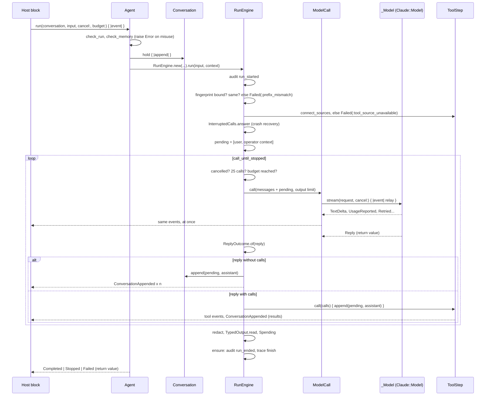

Step by step, with the code:

1. **Misuse raises, before anything runs.** A blank message, a blank context, a cost budget for a model with no
   price, a missing memory scope for an agent with memory: each raises `Officina::Error`
   ([`agent.rb:108-118`](../officina/lib/sleepyshark/officina/agent.rb#L108)). A second run on the same
   conversation raises from `hold` ([`conversation.rb:70`](../officina/lib/sleepyshark/officina/conversation.rb#L70)).
2. **The audit and trace bracket the run.** `RunEngine#run` records `run_started`, and its `ensure` records
   `run_ended` and ends the span whichever way the run ends, a host's `break` included, when the result is `nil`
   and the outcome `abandoned` ([`run_engine.rb:29-36`](../officina/lib/sleepyshark/officina/run_engine.rb#L29),
   [`audit_recorder.rb:88-95`](../officina/lib/sleepyshark/officina/audit_recorder.rb#L88)).
3. **Checks before the loop**: the prefix fingerprint (§2.5), the tool sources (§2.4), and calls a crash left without
   results (§2.5) ([`run_engine.rb:40-52`](../officina/lib/sleepyshark/officina/run_engine.rb#L40)).
4. **Pending messages.** The user's message and the run context (an `:operator` message) are held, not appended
   ([`run_engine.rb:49-50`](../officina/lib/sleepyshark/officina/run_engine.rb#L49)). They enter the conversation only
   with the reply that answers them, so a run with no reply leaves the conversation as it was (AGT-05, AGT-08).
5. **Before each call**: cancelled, 25 model calls (`MAX_MODEL_CALLS`), or a budget limit reached stop the run
   ([`run_engine.rb:54-67`](../officina/lib/sleepyshark/officina/run_engine.rb#L54)).
6. **The call.** `ModelCall#call` counts the call, builds a `Request` and streams it inside the trace's span
   ([`model_call.rb:18-24`](../officina/lib/sleepyshark/officina/model_call.rb#L18)). Each streamed event goes to the
   spending, the audit (for compaction and clearing), the trace, then the host, in `relay`
   ([`model_call.rb:38-50`](../officina/lib/sleepyshark/officina/model_call.rb#L38)).
7. **The model's failure versus the host's.** `stream` rescues `StandardError` around the model, one of the boundaries
   ruby/CLAUDE.md allows, and turns it into `Failed(:model_error)`, unless the exception came from the host's own
   block, which `relay` marks with `@host_raised` and which passes through
   ([`model_call.rb:30-36`](../officina/lib/sleepyshark/officina/model_call.rb#L30)).
8. **The reply.** `case … in Reply => reply` tells a reply from a result
   ([`run_engine.rb:71-77`](../officina/lib/sleepyshark/officina/run_engine.rb#L71)); `ReplyOutcome.of` maps the stop:
   `max_tokens` → `Stopped(:output_limit)` (or `:budget` when the budget lowered the limit), `refusal`,
   `context_full`, an unexpected stop → `Failed(:unexpected_stop)`, `end` → `Completed`, `tool_use` → `nil`, "go on"
   ([`reply_outcome.rb:14-35`](../officina/lib/sleepyshark/officina/reply_outcome.rb#L14)).
9. **Keep or drop.** An empty reply, or one that ends the run while it has calls, is not appended, as the provider
   would reject it ([`run_engine.rb:89`](../officina/lib/sleepyshark/officina/run_engine.rb#L89)). Otherwise the
   pending messages and the reply are appended together; with calls, `ToolStep` appends them first and then runs the
   pipeline (§2.2).
10. **Append, then report.** `Reporter#append` appends all of a step's messages, then yields one
    `ConversationAppended` per message ([`reporter.rb:17-20`](../officina/lib/sleepyshark/officina/reporter.rb#L17)),
    so a host that leaves at the first event still holds a valid conversation.
11. **The result** is redacted once, read as typed output when the agent has an output type, and given what the run
    used in one step, `Spending#report`
    ([`run_engine.rb:32`](../officina/lib/sleepyshark/officina/run_engine.rb#L32),
    [`spending.rb:53-55`](../officina/lib/sleepyshark/officina/spending.rb#L53)).

**Streaming in the Claude adapter.** The model contract is an RBS interface, `_Model`
([`officina/sig/…/model.rbs:8-21`](../officina/sig/sleepyshark/officina/model.rbs#L8)): `settings`, `info`, and
`stream(request, cancel:) { |event| } -> Reply?`. `Claude::Model#stream` makes up to five attempts with Ruby's
`retry` keyword inside `rescue` ([`officina-claude/…/model.rb:90-100`](../officina-claude/lib/sleepyshark/officina/claude/model.rb#L90)),
yielding `Retried` before each new one ([`model.rb:106-111`](../officina-claude/lib/sleepyshark/officina/claude/model.rb#L106)).
Each attempt is a `Call` that iterates the SDK's beta stream and checks the cancellation at every event
([`officina-claude/…/call.rb:44-59`](../officina-claude/lib/sleepyshark/officina/claude/call.rb#L44)). Transient
failures are classified by API error type first, then status
([`failure.rb:11-12`](../officina-claude/lib/sleepyshark/officina/claude/failure.rb#L11),
[`failure.rb:42`](../officina-claude/lib/sleepyshark/officina/claude/failure.rb#L42)); a "prompt is too long" 400 is a
reply stopping for `:context_full` ([`call.rb:32-35`](../officina-claude/lib/sleepyshark/officina/claude/call.rb#L32)).
The SDK's own retries are off (`max_retries: 0`,
[`model.rb:71`](../officina-claude/lib/sleepyshark/officina/claude/model.rb#L71)), as the model's must also cover
failures mid-stream and report each.

```ruby
# officina-claude/lib/sleepyshark/officina/claude/model.rb:90-100
def stream(request, cancel:, &)
  params = params(request)
  attempt = 1
  begin
    Call.new(client: @client, params:, cancel:).reply(&) unless cancel.cancelled?
  rescue Anthropic::Errors::Error, Call::IncompleteError => e
    wait_to_retry(Failure.new(e), attempt, cancel, &)
    attempt += 1
    retry
  end
end
```

`&` alone passes the method's block on to another method (Ruby 3.1), as a C# method would forward a delegate
parameter.

### 2.2 The tool pipeline

ARCHITECTURE §5.2: find the tool → validate input → approval → record the attempt → invoke → redact → cut. Reads run
concurrently, a write waits for every call before it and runs alone.

| Class | Role | Where |
|---|---|---|
| `Tool` | Name, description, input type, `kind:` (`:read`/`:write`, no default), approval need, handler block | [`tool.rb:42-52`](../officina/lib/sleepyshark/officina/tool.rb#L42) |
| `ToolStep` | Runs the pipeline for a reply's calls, relays its events, appends the results | [`tool_step.rb:24-49`](../officina/lib/sleepyshark/officina/tool_step.rb#L24) |
| `ToolPipeline` | One thread per reply; the steps of each call | [`tool_pipeline.rb:16-135`](../officina/lib/sleepyshark/officina/tool_pipeline.rb#L16) |
| `RunningReads` | The reads in flight, one thread each | [`running_reads.rb`](../officina/lib/sleepyshark/officina/running_reads.rb) |
| `ApprovalDesk` | Asks the `_Approver`, one call at a time | [`approval_desk.rb:16-44`](../officina/lib/sleepyshark/officina/approval_desk.rb#L16) |
| `CallReport` | Audit entry, then event | [`call_report.rb:17-34`](../officina/lib/sleepyshark/officina/call_report.rb#L17) |
| `ToolCallTrace` | The call's span and metrics | [`tool_call_trace.rb`](../officina/lib/sleepyshark/officina/tool_call_trace.rb) |

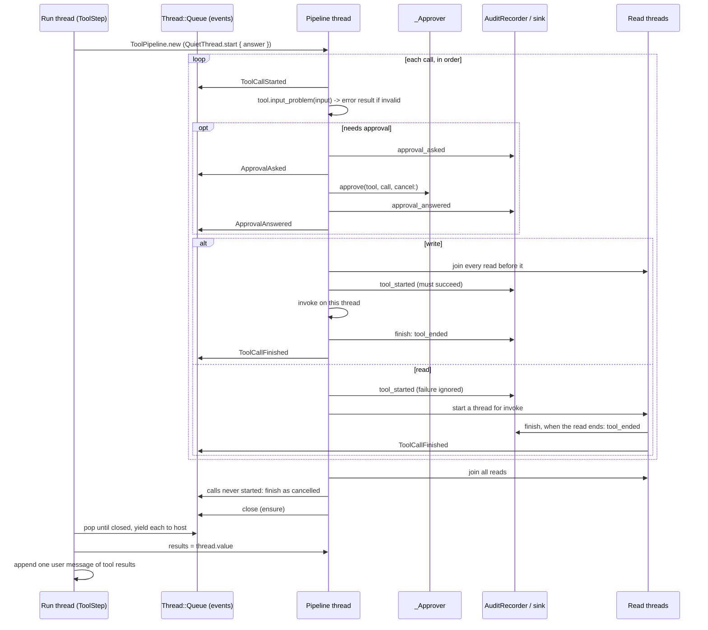

The steps in the code:

| Step | Code | Failure becomes |
|---|---|---|
| Find the tool | [`tool_pipeline.rb:57`](../officina/lib/sleepyshark/officina/tool_pipeline.rb#L57) | "There is no tool named …" ([`:63`](../officina/lib/sleepyshark/officina/tool_pipeline.rb#L63)) |
| Join the reads before a write | [`tool_pipeline.rb:58`](../officina/lib/sleepyshark/officina/tool_pipeline.rb#L58) | — |
| Parse and validate the input | `Tool#input_problem` ([`tool.rb:71-76`](../officina/lib/sleepyshark/officina/tool.rb#L71)) | "The input does not match the tool's schema:" with each JSON-pointer problem, or "not valid JSON" |
| Approval | `ApprovalDesk#denial` ([`approval_desk.rb:16-27`](../officina/lib/sleepyshark/officina/approval_desk.rb#L16)) | No approver: "…unattended, so it was denied." ([`:18`](../officina/lib/sleepyshark/officina/approval_desk.rb#L18)); an approver that raises denies with its message ([`:33-37`](../officina/lib/sleepyshark/officina/approval_desk.rb#L33)) |
| Cancelled meanwhile | [`tool_pipeline.rb:71`](../officina/lib/sleepyshark/officina/tool_pipeline.rb#L71) | "The call was cancelled before it started." |
| Audit before a write | `write` ([`tool_pipeline.rb:87-92`](../officina/lib/sleepyshark/officina/tool_pipeline.rb#L87)) | Outcome `:blocked`, "its attempt could not be recorded"; the handler never runs |
| Invoke | `invoke` ([`tool_pipeline.rb:100-111`](../officina/lib/sleepyshark/officina/tool_pipeline.rb#L100)) | `rescue StandardError` → "The tool failed: …"; a returned `ToolFailure` → its message as written |
| Redact and cut | `finish`, `cut` ([`tool_pipeline.rb:116-132`](../officina/lib/sleepyshark/officina/tool_pipeline.rb#L116)) | Cut at 64,000 characters with a note |

**Errors go back to the model.** A handler has two ways to fail. Raising is the unexpected one: the pipeline
rescues `StandardError` at the handler boundary, one of the three places ruby/CLAUDE.md allows it, and the model reads "The
tool failed: …". Returning a `ToolFailure` is the meant one, a business rule: the model reads the message as written
([`tool_failure.rb:5-18`](../officina/lib/sleepyshark/officina/tool_failure.rb#L5)). Bookshop's tools do the second in
one place: `ShopTool.define` rescues the shop's `RefusedError` and returns a `ToolFailure`, while a database that is
down (`PG::Error`) is left to the core's boundary ([`apps/bookshop/…/shop_tool.rb`](../apps/bookshop/lib/bookshop/shop_tool.rb),
design.md "Every tool is built by `ShopTool.define`").

**Audit before a write.** `CallReport#attempt` returns whether the entry is in the trail
([`call_report.rb:26`](../officina/lib/sleepyshark/officina/call_report.rb#L26)); the recorder returns `false` when the
sink raised, after counting the failure in telemetry
([`audit_recorder.rb:67-73`](../officina/lib/sleepyshark/officina/audit_recorder.rb#L67)). Without a sink, `record`
returns `true` at once ([`audit_recorder.rb:30-31`](../officina/lib/sleepyshark/officina/audit_recorder.rb#L30)):
no trail, nothing else changes (GEN-02). Entries are numbered under a `Mutex` and written while it is held, so they
reach the sink in sequence from any of the run's threads
([`audit_recorder.rb:34-37`](../officina/lib/sleepyshark/officina/audit_recorder.rb#L34)).

**A tool, written by a host.** The handler is a block; the input is a `Data` class from the schema DSL (§2.7):

```ruby
# officina/lib/sleepyshark/officina/tool.rb:10-14 (its doc example)
Tool.new(name: 'search_books', description: 'Searches the catalogue.', input: SearchBooks, kind: :read) do
  |input, cancel|
  catalogue.search(input.title)
end
```

The handler is called with three arguments, input, cancellation and memory scope
([`tool.rb:85`](../officina/lib/sleepyshark/officina/tool.rb#L85)); a block ignores extra arguments, so it may take
two (§5.4).

### 2.3 Memory

Memory is a tool (ARCHITECTURE §7). `MemoryTool` is the core's only `Tool` subclass, with `memory?` true and Claude's
commands (view, create, str_replace, insert, delete, rename) over files under `/memories`
([`memory_tool.rb:17-44`](../officina/lib/sleepyshark/officina/memory_tool.rb#L17)). The Claude adapter sends it as
Claude's own `memory_20250818` tool, with no schema of ours
([`officina-claude/…/model.rb:157`](../officina-claude/lib/sleepyshark/officina/claude/model.rb#L157)).

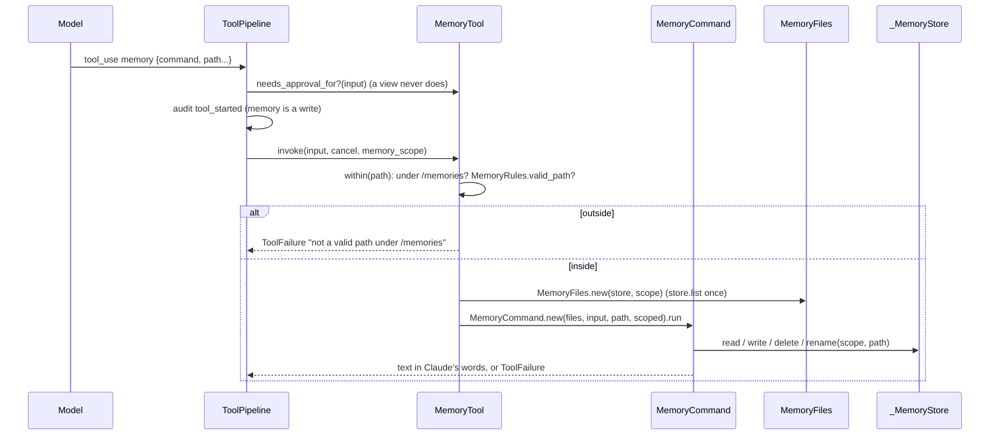

| Piece | Holds | Where |
|---|---|---|
| `MemoryTool` | The tool, its .NET-identical description and schema, path checks | [`memory_tool.rb:20-28`](../officina/lib/sleepyshark/officina/memory_tool.rb#L20), [`:70-78`](../officina/lib/sleepyshark/officina/memory_tool.rb#L70) |
| `MemoryCommand` | One command, dispatched with `case … in` | [`memory_command.rb:26-35`](../officina/lib/sleepyshark/officina/memory_command.rb#L26) |
| `MemoryFiles` | The scope's files as listed when the command started; 50,000-character file limit | [`memory_files.rb:10-16`](../officina/lib/sleepyshark/officina/memory_files.rb#L10) |
| `MemoryRules` | What every store accepts: no `.`/`..`, no `\ / : * ? " < > \| %`, no Windows device names, byte limits | [`memory_rules.rb:16-18`](../officina/lib/sleepyshark/officina/memory_rules.rb#L16), [`:35-40`](../officina/lib/sleepyshark/officina/memory_rules.rb#L35) |
| `FileMemoryStore` | Files under a root, one directory per scope named by the hex of its bytes; refuses links | [`file_memory_store.rb:17-78`](../officina/lib/sleepyshark/officina/file_memory_store.rb#L17) |
| `HashMemoryStore` | The same rules in a `Hash` | [`hash_memory_store.rb:9-63`](../officina/lib/sleepyshark/officina/hash_memory_store.rb#L9) |

- **The scope is the run's.** `Agent#run(memory_scope:)` is checked by `MemoryRules` before the run
  ([`agent.rb:114-118`](../officina/lib/sleepyshark/officina/agent.rb#L114)), kept by the run's trace, and passed to
  every handler as the third argument ([`tool_pipeline.rb:102`](../officina/lib/sleepyshark/officina/tool_pipeline.rb#L102)).
  Bookshop's scope is the staff member's name in lower case (`StaffMemory`,
  [`session.rb:58`](../apps/bookshop/lib/bookshop/session.rb#L58)).
- **A write, always.** The memory tool is `kind: :write`
  ([`memory_tool.rb:38`](../officina/lib/sleepyshark/officina/memory_tool.rb#L38)): every command is audited before it
  runs and runs alone, so each command sees what the one before left. Approval is per call: a `view` never needs it
  ([`memory_tool.rb:44`](../officina/lib/sleepyshark/officina/memory_tool.rb#L44)).
- **The stores guard themselves.** Each holds one `Mutex` around every operation, as stores are shared by many runs
  (design.md "Each store holds one `Mutex`"). A rename checks and moves under that lock in one step
  ([`file_memory_store.rb:69-78`](../officina/lib/sleepyshark/officina/file_memory_store.rb#L69)), which is why the
  store contract has five methods, not three.

### 2.4 MCP over stdio and Streamable HTTP

Two layers: the **client** (`Mcp.connect` → `Mcp::Client`), which speaks JSON-RPC over a transport, and the **tool
source** (`Mcp::ToolSource`), which pins the server's allowed tools as core `Tool`s and meets the core's
`_ToolSource` contract (`name`, `connect(cancel:)`, `take_changes`).

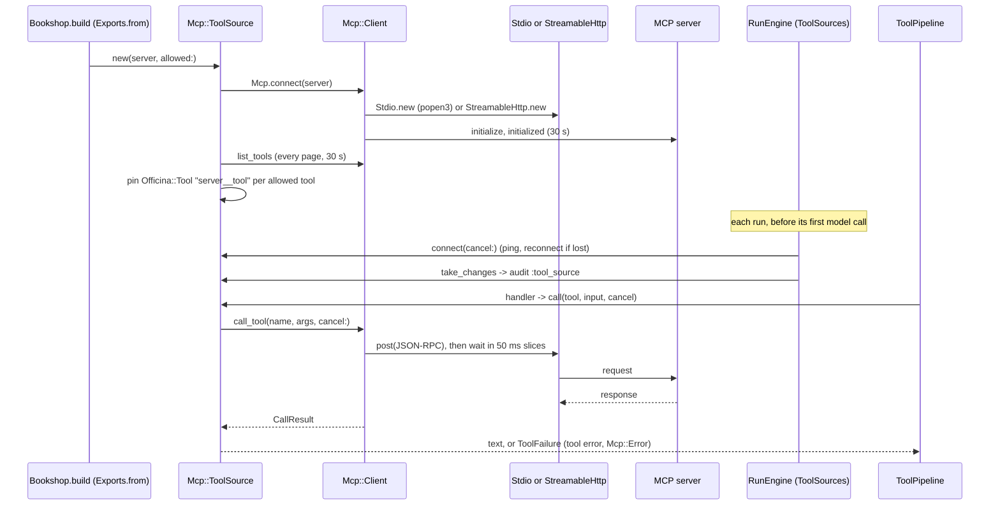

| Piece | Behaviour | Where |
|---|---|---|
| `Mcp.connect` | Stdio when the server has a command, else Streamable HTTP | [`officina-mcp/…/mcp.rb:37-40`](../officina-mcp/lib/sleepyshark/officina/mcp.rb#L37) |
| Waiting | `pending.take(POLL)` in a loop, checking `cancel.cancelled?` and the deadline between; `POLL = 0.05` | [`client.rb:142-156`](../officina-mcp/lib/sleepyshark/officina/mcp/client.rb#L142), [`mcp.rb:23`](../officina-mcp/lib/sleepyshark/officina/mcp.rb#L23) |
| Stdio process | `Open3.popen3` with `[program, program]` (no shell), its own process group | [`child_process.rb:22`](../officina-mcp/lib/sleepyshark/officina/mcp/child_process.rb#L22), [`:62-66`](../officina-mcp/lib/sleepyshark/officina/mcp/child_process.rb#L62) |
| Stdio responses | A reader thread hands each response to its request's own `Queue`; a lost server closes every waiting queue | [`stdio.rb:76-77`](../officina-mcp/lib/sleepyshark/officina/mcp/stdio.rb#L76), [`:106-109`](../officina-mcp/lib/sleepyshark/officina/mcp/stdio.rb#L106) |
| Streamable HTTP | One `Net::HTTP` connection per request, on a thread of its own; cancelling closes the connection | [`streamable_http.rb:79-82`](../officina-mcp/lib/sleepyshark/officina/mcp/streamable_http.rb#L79), [`:46-58`](../officina-mcp/lib/sleepyshark/officina/mcp/streamable_http.rb#L46) |
| Pinning | `"#{name}__#{tool.name}"`, the server's description, `kind:` the host's (write unless marked read), the schema as the server wrote it | [`tool_source.rb:140-156`](../officina-mcp/lib/sleepyshark/officina/mcp/tool_source.rb#L140) |
| A call | Tool error or `Mcp::Error` → `ToolFailure`, secrets redacted; a lost client recorded as `:disconnected` | [`tool_source.rb:159-173`](../officina-mcp/lib/sleepyshark/officina/mcp/tool_source.rb#L159) |
| Start of a run | A source that raises fails the run `Failed(:tool_source_unavailable)`, unless it was cancelled | [`officina/…/tool_sources.rb:16-27`](../officina/lib/sleepyshark/officina/tool_sources.rb#L16) |

Why a thread per HTTP request: `Net::HTTP` has no cancellation, and `Thread#raise` is ruled out (R10); closing the
socket from another thread is how Ruby ends a blocked read (design.md "Streamable HTTP"). The thread **returns** its
failure rather than raising it, because under `Thread.abort_on_exception` (which a host, or mutant, may set) a thread
that ends with an exception kills the process ([`streamable_http.rb:34-41`](../officina-mcp/lib/sleepyshark/officina/mcp/streamable_http.rb#L34),
design.md "A Streamable HTTP request's thread returns its failure").

### 2.5 Sessions, the prefix fingerprint and resume

**The conversation is append-only and persisted as JSON.** `Conversation` keeps its fingerprint and messages in one
frozen `State`, replaced in one assignment on each append
([`conversation.rb:15`](../officina/lib/sleepyshark/officina/conversation.rb#L15),
[`:121-123`](../officina/lib/sleepyshark/officina/conversation.rb#L121)), so a host reading on another thread never
sees messages without their fingerprint. `to_json` writes each block's raw provider JSON as a JSON *string*
(`"raw":"{…}"`), the format of .NET and Go ([`conversation.rb:59-63`](../officina/lib/sleepyshark/officina/conversation.rb#L59)).
`from_json` reads it back with pattern matching and refuses duplicate keys
([`conversation.rb:40-54`](../officina/lib/sleepyshark/officina/conversation.rb#L40)):

```ruby
# officina/lib/sleepyshark/officina/conversation.rb:45-47
parsed = JSON.parse(json, allow_duplicate_key: false, symbolize_names: true)
parsed => { id: String => id, messages: Array => messages }
parsed[:fingerprint] => String | nil => fingerprint
```

`=>` here is a *rightward pattern match*: it binds `id` and `messages` or raises `NoMatchingPatternError`, which the
method turns into `Officina::Error`.

**The prefix fingerprint** is a SHA-256 of `{"model":…,"instructions":…,"tools":[…],"output":…,"contextManagement":{…}}`,
written byte for byte as .NET's default JSON encoder writes it
([`agent.rb:160-171`](../officina/lib/sleepyshark/officina/agent.rb#L160)). Ruby's JSON generator escapes differently,
so the core has its own small writer, `DotnetJson`, which escapes what .NET escapes in uppercase `\uXXXX`
([`dotnet_json.rb:9`](../officina/lib/sleepyshark/officina/dotnet_json.rb#L9),
[`:17-26`](../officina/lib/sleepyshark/officina/dotnet_json.rb#L17)). The same writer writes the DSL's schemas and the
canonical form of stored blocks (`Block.canonical`, [`block.rb:32-36`](../officina/lib/sleepyshark/officina/block.rb#L32)).
The bytes are pinned by the shared `testdata/session/prefix.json`
([`prefix_fingerprint_test.rb:13`](../officina/test/prefix_fingerprint_test.rb#L13)).

**Replaying byte for byte through an SDK that re-encodes.** The `anthropic` gem keeps no raw block JSON and
re-encodes its typed `messages` (Ruby S02). So the Claude adapter stores each reply block as the canonical form of the
gem's `to_json`, and sends stored messages through the SDK's one raw field, each as a `JSON::Fragment`, which the
generator writes as it is ([`officina-claude/…/model.rb:145`](../officina-claude/lib/sleepyshark/officina/claude/model.rb#L145),
[`:175-176`](../officina-claude/lib/sleepyshark/officina/claude/model.rb#L175)). An MCP tool's schema is likewise
kept as the server's bytes (`RawJson`, §4.2).

**Bookshop's sessions** save after every step and at the run's end:

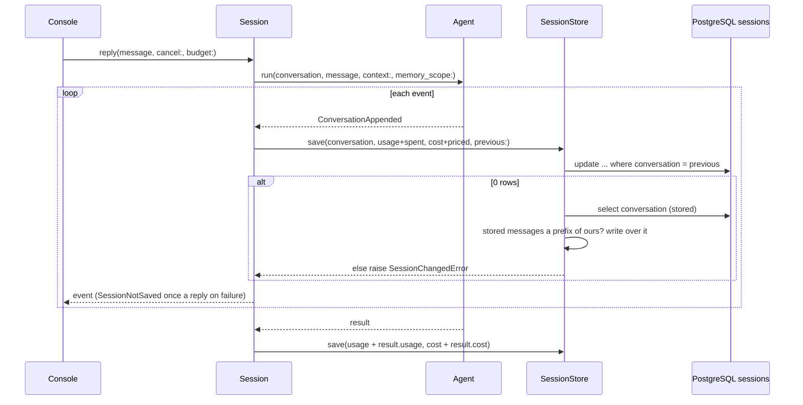

| Step | Code |
|---|---|
| Save on each `ConversationAppended`, with the reply's spend so far priced at the model's price | [`session.rb:92-102`](../apps/bookshop/lib/bookshop/session.rb#L92) |
| Save once more with the result's usage and cost | [`session.rb:80-85`](../apps/bookshop/lib/bookshop/session.rb#L80) |
| Optimistic update: only while the row holds the conversation this console last saved | [`session_store.rb:15-20`](../apps/bookshop/lib/bookshop/session_store.rb#L15), [`:66-77`](../apps/bookshop/lib/bookshop/session_store.rb#L66) |
| A lost answer: write over a stored conversation whose messages are the first of ours | [`session_store.rb:129-141`](../apps/bookshop/lib/bookshop/session_store.rb#L129) |
| A new session: `insert … on conflict (id) do nothing`, so an id taken is refused the same way | [`session_store.rb:8-13`](../apps/bookshop/lib/bookshop/session_store.rb#L8) |
| A failed save is told once a reply and the reply goes on | [`session.rb:114-127`](../apps/bookshop/lib/bookshop/session.rb#L114) |

**Resume.** `/resume <id>` goes on only when the stored fingerprint is nil or the agent's (design.md "`/resume <id>`
loads the session"); otherwise the next run would fail `Failed(:prefix_mismatch)`
([`run_engine.rb:42`](../officina/lib/sleepyshark/officina/run_engine.rb#L42)).

**A crash between the reply and its results.** A conversation saved while tools ran ends in a reply with calls and no
results. The next run first appends an error result for each, audits each as `tool_ended` with outcome
`interrupted`, and reports the message ([`interrupted_calls.rb:16-25`](../officina/lib/sleepyshark/officina/interrupted_calls.rb#L16)).

**Cross-implementation resume.** `testdata/session/` holds a session saved by each implementation
(`dotnet-session.json`, `go-session.json`, `ruby-session.json`). `SharedSessionTest` checks Ruby still writes its own
byte for byte and resumes all three ([`shared_session_test.rb:16`](../officina/test/shared_session_test.rb#L16));
`ruby-session.json` was written once by its documented step (design.md, the `shared_session.rb` row). What makes it
work: the same conversation JSON, the same canonical block bytes, the same fingerprint bytes, and the DSL writing
Bookshop's schemas as .NET's bytes (§2.7).

### 2.6 Budgets and cost with BigDecimal

Money is `BigDecimal` US dollars everywhere (R17), Ruby's exact decimal, as .NET's `decimal`. `Price` holds dollars per
million tokens ([`price.rb:7-27`](../officina/lib/sleepyshark/officina/price.rb#L7)); Claude's are a frozen table
([`officina-claude/…/model.rb:36-39`](../officina-claude/lib/sleepyshark/officina/claude/model.rb#L36)).

```ruby
# officina/lib/sleepyshark/officina/price.rb:14, 25-27
def cost(usage) = (plain(usage) + cache_reads(usage) + written(usage)) / 1_000_000

def written(usage)
  (cache_write * (usage.cache_write - usage.cache_write_hour)) + (cache_write_hour * usage.cache_write_hour)
end
```

`BigDecimal * Integer` stays a `BigDecimal`, so no `Float` enters the sum. Floats appear only at the edges that need
them: a span attribute and a histogram take a `Float` ([`run_trace.rb:99`](../officina/lib/sleepyshark/officina/run_trace.rb#L99)).

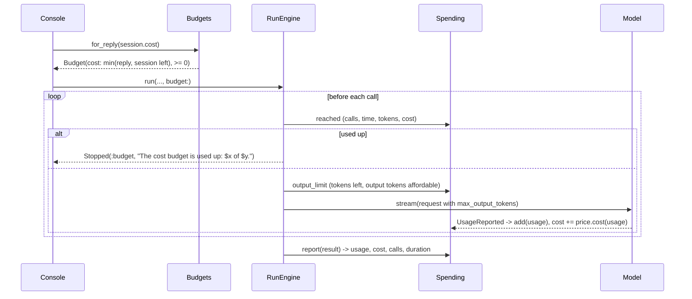

| Rule | Code |
|---|---|
| `Budget` is a value of four optional limits | [`budget.rb:5-17`](../officina/lib/sleepyshark/officina/budget.rb#L5) |
| Checked before every call; a limit already reached stops the run | [`spending.rb:49`](../officina/lib/sleepyshark/officina/spending.rb#L49), [`:69-94`](../officina/lib/sleepyshark/officina/spending.rb#L69) |
| Each call's output limit is lowered to what remains | [`spending.rb:46`](../officina/lib/sleepyshark/officina/spending.rb#L46), [`:63-67`](../officina/lib/sleepyshark/officina/spending.rb#L63) |
| A `max_tokens` reply under a lowered limit, budget now used up, is `Stopped(:budget)` | [`reply_outcome.rb:15`](../officina/lib/sleepyshark/officina/reply_outcome.rb#L15) |
| A model with no price costs nothing (`FREE`), and a cost budget for it is refused | [`spending.rb:11-12`](../officina/lib/sleepyshark/officina/spending.rb#L11), [`agent.rb:111`](../officina/lib/sleepyshark/officina/agent.rb#L111) |
| Dollars in messages: at most six decimals, rounded half away from zero as `BigDecimal` | [`spending.rb:99`](../officina/lib/sleepyshark/officina/spending.rb#L99) |
| The JSON-lines audit writes a cost as a JSON number of its digits, not a string | [`json_lines_audit_sink.rb:48`](../officina/lib/sleepyshark/officina/json_lines_audit_sink.rb#L48) |
| Bookshop: $0.50 a reply, $5 a session, `BOOKSHOP_REPLY_BUDGET` lowers the reply's | [`budgets.rb:15-41`](../apps/bookshop/lib/bookshop/budgets.rb#L15) |
| `pg` decodes `numeric` into `BigDecimal` through a type map | design.md "Rows come back with Symbol keys" |

### 2.7 Typed output

Ruby has no parameter types to derive a JSON schema from, so one small DSL declares a tool's input and an agent's
typed output (R19). `Input.define { … }` returns a frozen `Data` class with two class methods, `schema` and
`from_json` ([`input.rb:26-40`](../officina/lib/sleepyshark/officina/input.rb#L26)):

```ruby
# officina/lib/sleepyshark/officina/input.rb:9-14 (its doc example)
SearchBooks = Officina::Input.define do
  string :title, 'Part of the title.', optional: true
  integer :max_price, 'The highest price.', optional: true, minimum: 0
end
SearchBooks.schema.to_s # => {"type":"object","properties":{"title":{"description":…
SearchBooks.from_json({ 'title' => 'Dune' }) # => #<data SearchBooks title="Dune", max_price=nil>
```

The schema is written as text, in .NET's key order and escaping, with snake-case names turned to camel case
([`input.rb:42-46`](../officina/lib/sleepyshark/officina/input.rb#L42), [`:74-77`](../officina/lib/sleepyshark/officina/input.rb#L74)),
so a session saved in .NET resumes in Ruby (design.md "The schema is written as text by the DSL"). The block runs
with `instance_exec` on a `Declaration` object that has only the five type methods
([`input.rb:28`](../officina/lib/sleepyshark/officina/input.rb#L28), [`:83-155`](../officina/lib/sleepyshark/officina/input.rb#L83)):
that is how `string :title` works without a receiver.

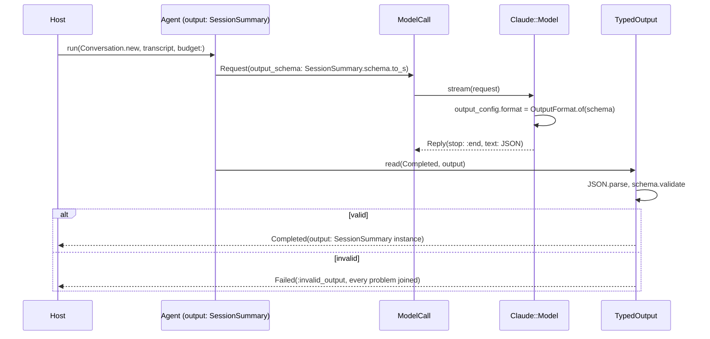

- `TypedOutput.read` acts only on a `Completed` when the agent has an output type
  ([`typed_output.rb:15-31`](../officina/lib/sleepyshark/officina/typed_output.rb#L15)). Text that is not JSON fails by
  line and column only, because the parser's message quotes the reply and the detail reaches telemetry
  ([`typed_output.rb:28-30`](../officina/lib/sleepyshark/officina/typed_output.rb#L28)).
- The schema is part of the prefix fingerprint ([`agent.rb:168-169`](../officina/lib/sleepyshark/officina/agent.rb#L168)).
- `Schema` validates the Q2 subset and returns problems as `"<JSON pointer>: <problem>"`, a list rather than an
  exception ([`schema.rb:47`](../officina/lib/sleepyshark/officina/schema.rb#L47)). A schema outside the subset is
  refused when made ([`schema.rb:34-39`](../officina/lib/sleepyshark/officina/schema.rb#L34)). A `Schema` is also its
  own input type (`schema` returns `self`, `from_json` the value), the form an MCP tool needs
  ([`schema.rb:52-55`](../officina/lib/sleepyshark/officina/schema.rb#L52)): one duck type for both, so `Tool` has no
  type switch.

### 2.8 The summarizer

A second, stateless agent: Opus 5.5 at low effort, 4,000 output tokens, no tools, `SessionSummary` as its typed
output, and a $0.05 budget per summary ([`summarizer.rb:21-48`](../apps/bookshop/lib/bookshop/summarizer.rb#L21)).
Each summary runs on a new `Conversation` dropped afterwards, so it never touches the chat's prefix or history.

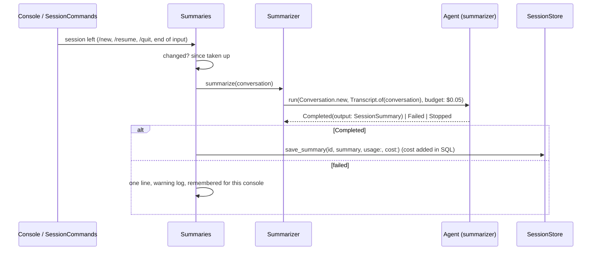

The flow, the texts and the three-sessions cap of `/sessions` are .NET's and Go's (design.md "`Summaries` summarizes a
session as it is left"; [`apps/bookshop/…/summaries.rb`](../apps/bookshop/lib/bookshop/summaries.rb)). The transcript is
built by [`transcript.rb`](../apps/bookshop/lib/bookshop/transcript.rb), each part cut after 1,000 characters.

### 2.9 Demo mode and context management

The core never edits a conversation; the provider shortens what it shows the model. `ContextManagement` (compaction
threshold) and `ToolResultClearing` (after, keep, at least tokens) are values on the agent, checked when made, refused
when the model's provider cannot do them ([`agent.rb:130-141`](../officina/lib/sleepyshark/officina/agent.rb#L130)),
and part of the fingerprint, written as .NET writes them
([`context_management.rb:26-29`](../officina/lib/sleepyshark/officina/context_management.rb#L26)).

| | Standard | `--demo` |
|---|---|---|
| Compact at | 150,000 tokens | 50,000 (Claude's minimum) |
| Clear tool results | above 20 calls, keep 5, only when 20,000 tokens go | above 12 calls, keep 10 |
| Claude's caches | 1 hour | 5 minutes |
| Where | [`chat_agent.rb:62-68`](../apps/bookshop/lib/bookshop/chat_agent.rb#L62) | [`chat_agent.rb:71-81`](../apps/bookshop/lib/bookshop/chat_agent.rb#L71) |

Both settings live in one `Mode` value, whose `claude` builds the model with the mode's cache lifetime, so the agent and
its model never disagree ([`chat_agent.rb:45-56`](../apps/bookshop/lib/bookshop/chat_agent.rb#L45)).

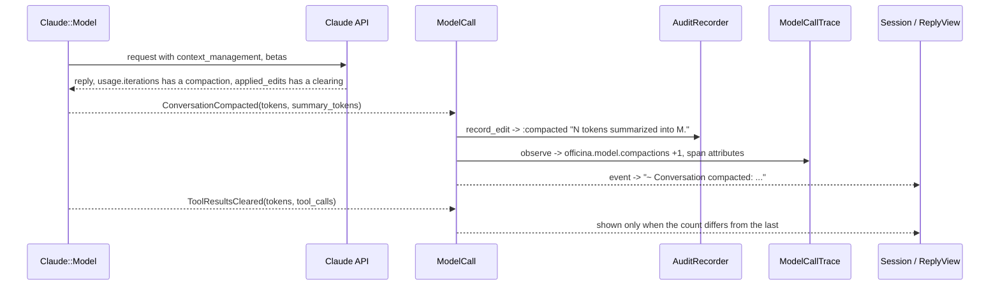

The relay is [`model_call.rb:38-50`](../officina/lib/sleepyshark/officina/model_call.rb#L38); the audit wording
[`audit_recorder.rb:47-56`](../officina/lib/sleepyshark/officina/audit_recorder.rb#L47); the session's repeat filter
[`session.rb:88`](../apps/bookshop/lib/bookshop/session.rb#L88). The adapter builds the request part in
[`context_editing.rb`](../officina-claude/lib/sleepyshark/officina/claude/context_editing.rb), merged at
[`model.rb:146`](../officina-claude/lib/sleepyshark/officina/claude/model.rb#L146).

### 2.10 Telemetry and logs

The core uses the OpenTelemetry **API** only. The host makes one `Officina::Telemetry` per pair of providers and passes
it to its agents ([`telemetry.rb:60-67`](../officina/lib/sleepyshark/officina/telemetry.rb#L60)); it makes every
instrument once, because a meter takes an instrument name once (design.md "`Telemetry` holds the host's tracer and
meter providers"). Names and units are .NET's, checked by a test that parses .NET's and Go's sources
([`telemetry.rb:28-53`](../officina/lib/sleepyshark/officina/telemetry.rb#L28)).

| Span | Started by | Carries |
|---|---|---|
| `invoke_agent bookshop` | `RunTrace#start_run`, under the host's current span ([`run_trace.rb:122-128`](../officina/lib/sleepyshark/officina/run_trace.rb#L122)) | conversation, run id, memory scope, result, reason, usage, cost |
| `chat claude-opus-5-5` | `ModelCallTrace` ([`model_call_trace.rb:8-15`](../officina/lib/sleepyshark/officina/model_call_trace.rb#L8)) | tokens, retries, time to first token, finish reason, compaction, clearing |
| `execute_tool <name>` | `ToolCallTrace` ([`tool_call_trace.rb:19-24`](../officina/lib/sleepyshark/officina/tool_call_trace.rb#L19)) | source, kind, approval and wait, outcome, ran, truncation |

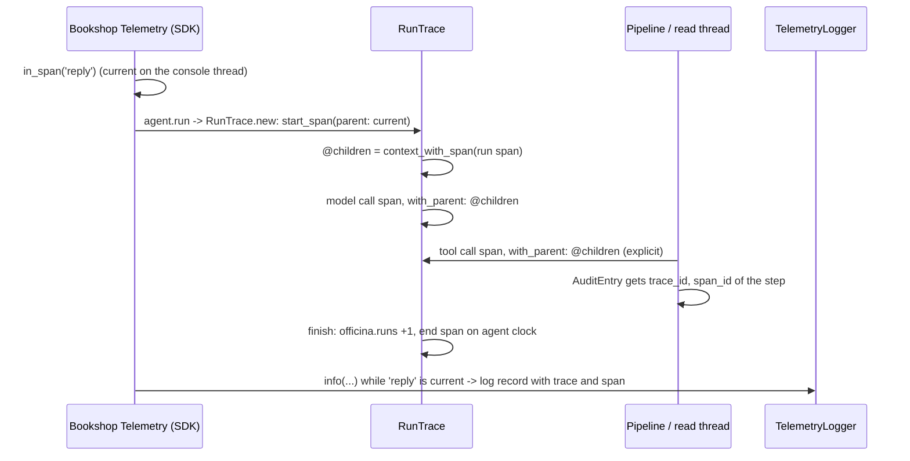

- **Trace context.** The run's span starts under `OpenTelemetry::Context.current`, the API's per-thread context, which
  the host sets with `in_span`; every later span gets its parent explicitly, as tool calls end on other threads where
  the run's context is not current, and no span is made current
  ([`run_trace.rb:29`](../officina/lib/sleepyshark/officina/run_trace.rb#L29),
  [`:82-84`](../officina/lib/sleepyshark/officina/run_trace.rb#L82)). Audit entries carry the step's trace and span
  ids ([`audit_recorder.rb:76-79`](../officina/lib/sleepyshark/officina/audit_recorder.rb#L76)), so `/audit` links each
  run to its trace.
- **A fresh attributes hash per measurement.** `RunTrace#dimensions` builds a new hash on each call, as the metrics
  SDK keeps the hash it is given and a view merges into it
  ([`run_trace.rb:75-78`](../officina/lib/sleepyshark/officina/run_trace.rb#L75)).
- **Every time from the agent's clock**, so tests check durations exactly
  ([`run_trace.rb:88`](../officina/lib/sleepyshark/officina/run_trace.rb#L88)).
- **No content unless opted in.** `content:` on `Telemetry`; text is redacted even then
  ([`run_trace.rb:103-108`](../officina/lib/sleepyshark/officina/run_trace.rb#L103)).
- **The application** makes the SDK's providers itself, never the globals, exports over OTLP/HTTP, and wraps each reply
  in a `reply` span ([`apps/bookshop/…/telemetry.rb:58`](../apps/bookshop/lib/bookshop/telemetry.rb#L58),
  [`:96-97`](../apps/bookshop/lib/bookshop/telemetry.rb#L96)). Logs go through `TelemetryLogger`, a `Logger`
  subclass whose `add` emits an OpenTelemetry log record (R16,
  [`telemetry_logger.rb`](../apps/bookshop/lib/bookshop/telemetry_logger.rb)).
- **Closing is bounded to two seconds.** The three providers shut down on threads of their own, joined against one
  deadline ([`apps/bookshop/…/telemetry.rb:83-87`](../apps/bookshop/lib/bookshop/telemetry.rb#L83)). This is the one
  deliberate exception to "join every thread": with the dashboard down the exporters retry for ten seconds and
  ignore the timeout, and nothing can stop them without `Thread#kill` (design.md "`Telemetry` makes the SDK's
  tracer…").

### 2.11 Cancellation (Ctrl+C) and concurrency

Ruby has no `CancellationToken`, so the core has a small one, `Cancellation`: `cancel`, `cancelled?`, and
`on_cancel { }`, which runs a block once when cancelled, or at once if it already is
([`cancellation.rb:17-40`](../officina/lib/sleepyshark/officina/cancellation.rb#L17)). It is passed as `cancel:`, one per
run (R10). Cancellation is cooperative only: never `Thread#raise`, `Thread#kill` or `Timeout.timeout`, which interrupt
code at any point ([`ruby/CLAUDE.md`](../CLAUDE.md), *Concurrency*).

**Ctrl+C**, from the signal to the stream:

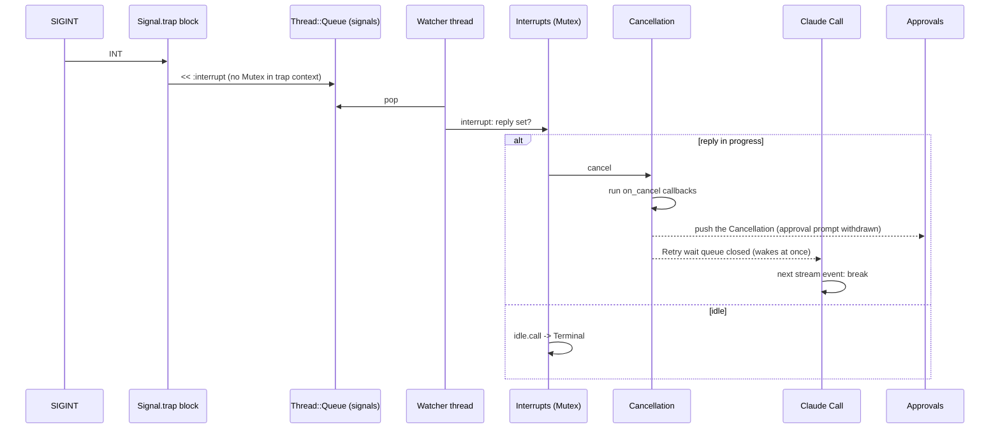

- The trap only pushes to a queue, as a `Mutex` raises in trap context; the watcher thread does the rest
  ([`interrupts.rb:19-30`](../apps/bookshop/lib/bookshop/interrupts.rb#L19)). Its `ensure` restores the old handler,
  closes the queue (the trap was its only sender) and joins the watcher.
- `cancelling(reply)` makes a reply cancellable only while it runs
  ([`interrupts.rb:36-41`](../apps/bookshop/lib/bookshop/interrupts.rb#L36),
  [`console.rb:123-128`](../apps/bookshop/lib/bookshop/console.rb#L123)).
- The stream stops at its next event ([`call.rb:51`](../officina-claude/lib/sleepyshark/officina/claude/call.rb#L51));
  the wait between attempts wakes at once, as `on_cancel` closes the queue it waits on
  ([`model.rb:29-33`](../officina-claude/lib/sleepyshark/officina/claude/model.rb#L29)). Leaving the loop over the
  SDK's enumerator closes its connection in the SDK's own `ensure`.
- An approval waiting on the console is withdrawn: `on_cancel` pushes the `Cancellation` into the answers queue, and
  the approver matches it with a pinned pattern ([`approvals.rb:26-35`](../apps/bookshop/lib/bookshop/approvals.rb#L26)).

**A host that leaves the block** (`break`, an exception) while a reply's calls run cancels the run, waits for the
pipeline, and still appends every call's result, unreported
([`tool_step.rb:24-49`](../officina/lib/sleepyshark/officina/tool_step.rb#L24)). `reported` is set only after the
whole event loop, so the `ensure` knows whether the host left.

**Who owns each thread and queue:**

| Thread | Started at | Its owner joins it | Stopped by |
|---|---|---|---|
| The run | The caller's own thread | — | Its `Cancellation`, checked before each call and each stream event |
| Tool pipeline (one per reply) | [`tool_pipeline.rb:26`](../officina/lib/sleepyshark/officina/tool_pipeline.rb#L26) | `ToolStep#append_results`, in an `ensure`, through `results` = `Thread#value` ([`tool_step.rb:41`](../officina/lib/sleepyshark/officina/tool_step.rb#L41)) | The run's `Cancellation` |
| Each read call | [`running_reads.rb:14-16`](../officina/lib/sleepyshark/officina/running_reads.rb#L14) | The pipeline, before a write and at the end ([`running_reads.rb:19-21`](../officina/lib/sleepyshark/officina/running_reads.rb#L19)); on failure `stop` cancels and joins all ([`:25-42`](../officina/lib/sleepyshark/officina/running_reads.rb#L25)) | The run's `Cancellation`, passed to the handler |
| MCP stdio output and error readers | [`child_process.rb:72-73`](../officina-mcp/lib/sleepyshark/officina/mcp/child_process.rb#L72) | `ChildProcess#stop` closes each pipe and joins ([`:127-128`](../officina-mcp/lib/sleepyshark/officina/mcp/child_process.rb#L127)) | Closing the pipe |
| MCP HTTP request | [`streamable_http.rb:82`](../officina-mcp/lib/sleepyshark/officina/mcp/streamable_http.rb#L82) | `Pending#release`, in `Client#exchange`'s `ensure` ([`client.rb:135-139`](../officina-mcp/lib/sleepyshark/officina/mcp/client.rb#L135)) | Closing its connection |
| Ctrl+C watcher | [`interrupts.rb:21`](../apps/bookshop/lib/bookshop/interrupts.rb#L21) | `watch`'s `ensure` | Closing its queue |
| Terminal reader | [`terminal.rb:75`](../apps/bookshop/lib/bookshop/terminal.rb#L75) | `Terminal#close` ([`:63-68`](../apps/bookshop/lib/bookshop/terminal.rb#L63)) | Closing the input |
| Telemetry shutdown (three) | [`telemetry.rb:86`](../apps/bookshop/lib/bookshop/telemetry.rb#L86) | Joined against a 2 s deadline, then left with the process | — (the documented exception) |

| Queue | Sender (closes it) | Reader |
|---|---|---|
| Pipeline events | The pipeline, in `answer`'s `ensure` ([`tool_pipeline.rb:52`](../officina/lib/sleepyshark/officina/tool_pipeline.rb#L52)) | The run, `each_event` until `pop` returns nil ([`:31-35`](../officina/lib/sleepyshark/officina/tool_pipeline.rb#L31)) |
| Ctrl+C signals | The trap; closed by `watch` once the trap is gone | The watcher |
| Approval answers | The console and `on_cancel`; never closed, cleared after each reply ([`console.rb:133`](../apps/bookshop/lib/bookshop/console.rb#L133)) | The pipeline's thread |
| Stdio responses, one per request | The output reader; closed when the server is lost | The request |
| Claude's retry wait | Closed by `on_cancel` | `pop(timeout:)` |

Every test checks the first table: `ThreadLeakCheck` fails any test that ends with more threads than it started
([`officina-testing/…/thread_leak_check.rb:8-21`](../officina-testing/lib/sleepyshark/officina/testing/thread_leak_check.rb#L8)),
which is why tests run one at a time (R11). Concurrency itself is proven by tests that start their own runs in parallel
(`run_concurrency_test.rb`, AGT-04).

---

## 3. Design principles as applied

### 3.1 SOLID

| Principle | Applied | Notes |
|---|---|---|
| **Single responsibility** | The run engine is the loop alone; `ModelCall`, `ReplyOutcome`, `ToolStep`, `Reporter` each hold one concern (design.md "The run engine is the loop alone"). In the pipeline, `ApprovalDesk`, `CallReport`, `RunningReads` and `ToolCallTrace` split approval, audit-then-event, read threads and telemetry | `Agent` both holds the definition and starts the run: `run` is three lines that hand over to `RunEngine` ([`agent.rb:96-104`](../officina/lib/sleepyshark/officina/agent.rb#L96)) |
| **Open/closed** | A new provider, store, sink or approver is a new object with the contract's methods; the core does not change. A tool's behaviour is its block | Event handling is `case … in` over event classes in each host, not a visitor; Ruby's idiom, and an unknown event falls to `else` |
| **Liskov** | `HashMemoryStore` and `FileMemoryStore` pass one shared contract suite (`memory_store_contract.rb`, design.md "`HashMemoryStore` refuses a path…"); a `Schema` and an `Input` class answer the same `schema`/`from_json` | `MemoryTool < Tool` changes `memory?` and `needs_approval_for?` only, keeping every promise of `Tool` |
| **Interface segregation** | Contracts are small: `_Approver` one method, `_AuditSink` one, `_Model` three, `_ToolSource` three | `_MemoryStore` has five, the operations ARCHITECTURE §4.4 names; a store's own `rename` keeps check-and-move under one lock (design.md "The memory store contract") |
| **Dependency inversion** | The core defines `_Model`, `_ToolSource`, `_MemoryStore`, `_AuditSink`, `_Approver` beside their consumers; the adapters depend on the core, enforced by the dependency test | No interface where one implementation has no swap: `Telemetry`, `Spending`, `RunTrace` are concrete classes |

### 3.2 Ports and adapters

Every boundary is a duck type the core consumes, an RBS interface, with a real adapter and a test double from the kit:

| Port (the core's) | Contract | Production adapter | Test adapter |
|---|---|---|---|
| Model provider | `_Model` ([`model.rbs:8`](../officina/sig/sleepyshark/officina/model.rbs#L8)) | `Claude::Model` | `Testing::ScriptedModel` ([`scripted_model.rb:71-95`](../officina-testing/lib/sleepyshark/officina/testing/scripted_model.rb#L71)), which also checks each request against the provider's rules |
| Tools from elsewhere | `_ToolSource` | `Mcp::ToolSource` | `Testing::FakeMcpServer` under a real `Mcp::ToolSource` |
| The human | `_Approver` ([`approver.rbs:5`](../officina/sig/sleepyshark/officina/approver.rbs#L5)) | `Bookshop::Approvals` | `Testing::ScriptedApprover` |
| Memory storage | `_MemoryStore` | `FileMemoryStore` | `HashMemoryStore` |
| Audit storage | `_AuditSink` | `JsonLinesAuditSink`, `Bookshop::AuditTable` | `Testing::RecordingAuditSink` |
| Clock | `clock:` a callable returning `Time` ([`agent.rb:60`](../officina/lib/sleepyshark/officina/agent.rb#L60)); MCP's monotonic `clock:` ([`mcp.rb:25`](../officina-mcp/lib/sleepyshark/officina/mcp.rb#L25)); Claude's `wait:` | `-> { Time.now }` | `FakeClock` ([`fake_clock.rb`](../officina/test/support/fake_clock.rb)), which the test moves with `advance`; MCP's tests use a lambda that steps on each reading |
| Telemetry | The OpenTelemetry API | The SDK with OTLP exporters | The SDK's in-memory exporter and reader |

A callable (`#call`) is Ruby's one-method port: a lambda satisfies it, so the clock needs no interface at all.

### 3.3 DRY, KISS, YAGNI

| | Example |
|---|---|
| **DRY** | One writer of .NET's JSON escaping (`DotnetJson`) for the fingerprint, the DSL's schemas and stored blocks; one `Secrets` for the agent and the MCP source (design.md "`Mcp::Server#secrets`"); one `ConversationRules` for the scripted model and the property test; one rescue for the nine Bookshop tools (`ShopTool.define`) |
| **KISS** | Threads and `Thread::Queue` rather than a fiber scheduler (R11); one HTTP connection per MCP request, so no pool to manage; the SQL is plain `exec_params` with frozen constants, no mapper (R7) |
| **YAGNI** | One error class, "until a host needs to tell two apart" (design.md "Misuse and a broken environment raise"); the DSL has only what Bookshop and the samples need (design.md "A tool's input or a typed output is declared with `Input.define`"); `Input` integers take `minimum:` only |
| **Deliberately repeated** | `Completed`, `Stopped` and `Failed` repeat the same five usage members rather than share a base class, so each is a plain `Data` and pattern matching reads them alike |

### 3.4 Composition over inheritance

The engine holds its collaborators ([`run_engine.rb:14-24`](../officina/lib/sleepyshark/officina/run_engine.rb#L14));
nothing in the core is a template method. The only subclasses are:

| Subclass | Why inheritance |
|---|---|
| `MemoryTool < Tool` | Only the core makes a memory tool; a flag a host could set on any tool would let it pose as one (design.md "`MemoryTool` is a subclass of `Tool`") |
| `…Error < Officina::Error < StandardError` | Ruby's exception hierarchy is how `rescue` selects |
| `TelemetryLogger < Logger` | So the application logs through `Logger` without patching it (R16) |

### 3.5 Tell, Don't Ask and the Law of Demeter

- Told, not asked: the pipeline asks a tool `input_problem(input)` and gets a sentence, rather than reading its schema
  ([`tool.rb:71-76`](../officina/lib/sleepyshark/officina/tool.rb#L71)); `Spending#reached` returns which limit is
  used up, as a sentence ([`spending.rb:49`](../officina/lib/sleepyshark/officina/spending.rb#L49)).
- A known breach, marked as interim: `Session#priced` reaches through `@agent.model.info` for the price, because the
  core's `UsageReported` has no cost yet; the design notes record the follow-up that removes it
  ([`session.rb:106-110`](../apps/bookshop/lib/bookshop/session.rb#L106), design.md "Mid-reply saves price…").

### 3.6 Immutability

- **Values are `Data`.** `Usage`, `Message`, `Block`, `Reply`, `Request`, `Budget`, `Price`, the results, the events
  and the audit entry are `X = Data.define(…)`, reopened when they need methods
  ([`usage.rb:5-29`](../officina/lib/sleepyshark/officina/usage.rb#L5)). `Usage#+` returns a new value with `with`.
- **Frozen collections inside them**: `blocks.dup.freeze` ([`message.rb`](../officina/lib/sleepyshark/officina/message.rb),
  [`reply.rb:20`](../officina/lib/sleepyshark/officina/reply.rb#L20)).
- **Frozen objects.** `Agent`, `Tool`, `Schema`, `Telemetry` and `Claude::Model` call `freeze` at the end of
  `initialize` ([`agent.rb:62`](../officina/lib/sleepyshark/officina/agent.rb#L62)), so many threads may share them.
- **Frozen strings.** Every file starts with `# frozen_string_literal: true`; `-string` returns a frozen, deduplicated
  copy, used for every string a value keeps ([`agent.rb:146`](../officina/lib/sleepyshark/officina/agent.rb#L146),
  [`tool_result.rb:13`](../officina/lib/sleepyshark/officina/tool_result.rb#L13)).
- **Mutable state, guarded.** What must change lives behind one `Mutex` of the object that holds it: `Cancellation`,
  `AuditRecorder`, the stores, `Mcp::ToolSource`, `JsonLinesAuditSink`. `Conversation` swaps one frozen `State`.

### 3.7 Errors as values

| Kind | Ruby | Example |
|---|---|---|
| How a run ended | A `Completed`, `Stopped` or `Failed` value, returned | [`run_engine.rb:110-111`](../officina/lib/sleepyshark/officina/run_engine.rb#L110) |
| A tool's failure | An error `ToolResult` the model reads; a handler may return `ToolFailure` | [`tool_pipeline.rb:107-110`](../officina/lib/sleepyshark/officina/tool_pipeline.rb#L107) |
| Invalid input or output | A list of problems | `Schema#validate` |
| Misuse, broken environment | `raise Officina::Error`, `Mcp::Error`, `Claude::…Error` | [`agent.rb:109`](../officina/lib/sleepyshark/officina/agent.rb#L109) |
| A model failure after retries | Raised by the adapter, turned into `Failed(:model_error)` by `ModelCall` | [`model_call.rb:30-36`](../officina/lib/sleepyshark/officina/model_call.rb#L30) |
| A bad MCP server mid-run | `Mcp::Error` raised by the client, turned into a `ToolFailure` by the source | [`tool_source.rb:170-172`](../officina-mcp/lib/sleepyshark/officina/mcp/tool_source.rb#L170) |

`rescue StandardError` appears only at the boundaries ruby/CLAUDE.md names (handler, stream, sink write), at `relay`'s
mark-and-re-raise of the host's exception ([`model_call.rb:47`](../officina/lib/sleepyshark/officina/model_call.rb#L47)),
and at two places it does not name: the approver, as it runs on the pipeline's thread where the host cannot rescue it
([`approval_desk.rb:33-37`](../officina/lib/sleepyshark/officina/approval_desk.rb#L33)), and a tool source's connect,
whose failure is the run's result ([`tool_sources.rb:19`](../officina/lib/sleepyshark/officina/tool_sources.rb#L19)).

### 3.8 The project's own rules

| Rule | Where Ruby keeps it |
|---|---|
| **Append-only conversation** | The only way to append is the lambda `hold` yields ([`conversation.rb:73`](../officina/lib/sleepyshark/officina/conversation.rb#L73)); `messages` is a frozen array, and `append` makes a new one ([`:121-123`](../officina/lib/sleepyshark/officina/conversation.rb#L121)); crash recovery appends error results rather than dropping the reply |
| **Stable prefix** | Tools sorted by name and frozen ([`agent.rb:149-154`](../officina/lib/sleepyshark/officina/agent.rb#L149)), instructions frozen, the fingerprint bound on the first append and checked each run; run context is an operator message after the user's, never in the instructions; the prefix check `PrefixAssertions` in the kit compares every request's fixed parts |
| **Purpose-neutral core** | No domain, UI or storage choice in `officina/`; the stores and the JSON-lines sink run only when a host passes them; Bookshop's tools, SQL and console live in `apps/bookshop` |
| **Every run ends in a result** | `RunEngine#run`'s `ensure` closes the audit and the span for every result, `nil` (abandoned) included |
| **A write never runs unaudited** | §2.2 |

---

## 4. Notable decisions and tricky cases

### 4.1 Decisions R1–R20

From [`docs/implementations/ruby.md`](../../docs/implementations/ruby.md); each row there has the full text.

| # | Decision | Why |
|---|---|---|
| R1 | Ruby 4.0.x pinned in `.ruby-version`, gemspecs `>= 4.0`, `Gemfile.lock` committed, CI on Linux and Windows | One pinned version, the same reach as .NET and Go |
| R2 | One Bundler workspace; four gems named `sleepyshark-officina[-…]`; Bookshop in `apps/bookshop` | The owner prefix in Ruby's naming convention |
| R3 | The core is one gem, one file per public class, `require_relative`, internals `private_constant`, no autoloading | Load order visible (§1.4) |
| R4 | The official `anthropic` gem, pinned exactly, in the Claude gem only; a Prism-based dependency test | Prism finds `require`s without running the code |
| R5 | No DI container; keyword constructors; one composition root, `Bookshop.build` | Ruby's convention is explicit wiring |
| R6 | What each gem may require; OpenTelemetry API only in the core, providers passed in; `dotenv` in the app | Libraries depend on the API only; EVT-02 needs metrics |
| R7 | `pg` and `connection_pool`; plain SQL, no ORM | The plain driver, as .NET and Go |
| R8 | The core's own small validator; `json_schemer` as reference, tests only | As .NET and Go |
| R9 | `json` with `allow_duplicate_key: false`; raw blocks as frozen canonical strings; stored messages sent as `JSON::Fragment`s through `extra_body`; the core's .NET-escaping writer for the fingerprint | Ruby's generator escapes differently; replay needs exact bytes |
| R10 | `Agent#run` yields events and returns the result; leaving the block cancels; `Officina::Cancellation`; a trap only pushes to a queue | A block is Ruby's push stream; cooperative cancellation is the only safe kind |
| R11 | Threads, `Thread::Queue`, `Mutex`; no fiber scheduler; every thread joined; a thread-leak check; tests one at a time | Threads suffice for I/O-bound tools; a scheduler would impose a runtime choice on hosts |
| R12 | Minitest; `pbt` for property tests (seeded, prints the seed); a local `TCPServer` instead of `webmock`; PostgreSQL through the `docker` command; the clock as `clock:` | `prop_check` and `rantly` take no seed; `testcontainers-postgres` is unmaintained |
| R13 | RuboCop with plugins; frozen string literals; Steep; warnings fail tests; `bundler-audit`; SimpleCov reported; mutant as a gate | The tools Ruby projects expect; mutant is the only maintained Ruby mutation tester |
| R14 | Core budget of 2,800 code lines, enforced by a test ([`core_budget_test.rb:8`](../test/core_budget_test.rb#L8)) | Set by measurement at Ruby S03 |
| R15 | `ruby.yml` runs on every PR, skipping its jobs when nothing of Ruby changed | A required check skipped by a path filter never reports |
| R16 | The OpenTelemetry SDK and OTLP/HTTP exporters in the app only; compression off; `Logger` subclass for logs | Ruby has no maintained OTLP/gRPC exporter; the dashboard rejects gzip |
| R17 | Money is `BigDecimal` | Exact, like `decimal`; ships with Ruby; `pg` decodes `numeric` into it |
| R18 | RBS signatures for every public API, checked by Steep; contracts as RBS interfaces | Typed contracts without changing how Ruby is written |
| R19 | The `Input.define` schema DSL, writing .NET's bytes | No parameter types to reflect over; one source for class and schema |
| R20 | Hosting helpers, when they come, target Rack | Every Ruby web server speaks Rack |

### 4.2 Tricky cases met along the way

| Case | What happened | Resolution |
|---|---|---|
| **json 2.18 versus 3.x and `RawJson`** | An MCP tool's schema must be the server's bytes for the fingerprint, and `JSON.parse` keeps no text, so `RawJson` re-reads member text from text the parser already accepted. Ruby 4.0's default `json`, 2.18, accepts comments, which `RawJson` cannot follow; review of #119 asked what happens on such text | `RawJson` fails closed: every step must advance or it raises `JSON::ParserError`, which makes the page unreadable (`Mcp::Error`); the MCP gem declares `json ~> 3.0` ([gemspec:15-16](../officina-mcp/sleepyshark-officina-mcp.gemspec#L15)), whose parser refuses comments and repeated names by default. Generated garbage and tool lists with comments are property-tested (PR #119, R6, design.md "An MCP tool's input schema is its JSON text") |
| **Steep silently skipping a file** | Steep 2.1 logs a FATAL and skips a file it crashes on, then exits 0 ("No type error detected"). Found in #117's review: a block given to `super` with arguments crashed it in `MemoryTool` | `rake steep` reads Steep's log and fails on a FATAL or ERROR line ([`Rakefile:11-15`](../Rakefile#L11), [`steep_verdict.rb:6-13`](../steep_verdict.rb#L6)), tested directly (PR #118); `MemoryTool` passes a lambda instead of a block, with a comment saying why ([`memory_tool.rb:36-38`](../officina/lib/sleepyshark/officina/memory_tool.rb#L36)) |
| **The `RunEngine` and `ModelCall` split** | In #115 a new `relay` line pushed `RunEngine` to 101 lines, over RuboCop's `Metrics/ClassLength` of 100, and `no_reply` was squeezed into one line to fit. The reviewer called that dodging a limit | The model call's streaming moved, unchanged, into `ModelCall` (commit 6075c8c, a pure move), and `no_reply` went back to its natural form (da874ff): the limit was a sign to split by concept, as ruby/CLAUDE.md says |
| **mutant and `case … in` bound variables** | `in Stopped(reason:, detail:) then { outcome: "stopped: #{reason}", detail: }` interpolates a pattern-bound variable, which mutant's unparser could not round-trip (commit dc6e256) | The branch matches the class only and reads `result.reason`, `result.detail` ([`audit_recorder.rb:88-95`](../officina/lib/sleepyshark/officina/audit_recorder.rb#L88)) |
| **A `case … in` without `else`** | In #100's review a `relay` matched only some events; `Retried` raised `NoMatchingPatternError`, which the host mark then took for the host's own exception, so a live 429 would have crashed the run | `relay` ends with `else nil` ([`model_call.rb:40-44`](../officina/lib/sleepyshark/officina/model_call.rb#L40)); a run test streams `Retried` through. Unlike `case … when`, `case … in` raises when nothing matches |
| **`>=` restored in the spending check** | To kill a mutant, #112 changed the model-call limit check to `==`, reasoning that the count is checked before each call and "reaches it, never passes it" (e5c4486). That holds only for limits of zero and above: a limit below zero would never equal the count | Round 1 restored `>=` (bddbde6), as .NET and Go, and a test that every limit below zero is used up before the first call kills the `==` and `>` mutants ([`spending.rb:69-72`](../officina/lib/sleepyshark/officina/spending.rb#L69)). A "surviving mutant is equivalent" claim is shown, not trusted |
| **The dotenv choice** | Bookshop needed a local settings file, as .NET has `appsettings.Local.json`; the standard library has no `.env` reader | `dotenv ~> 3.2` (MIT, maintained, no dependencies of its own), in the app only, loaded by `exe/bookshop` from the app's folder, never the working directory; a variable set in the shell wins ([`exe/bookshop:8`](../apps/bookshop/exe/bookshop#L8), PR #130, R6) |

---

## 5. Ruby for a .NET developer

### 5.1 Mapping table

| C# / .NET | Ruby, as this code uses it | Example |
|---|---|---|
| `record Usage(int Input, …)` | `Usage = Data.define(:input, …)` | [`usage.rb:5`](../officina/lib/sleepyshark/officina/usage.rb#L5) |
| `record with { X = 1 }` | `value.with(x: 1)` | [`usage.rb:22`](../officina/lib/sleepyshark/officina/usage.rb#L22) |
| `interface IApprover` | RBS `interface _Approver` + any object with `approve` (duck typing) | [`approver.rbs:5`](../officina/sig/sleepyshark/officina/approver.rbs#L5) |
| `internal` | `private_constant :X` (hidden outside its module) | [`run_engine.rb:113`](../officina/lib/sleepyshark/officina/run_engine.rb#L113) |
| Constructor injection | Keyword arguments, `def initialize(model:, tools: [])` | [`agent.rb:53`](../officina/lib/sleepyshark/officina/agent.rb#L53) |
| `Func<T>`, `Action<T>`, lambda | Block, `Proc`, lambda `->(x) { }` | [`agent.rb:60`](../officina/lib/sleepyshark/officina/agent.rb#L60) |
| `IAsyncEnumerable<RunEvent>` + `await foreach` | A method that `yield`s to the caller's block | [`agent.rb:96`](../officina/lib/sleepyshark/officina/agent.rb#L96) |
| `switch` with type patterns | `case … in Completed(text:)` | [`run_engine.rb:101-107`](../officina/lib/sleepyshark/officina/run_engine.rb#L101) |
| `is { Id: var id }` / deconstruction | `value => { id: String => id }` | [`conversation.rb:46`](../officina/lib/sleepyshark/officina/conversation.rb#L46) |
| `CancellationToken` | `Officina::Cancellation` (the core's own) | [`cancellation.rb`](../officina/lib/sleepyshark/officina/cancellation.rb) |
| `Task.Run`, owned task | `Thread.new`, joined with `#join`/`#value` | [`quiet_thread.rb:7-12`](../officina/lib/sleepyshark/officina/quiet_thread.rb#L7) |
| `Channel<T>` | `Thread::Queue` (same class as `Queue`) | [`tool_pipeline.rb:23`](../officina/lib/sleepyshark/officina/tool_pipeline.rb#L23) |
| `lock` | `Mutex#synchronize { }` | [`cancellation.rb:18`](../officina/lib/sleepyshark/officina/cancellation.rb#L18) |
| `try/finally`, `using` | `begin … ensure … end`, or a block that closes (`File.open(…) { }`) | [`json_lines_audit_sink.rb:35`](../officina/lib/sleepyshark/officina/json_lines_audit_sink.rb#L35) |
| `decimal` | `BigDecimal` | [`price.rb`](../officina/lib/sleepyshark/officina/price.rb) |
| Expression-bodied member `=> x` | Endless method `def x = …` | [`agent.rb:66`](../officina/lib/sleepyshark/officina/agent.rb#L66) |
| `x?.y` | `x&.y` | [`agent.rb:111`](../officina/lib/sleepyshark/officina/agent.rb#L111) |
| `bool IsCancelled` | `cancelled?` (a predicate ends in `?`) | [`cancellation.rb:27`](../officina/lib/sleepyshark/officina/cancellation.rb#L27) |
| `string.Intern` + immutable | `-string` (frozen, deduplicated) | [`agent.rb:146`](../officina/lib/sleepyshark/officina/agent.rb#L146) |
| NuGet, `.csproj`, `Directory.Packages.props` | Gems, gemspec, `Gemfile` + `Gemfile.lock` | [`Gemfile`](../Gemfile) |
| Roslyn analyzers, warnings as errors | RuboCop; Ruby warnings turned into test failures | [`.rubocop.yml`](../.rubocop.yml) |
| Nullable reference types, compiler | RBS signatures checked by Steep | [`sig/`](../officina/sig/) |
| xUnit, CsCheck | Minitest, `pbt` | [`test/test_helper.rb`](../test/test_helper.rb) |
| Stryker.NET | mutant with `mutant-minitest` | [`officina/mutant.yml`](../officina/mutant.yml) |
| Assemblies, namespaces, `using` | Gems, modules, `require` / `require_relative` | [`officina.rb`](../officina/lib/sleepyshark/officina.rb) |

### 5.2 `Data.define` and `Struct` versus records

`Data.define` (Ruby 3.2) makes an immutable value class with keyword and positional constructors, value equality,
`with`, `to_h` and pattern-matching support: the closest thing to a positional record. `Struct` is the older, mutable
cousin; the code never uses it. The house pattern (design.md "Value types are `X = Data.define(…)`"):

```ruby
# officina/lib/sleepyshark/officina/tool_result.rb:5-19
ToolResult = Data.define(:call_id, :content, :error)

class ToolResult                  # reopen the class Data.define made
  def initialize(call_id:, content:, error:)
    super(call_id: -call_id, content: -content, error:)   # freeze before storing
  end

  alias error? error              # the predicate is the reader...
  private :error                  # ...and the plain reader is hidden
end
```

Why reopen rather than pass a block to `Data.define`: Steep does not read a `Data.define` block as the class's body,
so its methods would go unchecked. `ruby/sig/data.rbs` declares that `Data#initialize` takes keywords, which RBS's own
signature leaves out ([`sig/data.rbs:4-6`](../sig/data.rbs#L4)).

### 5.3 Modules, mixins and duck typing versus interfaces

Ruby checks nothing at a call: any object with the right methods works ("duck typing"). A **module** is two things at
once: a namespace (`module Sleepyshark::Officina`) and a mixin, a bag of methods included into a class. The kit's
`ThreadLeakCheck` is a mixin included into every `Minitest::Test` ([`test_helper.rb:24`](../test/test_helper.rb#L24)),
overriding `before_setup` and `after_teardown` and calling `super`, the way a C# base class's virtual hooks would be.

The contracts are **RBS interfaces**, named with a leading underscore, in `sig/`. They describe a shape and have no
runtime existence; Steep checks that the code passing an object as `_Model` passes one with those methods. ruby/CLAUDE.md
forbids the C# reflex: no abstract base class whose methods raise `NotImplementedError`, no `I`-prefixed modules.

| C# | Ruby here |
|---|---|
| `interface IModel { … }`, `class ClaudeModel : IModel` | `interface _Model` in RBS; `Claude::Model` just has `settings`, `info`, `stream` |
| A compile error when a method is missing | Steep's error, in the commit hook and CI; at runtime, `NoMethodError` |
| `is IMemoryTool` | `tool.memory?` (ask the object, not its class) |

### 5.4 Blocks, procs, lambdas and `yield` versus delegates

| Ruby | Is | C# nearest |
|---|---|---|
| `do \|x\| … end` / `{ \|x\| … }` after a call | A **block**: one anonymous callback passed to the method, outside the argument list | A trailing `Action<T>` parameter |
| `yield x` | Calls the method's block | `callback(x)` |
| `&handler` in the parameters | Captures the block as a `Proc` object | Storing the delegate |
| `&` alone | Forwards the block to another call | Passing the delegate on |
| `->(a, b) { }` | A **lambda**: a `Proc` that checks its argument count and where `return` returns from itself | A lambda expression |
| `proc { \|a, b\| }` / a block | A loose `Proc`: missing arguments are `nil`, extras dropped; `return` returns from the *enclosing method* | No equivalent |

Why it matters here:

- **`Agent#run` takes a block for events**, and `break` in that block leaves `run` at once, unwinding through every
  `ensure` in the engine: that is "the host stopped reading" (R10). There is no C# equivalent of a callback that
  aborts its caller; it is what `ToolStep`'s `reported` flag detects ([`tool_step.rb:24-33`](../officina/lib/sleepyshark/officina/tool_step.rb#L24)).
- **A tool's handler is a block** called with three arguments; a block declared with two simply drops the third, a
  lambda must take all three (design.md "The run's memory scope is `Agent#run(memory_scope:)`").
- `it` is the implicit single parameter of a block (Ruby 3.4): `tools.map { tool(it) }`
  ([`officina-claude/…/model.rb:142`](../officina-claude/lib/sleepyshark/officina/claude/model.rb#L142)).
- `instance_exec(&block)` runs a block with another `self`; the DSL uses it so `string :title` reaches the
  declaration object ([`input.rb:28`](../officina/lib/sleepyshark/officina/input.rb#L28)).

### 5.5 `Enumerator` and lazy versus `IEnumerable` and LINQ

`Array` and `Hash` mix in `Enumerable`, which is LINQ: `map` (`Select`), `select`/`filter` (`Where`), `filter_map`
(`Select` then `Where != null`), `find` (`FirstOrDefault`), `any?`, `sum`, `tally` (`GroupBy` + `Count`), `sort_by`,
`each_with_index`, `chunk`. They are eager: each returns an `Array`. `lazy` gives deferred evaluation like LINQ's, and
an `Enumerator` is an external iterator; this code base needs neither in its own code. The one `Enumerator` that
matters is the SDK's stream, which the Claude adapter consumes with `each`: leaving that loop by `break`, `return`
or an exception runs the enumerator's `ensure`, which closes the HTTP connection
([`call.rb:49-55`](../officina-claude/lib/sleepyshark/officina/claude/call.rb#L49)), the way disposing an
`IAsyncEnumerator` would.

Examples worth reading: duplicate tool names with `tally` ([`agent.rb:150`](../officina/lib/sleepyshark/officina/agent.rb#L150));
`chunk` grouping covered characters for redaction ([`secrets.rb:27`](../officina/lib/sleepyshark/officina/secrets.rb#L27)).

### 5.6 Threads, `Queue`, `Mutex` and `ConditionVariable` versus Tasks, Channels and locks

| .NET | Ruby | Notes |
|---|---|---|
| `Task.Run(f)` | `Thread.new { f }` | A real OS thread. MRI's global VM lock lets one thread run Ruby at a time, but blocking I/O releases it, so I/O-bound reads overlap (R11) |
| `await task` | `thread.join` / `thread.value` | `value` re-raises the thread's exception in the joiner, as `await` does |
| Unobserved task exception | Printed to stderr as the thread dies, unless `report_on_exception = false` | `QuietThread` turns it off, as every failure is raised where it is joined ([`quiet_thread.rb:7-12`](../officina/lib/sleepyshark/officina/quiet_thread.rb#L7)) |
| `Channel<T>` | `Thread::Queue` (`Queue` is the same class) | `pop` blocks; after `close`, `pop` returns `nil` once empty, which ends a `while (x = q.pop)` loop; `pop(timeout:)` waits at most that long |
| `lock (o) { }` | `mutex.synchronize { }` | Not reentrant: a second `lock` on the same thread raises. `try_lock` is `Monitor.TryEnter` ([`conversation.rb:70`](../officina/lib/sleepyshark/officina/conversation.rb#L70)) |
| `Monitor.Wait/Pulse`, `SemaphoreSlim` | `ConditionVariable` | Not used: every wait here is a `Queue#pop`, which closing or pushing wakes |
| `CancellationToken.Register` | `Cancellation#on_cancel` | Callbacks run outside the lock, on the cancelling thread ([`cancellation.rb:17-25`](../officina/lib/sleepyshark/officina/cancellation.rb#L17)) |
| `Thread.Abort` (gone) | `Thread#raise`, `Thread#kill`, `Timeout.timeout` | Banned: they interrupt code at any point, between a lock and its release |
| `Console.CancelKeyPress` | `Signal.trap('INT') { }` | A trap runs between instructions of the main thread; a `Mutex` raises there, so it only pushes to a queue ([`interrupts.rb:20`](../apps/bookshop/lib/bookshop/interrupts.rb#L20)) |

### 5.7 Exceptions and `ensure` versus try/finally and `IDisposable`

`begin … rescue X => e … else … ensure … end` is `try … catch (X e) … finally`, with `else` for "no exception". A
`def` body is an implicit `begin`, so `rescue` and `ensure` can sit directly in a method
([`run_engine.rb:29-36`](../officina/lib/sleepyshark/officina/run_engine.rb#L29),
[`tool_pipeline.rb:100-111`](../officina/lib/sleepyshark/officina/tool_pipeline.rb#L100)). `retry` inside `rescue`
re-runs the `begin` block, which the Claude adapter's attempts use (§2.1). Raising inside a `rescue` sets the new
exception's `cause` automatically, as `InnerException` must be set by hand in C#
([`model.rb:104-107`](../officina-claude/lib/sleepyshark/officina/claude/model.rb#L104)).

There is no `IDisposable`. A resource is released by a block-taking method that closes in its own `ensure`
(`File.open(path, 'a') { |file| … }`, [`json_lines_audit_sink.rb:35-38`](../officina/lib/sleepyshark/officina/json_lines_audit_sink.rb#L35)),
or by an explicit `close` the owner calls in an `ensure` ([`exe/bookshop:21-25`](../apps/bookshop/exe/bookshop#L21)).

`rescue` with no class catches `StandardError`, not `Exception`, so `Interrupt` and `SystemExit` pass through; the
rules forbid `rescue Exception` and allow `rescue StandardError` only at the named boundaries.

### 5.8 `frozen_string_literal`

String literals in Ruby are objects. `# frozen_string_literal: true` on a file's first line makes each literal in it
frozen, so it cannot be changed in place and may be shared between threads, as a C# `string` always is. A hook
enforces the comment after every edit of a `.rb` file under `ruby/` (§6). Interpolated strings and strings built at
runtime are not frozen by it; `-str` freezes one where a value keeps it.

### 5.9 Gems, Bundler and `Gemfile.lock` versus NuGet

| .NET | Ruby |
|---|---|
| `.csproj` `PackageReference` | gemspec `add_dependency` (runtime) |
| `Directory.Packages.props` (central versions) | The `Gemfile`'s version constraints + `Gemfile.lock`, one for the workspace |
| `dotnet restore` | `bundle install` |
| `dotnet run` | `bundle exec …`, which runs with exactly the locked versions |
| Version ranges `[1.0,2.0)` | `'~> 1.11'` (≥ 1.11, < 2.0); `'= 0.9.0'` exact; `'~> 0.17.0'` (≥ 0.17.0, < 0.18) |
| Dev-only packages | `group :development` in the `Gemfile` ([`Gemfile:11-31`](../Gemfile#L11)) |

A pre-1.0 dependency is pinned exactly (`opentelemetry-metrics-api = 0.9.0`, `anthropic = 1.78.0`), as its minor
versions may break. A new dependency needs a line in the decisions page saying why the standard library is not
enough, its licence and that it is maintained (conventions, *Dependencies*).

### 5.10 RuboCop versus analyzers

RuboCop is the analyzers plus `dotnet format` in one: style, layout, metrics (method and class length, ABC size,
parameter lists) and lint, with plugins for Minitest, performance and Rake ([`.rubocop.yml`](../.rubocop.yml)). Test
code inherits `.rubocop_tests.yml`, which lets a test method run to 15 lines and five assertions. A rule is turned off
only on its line or the line before, with `# rubocop:disable Department/Cop -- <reason>`, which the reviewer must accept; the one
workspace-wide change is that keyword arguments do not count towards `Metrics/ParameterLists`, because the rules ask
for a keyword per setting ([`.rubocop.yml:17-20`](../.rubocop.yml#L17)). Ruby has no "warnings as errors" switch, so a
module prepended to `Warning.warn` fails the tests on any warning about a workspace file
([`test_helper.rb:7-8`](../test/test_helper.rb#L7)).

### 5.11 RBS and Steep versus the C# type system

| C# | Ruby here |
|---|---|
| Types in the source | Types in separate `.rbs` files under each gem's `sig/`, one per class |
| The compiler | Steep, run by `rake steep` before every commit and in CI |
| `T?` | `T?` in RBS |
| `object`, `dynamic` | `untyped` |
| Local type annotation | `# @type var x: T` comments, needed where Steep does not infer (pattern bindings: [`conversation.rb:42-44`](../officina/lib/sleepyshark/officina/conversation.rb#L42)) |
| `#pragma warning disable` | `# steep:ignore` on a line, with its reason beside it |

Types are not enforced at runtime: a value of the wrong type reaches the method, and fails when it is used.
Signatures cover every public API; internals need none (R18). Steep reads a hand-written subset of the SDK's
signatures ([`sig/anthropic.rbs`](../sig/anthropic.rbs)), as the gem's full ones took 2 min 20 s instead of 6 s.

### 5.12 Minitest and pbt versus xUnit and CsCheck

| xUnit / CsCheck | Minitest / pbt |
|---|---|
| `[Fact] void Name()` | `def test_name` in a `Minitest::Test` subclass; the requirement ID in lower case, `test_agt05_…` |
| `Assert.Equal(expected, actual)` | `assert_equal expected, actual` |
| `Assert.Throws<T>` | `assert_raises(T) { }` |
| Fixture `IDisposable` | `setup` / `teardown` |
| Parallel by default | Random order, one at a time (no `parallelize_me!`), for the thread-leak check |
| CsCheck `Gen…Sample` | `Pbt.assert { Pbt.property(Pbt.array(…)) { \|x\| … } }` ([`interrupted_calls_test.rb:51-52`](../officina/test/interrupted_calls_test.rb#L51)) |
| Seed in the failure | `pbt` prints its seed, which replays the failure (§6.4) |

### 5.13 mutant versus Stryker

Both change the code (a mutant) and run the tests that cover it; a mutant no test kills "survives". Differences:

| Stryker.NET | mutant |
|---|---|
| Mutates by file | Mutates by *subject*, a method, and needs each test class to say which subjects it covers: `cover 'Sleepyshark::Officina*'` ([`conversation_refusal_test.rb:9`](../officina/test/conversation_refusal_test.rb#L9)) |
| Thresholds in `stryker-config.json` | `mutant.yml` per gem; the gate is in §6.3 |
| Ignore by comment or config | `# mutant:disable -- <why>` on the method, which the review judges ([`tool_pipeline.rb:30`](../officina/lib/sleepyshark/officina/tool_pipeline.rb#L30)) |
| — | Sets `Thread.abort_on_exception`, so a mutation that makes a thread raise ends the process: counted as a kill (`process_abort`), as is a timeout ([`mutant.yml:11-13`](../officina/mutant.yml#L11)) |

mutant re-parses and unparses each mutated method, which is how it met the pattern-binding case of §4.2.

### 5.14 `require` and modules versus assemblies and namespaces

A module is a namespace and an object at runtime; reopening `module Sleepyshark; module Officina` in each file adds to
it. `require 'json'` loads a gem's entry file once per process (the assembly reference); `require_relative 'x'`
loads a file of the same gem by path. Loading and what `private_constant` hides are in §1.4; so nothing is private to a gem. Hence a few methods are public with a comment saying only the core calls them, such as
`Conversation#hold` ([`conversation.rb:65-68`](../officina/lib/sleepyshark/officina/conversation.rb#L65)) and
`Telemetry#start_span` ([`telemetry.rb:72-80`](../officina/lib/sleepyshark/officina/telemetry.rb#L72)).

---

## 6. The quality machinery

### 6.1 Hooks (Claude Code, `.claude/`)

| When | What, for files under `ruby/` | Where |
|---|---|---|
| After an edit of a `.rb` file | `# frozen_string_literal: true` first; no requirement IDs in comments | [`.claude/hooks/ruby-rules.py`](../../.claude/hooks/ruby-rules.py) |
| Before a commit that stages Ruby code (not docs) | `bundle exec rubocop` and `bundle exec rake steep`, which also fails on a Steep FATAL or ERROR | [`git-gate.py:134-139`](../../.claude/hooks/git-gate.py#L134) |
| Before a push that changes Ruby beyond docs | The Ruby tests | [`git-gate.py`](../../.claude/hooks/git-gate.py) |
| Always | No commit on or push to `main`; branch prefixes | `git-gate.py` |

### 6.2 CI: `.github/workflows/ruby.yml`

| Job (required check) | Runs | Where |
|---|---|---|
| `ruby-changes` | `.github/changes.py ruby`: does the PR touch Ruby (`ruby/`, its spike, its workflow, shared `testdata/`)? Others are skipped, which counts as passing | [`ruby.yml:41-44`](../../.github/workflows/ruby.yml#L41) |
| `ruby-ubuntu`, `ruby-windows` | The tests, with a fixed seed (§6.4); Docker tests run on Linux | [`ruby.yml:48-79`](../../.github/workflows/ruby.yml#L48) |
| `ruby-quality` | RuboCop, `rbs collection install --frozen` and `rake steep`, `bundle-audit`, coverage reported | [`ruby.yml:80-114`](../../.github/workflows/ruby.yml#L80) |
| `ruby-mutation` | mutant per gem with a `mutant.yml` (§6.3) | [`ruby.yml:140-163`](../../.github/workflows/ruby.yml#L140) |

### 6.3 Mutation testing as a gate

The core, the Claude gem and the MCP gem each have a `mutant.yml`; the application has none. On a pull request mutant
runs `--since` the base, and a survivor in a changed method fails `ruby-mutation`; on `main` it covers the whole gem
against a 99% bar. The answer is to kill it with a test, or remove the code that makes
it equivalent; an exclusion needs a `mutant:disable` comment with a reason the reviewer accepts. Examples of each:

| Kind | Example |
|---|---|
| Killed by a test | The `==` and `>` mutants of the call-limit check (§4.2) |
| Removed by changing the code | A dead `clamp` and a nil-price branch, gone in #112 (now `Spending::FREE`) |
| Excluded with a reason | `Queue#pop` versus `Queue#shift`, the same method ([`tool_pipeline.rb:30`](../officina/lib/sleepyshark/officina/tool_pipeline.rb#L30)); `fsync` and the sink's lock, which no test can observe ([`json_lines_audit_sink.rb:31-32`](../officina/lib/sleepyshark/officina/json_lines_audit_sink.rb#L31)) |
| Made countable | Warnings off while mutant inserts a mutation, as a warning at insertion was counted as a survivor before any test ran ([`test/mutant_hooks.rb:7-9`](../test/mutant_hooks.rb#L7)) |

### 6.4 Property tests and seeds

Every parser and validator has generated-input tests (conventions): the schema validator against `json_schemer`
(`schema_property_test.rb`), memory paths, MCP's JSON-RPC and event-stream parsing, `RawJson`, redaction
(`secrets_property_test.rb`), and TEST-07's run property (`run_property_test.rb`), which draws whole sessions of runs,
cancels and failing sinks. A failing property prints its seed; `PROPERTY_SEED` replays it, and CI always sets
`20261010`, which mutant needs for repeatable kills.

### 6.5 Golden files and shared fixtures

The shared top-level `testdata/` is read-only for every test: `prefix.json` pins the fingerprint's bytes, the three
saved sessions pin cross-implementation resume, `testdata/claude/` pins the adapter's request shapes. A new shared
fixture is added once, by its documented step (design.md, the `shared_session.rb` row). Fixtures of .NET's output live
in a gem's `test/fixtures/` (for example `dotnet-schemas.tsv`, `dotnet-tools.tsv`), compared byte for byte.
ruby/CLAUDE.md reserves `UPDATE_GOLDEN=1` for regenerating a gem's own golden files; no Ruby test reads that flag yet,
as none writes a golden file.

### 6.6 The review gate

Every pull request needs an approval verdict comment, `**Verdict: APPROVE** at <sha>`, from the reviewer agent, which
`.github/review_gate.py` reads as the `review` check (conventions, *The review gate*). The reviewer applies the
[code quality bar](../../docs/conventions.md#code-quality-bar) to every changed line: mediocre code is sent back even
when it works. Several of §4.2's cases were found that way: the squeezed `no_reply`, the `Retried` crash, the `==`
check, and Steep's silent skip.

---

## 7. Ruby next to .NET's design diagrams

The .NET type-level view is [`docs/design/README.md`](../../docs/design/README.md). Its class diagrams name .NET types
and have no Ruby counterpart to draw; each other diagram maps to Ruby as follows.

| .NET diagram | How Ruby realizes it | In this guide |
|---|---|---|
| Core architecture | The same components; private classes (`RunEngine`, `ModelCall`, `ToolPipeline`, `AuditRecorder`, `RunTrace`) in place of internal ones | §1, §2.1 |
| Package dependencies | Four gems and the app, enforced by the Prism dependency test instead of project references | §1.2 |
| One chat turn | `Console` → `Session#reply` → `Agent#run` with a block; a save on each `ConversationAppended` | §2.5 |
| A write call that needs approval | `ApprovalDesk` on the pipeline's thread; `Bookshop::Approvals` matches answers by call id through a `Thread::Queue` | §2.2, §2.11 |
| One model call | `ModelCall` relays what `Claude::Model#stream` yields; retries with `retry` inside the adapter | §2.1 |
| The agentic run loop | `RunEngine#call_until_stopped`; events yielded, the result returned | §2.1 |
| One tool call | `ToolPipeline#start` … `#finish`; reads on threads, writes on the pipeline's | §2.2 |

**Behavioural differences.** Each row was checked against both implementations' code on `main`. These are **open
differences, not decisions**: no decision page or design note chooses them, and which side should change is not
settled.

| # | Situation | Ruby | .NET |
|---|---|---|---|
| 1 | The host stops consuming while a reply's tools run | Cancels, waits for the pipeline, then appends every call's result, unreported ([`tool_step.rb:39-49`](../officina/lib/sleepyshark/officina/tool_step.rb#L39)) | Cancels and awaits the tools in a `finally`, but the results message is never appended: the iterator is disposed before that line ([`RunEngine.cs:165-178`](../../src/Sleepyshark.Officina/Runs/RunEngine.cs#L165)) |
| 2 | The run is cancelled while the approver decides | Records `approval_answered` as denied and emits `ApprovalAnswered` ([`approval_desk.rb:23-25`](../officina/lib/sleepyshark/officina/approval_desk.rb#L23); Bookshop's approver returns its withdrawal, [`approvals.rb:30`](../apps/bookshop/lib/bookshop/approvals.rb#L30)) | Returns the cancelled result with neither the audit entry nor the event ([`ToolPipeline.cs:135-139`](../../src/Sleepyshark.Officina/Tools/ToolPipeline.cs#L135)) |
| 3 | The host abandons the run | Audits `run_ended` with outcome `abandoned` ([`audit_recorder.rb:93`](../officina/lib/sleepyshark/officina/audit_recorder.rb#L93)) | Ends the span as abandoned; no `RunEnded` audit entry ([`RunEngine.cs:47-55`](../../src/Sleepyshark.Officina/Runs/RunEngine.cs#L47)) |
| 4 | A run cancelled before its first model call | The tool-source step does not stop it ([`tool_sources.rb:19-22`](../officina/lib/sleepyshark/officina/tool_sources.rb#L19)), so interrupted calls are answered and appended first; the loop then checks cancellation before the call limit and the budget ([`run_engine.rb:44-60`](../officina/lib/sleepyshark/officina/run_engine.rb#L44)) | Stops `Cancelled` right after connecting the tool sources, before answering interrupted calls; the loop checks the call limit and budget first ([`RunEngine.cs:76-102`](../../src/Sleepyshark.Officina/Runs/RunEngine.cs#L76)) |
| 5 | A model call is retried | Every `Retried` reaches the host ([`model_call.rb:45-46`](../officina/lib/sleepyshark/officina/model_call.rb#L45)) | `ReplyRestarted` only when the failed attempt had streamed text ([`RunEngine.cs:240-248`](../../src/Sleepyshark.Officina/Runs/RunEngine.cs#L240)) |
| 6 | Usage during a call | `UsageReported` carries usage only ([`usage_reported.rb:7`](../officina/lib/sleepyshark/officina/usage_reported.rb#L7)); Bookshop prices it itself ([`session.rb:106-110`](../apps/bookshop/lib/bookshop/session.rb#L106)) | `UsageReported(Usage, Cost)` ([`UsageReported.cs:4`](../../src/Sleepyshark.Officina/Runs/Events/UsageReported.cs#L4)) |
| 7 | Tool-source changes after a reply's calls | Audited after the results message is appended ([`tool_step.rb:43-48`](../officina/lib/sleepyshark/officina/tool_step.rb#L43)) | Audited by the pipeline once its calls end, before the results are appended ([`ToolPipeline.cs:68-69`](../../src/Sleepyshark.Officina/Tools/ToolPipeline.cs#L68)) |

Notes:

- Row 1 matters most: ARCHITECTURE §5 says every call gets exactly one result, also when cancelled. Ruby keeps the
  conversation answerable after a host leaves; in .NET the conversation then ends in calls without results, which the
  next run answers as interrupted.
- Row 6 is already a recorded follow-up on the Ruby side (design.md "Mid-reply saves price…").
- Rows 2, 3 and 7 change only what the audit trail and the event stream hold; rows 4 and 5 change what a host sees.
